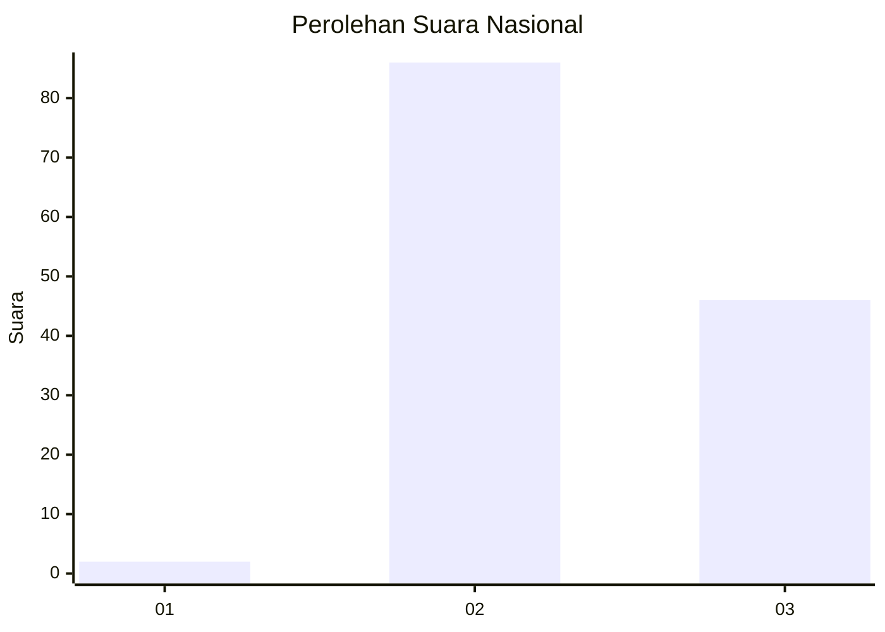
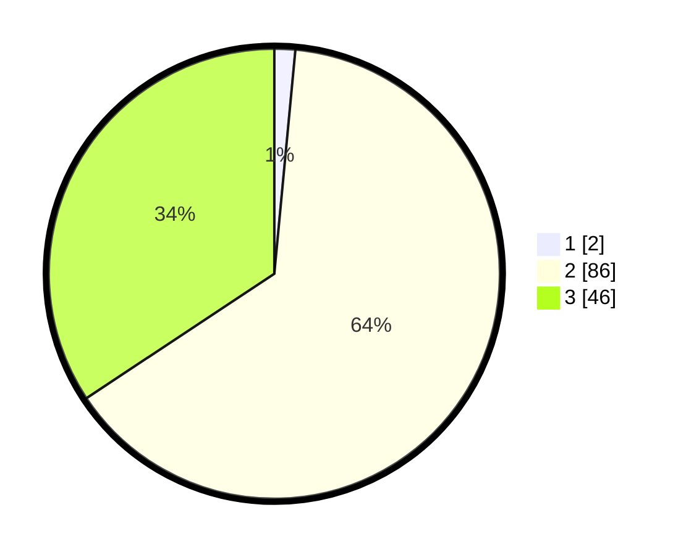

# Hasil

## Grafik

## Tabel

| No. | Nama Paslon    | Suara | Suara (raw) | Persentase |
|:--- |:-------------- | -----:| -----------:| ----------:|
| 1   | ANIES MUHAIMIN | 2     | [2][p-1]    | 1,49       |
| 2   | PRABOWO GIBRAN | 86    | [86][p-2]   | 64,18      |
| 3   | GANJAR MAHFUD  | 46    | [46][p-3]   | 34,33      |

[p-1]: https://github.com/gigit-pemilu/pemilu-2024/blob/main/pilpres/hitung-suara/sub/51-bali/sub/02-tabanan/sub/09-baturiti/sub/2004-angseri/sub/010-tps/sub/paslon-1.txt
[p-2]: https://github.com/gigit-pemilu/pemilu-2024/blob/main/pilpres/hitung-suara/sub/51-bali/sub/02-tabanan/sub/09-baturiti/sub/2004-angseri/sub/010-tps/sub/paslon-2.txt
[p-3]: https://github.com/gigit-pemilu/pemilu-2024/blob/main/pilpres/hitung-suara/sub/51-bali/sub/02-tabanan/sub/09-baturiti/sub/2004-angseri/sub/010-tps/sub/paslon-3.txt

## Foto C Plano

https://sirekap-obj-formc.kpu.go.id/d8da/pemilu/ppwp/51/02/09/20/04/5102092004010-20240216-061535--3dacd459-4343-439c-ac94-694ca5148946.jpg

https://sirekap-obj-formc.kpu.go.id/d8da/pemilu/ppwp/51/02/09/20/04/5102092004010-20240216-061540--fd83c69d-b394-4730-a7a5-0d8d9bdfc67d.jpg

https://sirekap-obj-formc.kpu.go.id/d8da/pemilu/ppwp/51/02/09/20/04/5102092004010-20240216-061536--653ac8fe-39f1-4bce-900c-c69e7635337b.jpg

## Metadata

| Key        | Value               |
| ---------- | ------------------- |
| Time Stamp | 2024-02-16 16:25:10 |

## DATA PEMILIH TETAP

Jumlah pemilih dalam DPT: **166**.
 * L: **80**.
 * P: **86**.

## DATA PENGGUNA HAK PILIH

Jumlah pengguna hak pilih dalam DPT: **140**.
 * L: **67**.
 * P: **73**.

Jumlah pengguna hak pilih dalam DPTb: **4**.
 * L: **2**.
 * P: **2**.

Jumlah pengguna hak pilih dalam DPK: **0**.
 * L: **0**.
 * P: **0**.

Jumlah pengguna hak pilih: **144**.
 * L: **69**.
 * P: **75**.

## JUMLAH SUARA SAH DAN TIDAK SAH

JUMLAH SELURUH SUARA SAH: **134**.

JUMLAH SUARA TIDAK SAH: **10**.

JUMLAH SELURUH SUARA SAH DAN SUARA TIDAK SAH: **144**.

