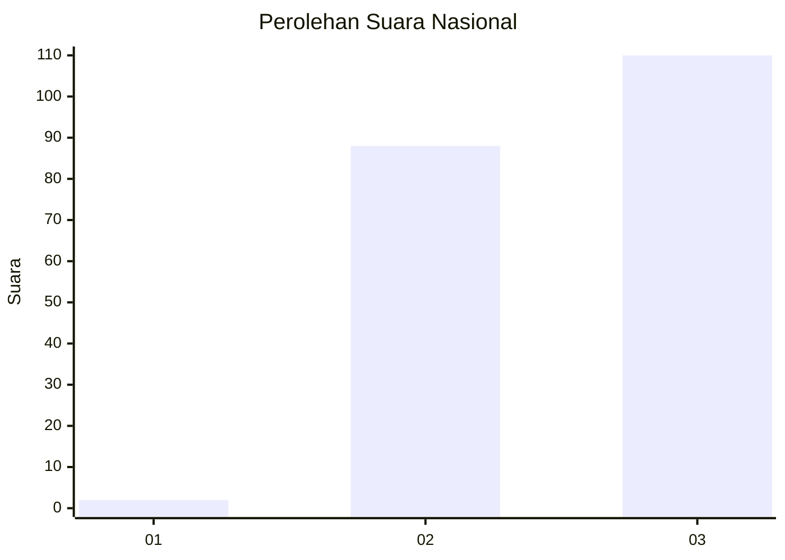
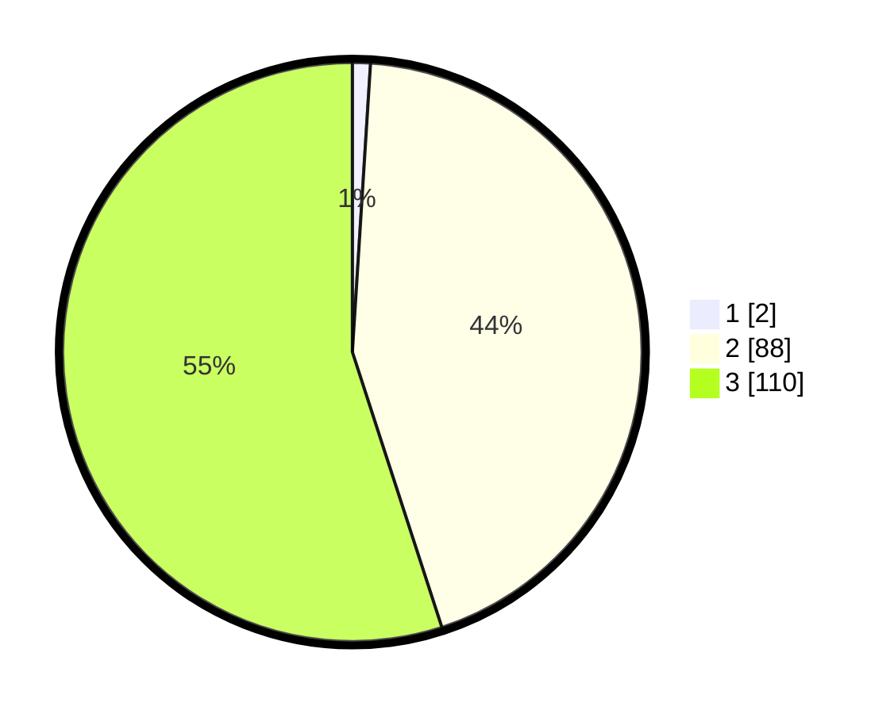

# Hasil

## Grafik

## Tabel

| No. | Nama Paslon    | Suara | Suara (raw) | Persentase |
|:--- |:-------------- | -----:| -----------:| ----------:|
| 1   | ANIES MUHAIMIN | 2     | [2][p-1]    | 1,00       |
| 2   | PRABOWO GIBRAN | 88    | [88][p-2]   | 44,00      |
| 3   | GANJAR MAHFUD  | 110   | [110][p-3]  | 55,00      |

[p-1]: https://github.com/gigit-pemilu/pemilu-2024/blob/main/pilpres/hitung-suara/sub/51-bali/sub/02-tabanan/sub/09-baturiti/sub/2005-bangli/sub/003-tps/sub/paslon-1.txt
[p-2]: https://github.com/gigit-pemilu/pemilu-2024/blob/main/pilpres/hitung-suara/sub/51-bali/sub/02-tabanan/sub/09-baturiti/sub/2005-bangli/sub/003-tps/sub/paslon-2.txt
[p-3]: https://github.com/gigit-pemilu/pemilu-2024/blob/main/pilpres/hitung-suara/sub/51-bali/sub/02-tabanan/sub/09-baturiti/sub/2005-bangli/sub/003-tps/sub/paslon-3.txt

## Foto C Plano

https://sirekap-obj-formc.kpu.go.id/ce08/pemilu/ppwp/51/02/09/20/05/5102092005003-20240216-042845--30288e4e-39d7-47e8-8ecb-d595fe1d2b89.jpg

https://sirekap-obj-formc.kpu.go.id/ce08/pemilu/ppwp/51/02/09/20/05/5102092005003-20240216-060331--aaf97490-69d6-4b30-8d23-dac252e102b9.jpg

https://sirekap-obj-formc.kpu.go.id/ce08/pemilu/ppwp/51/02/09/20/05/5102092005003-20240216-042852--1e81a006-7775-4b0a-a507-4b4a3fe6ef67.jpg

## Metadata

| Key        | Value               |
| ---------- | ------------------- |
| Time Stamp | 2024-02-16 16:25:10 |

## DATA PEMILIH TETAP

Jumlah pemilih dalam DPT: **225**.
 * L: **114**.
 * P: **111**.

## DATA PENGGUNA HAK PILIH

Jumlah pengguna hak pilih dalam DPT: **199**.
 * L: **103**.
 * P: **96**.

Jumlah pengguna hak pilih dalam DPTb: **0**.
 * L: **0**.
 * P: **0**.

Jumlah pengguna hak pilih dalam DPK: **5**.
 * L: **3**.
 * P: **2**.

Jumlah pengguna hak pilih: **204**.
 * L: **106**.
 * P: **98**.

## JUMLAH SUARA SAH DAN TIDAK SAH

JUMLAH SELURUH SUARA SAH: **200**.

JUMLAH SUARA TIDAK SAH: **4**.

JUMLAH SELURUH SUARA SAH DAN SUARA TIDAK SAH: **204**.

