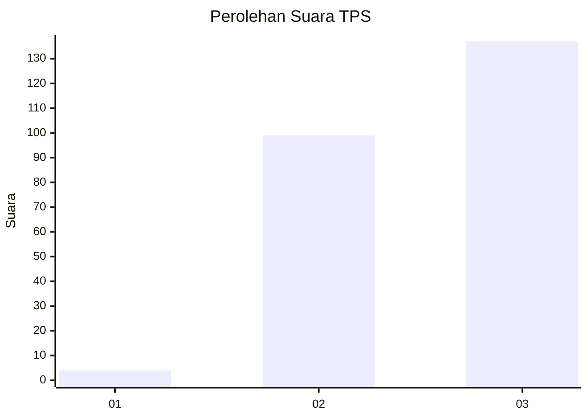
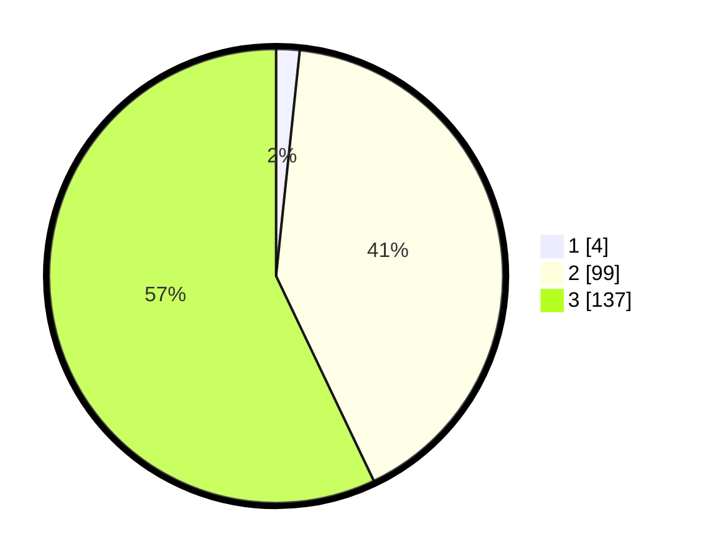

# Hasil

## Grafik

## Tabel

| No. | Nama Paslon    | Suara | Suara (raw) | Persentase |
|:--- |:-------------- | -----:| -----------:| ----------:|
| 1   | ANIES MUHAIMIN | 4     | [4][p-1]    | 1,67       |
| 2   | PRABOWO GIBRAN | 99    | [99][p-2]   | 41,25      |
| 3   | GANJAR MAHFUD  | 137   | [137][p-3]  | 57,08      |

[p-1]: https://github.com/gigit-pemilu/pemilu-2024-51-bali/blob/main/pilpres/hitung-suara/sub/51-bali/sub/02-tabanan/sub/09-baturiti/sub/2005-bangli/sub/005-tps/sub/paslon-1.txt
[p-2]: https://github.com/gigit-pemilu/pemilu-2024-51-bali/blob/main/pilpres/hitung-suara/sub/51-bali/sub/02-tabanan/sub/09-baturiti/sub/2005-bangli/sub/005-tps/sub/paslon-2.txt
[p-3]: https://github.com/gigit-pemilu/pemilu-2024-51-bali/blob/main/pilpres/hitung-suara/sub/51-bali/sub/02-tabanan/sub/09-baturiti/sub/2005-bangli/sub/005-tps/sub/paslon-3.txt

## Foto C Plano

https://sirekap-obj-formc.kpu.go.id/2c3a/pemilu/ppwp/51/02/09/20/05/5102092005005-20240216-084714--bb5300a5-428a-46ee-a9f6-8ce0d92f5ad8.jpg

https://sirekap-obj-formc.kpu.go.id/2c3a/pemilu/ppwp/51/02/09/20/05/5102092005005-20240216-084725--886a56c7-e3f2-4292-a812-f92674246e47.jpg

https://sirekap-obj-formc.kpu.go.id/2c3a/pemilu/ppwp/51/02/09/20/05/5102092005005-20240216-084723--f2c7aaad-9f5a-4db9-8728-94dd2a0b95fc.jpg

## Metadata

| Key        | Value               |
| ---------- | ------------------- |
| Time Stamp | 2024-02-16 16:25:10 |

## DATA PEMILIH TETAP

Jumlah pemilih dalam DPT: **272**.
 * L: **131**.
 * P: **141**.

## DATA PENGGUNA HAK PILIH

Jumlah pengguna hak pilih dalam DPT: **241**.
 * L: **120**.
 * P: **121**.

Jumlah pengguna hak pilih dalam DPTb: **1**.
 * L: **0**.
 * P: **1**.

Jumlah pengguna hak pilih dalam DPK: **2**.
 * L: **2**.
 * P: **0**.

Jumlah pengguna hak pilih: **244**.
 * L: **122**.
 * P: **122**.

## JUMLAH SUARA SAH DAN TIDAK SAH

JUMLAH SELURUH SUARA SAH: **240**.

JUMLAH SUARA TIDAK SAH: **4**.

JUMLAH SELURUH SUARA SAH DAN SUARA TIDAK SAH: **244**.

