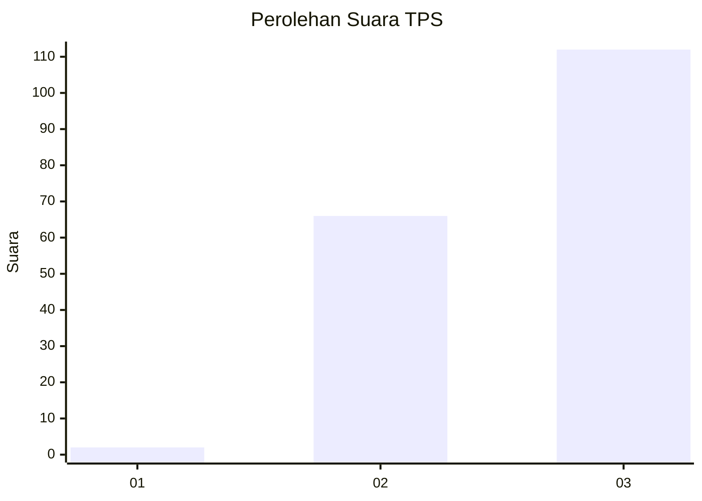
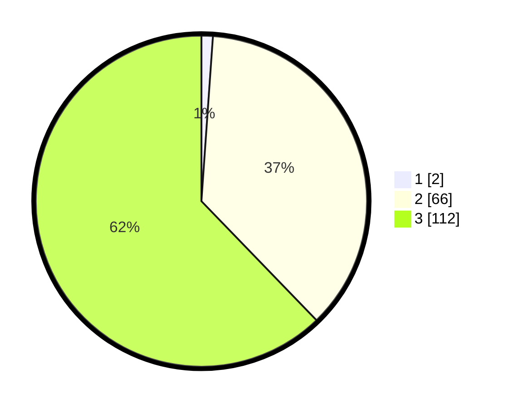

# Hasil

## Grafik

## Tabel

| No. | Nama Paslon    | Suara | Suara (raw) | Persentase |
|:--- |:-------------- | -----:| -----------:| ----------:|
| 1   | ANIES MUHAIMIN | 2     | [2][p-1]    | 1,11       |
| 2   | PRABOWO GIBRAN | 66    | [66][p-2]   | 36,67      |
| 3   | GANJAR MAHFUD  | 112   | [112][p-3]  | 62,22      |

[p-1]: https://github.com/gigit-pemilu/pemilu-2024-51-bali/blob/main/pilpres/hitung-suara/sub/51-bali/sub/02-tabanan/sub/09-baturiti/sub/2005-bangli/sub/006-tps/sub/paslon-1.txt
[p-2]: https://github.com/gigit-pemilu/pemilu-2024-51-bali/blob/main/pilpres/hitung-suara/sub/51-bali/sub/02-tabanan/sub/09-baturiti/sub/2005-bangli/sub/006-tps/sub/paslon-2.txt
[p-3]: https://github.com/gigit-pemilu/pemilu-2024-51-bali/blob/main/pilpres/hitung-suara/sub/51-bali/sub/02-tabanan/sub/09-baturiti/sub/2005-bangli/sub/006-tps/sub/paslon-3.txt

## Foto C Plano

https://sirekap-obj-formc.kpu.go.id/7513/pemilu/ppwp/51/02/09/20/05/5102092005006-20240216-151901--6480bd4e-aa14-45a8-b7c7-7d1e05d47364.jpg

https://sirekap-obj-formc.kpu.go.id/7513/pemilu/ppwp/51/02/09/20/05/5102092005006-20240216-151902--c865d732-d166-4e8d-869b-92eda42fab42.jpg

https://sirekap-obj-formc.kpu.go.id/7513/pemilu/ppwp/51/02/09/20/05/5102092005006-20240216-151902--08224230-4518-4329-a0ed-2c2f92d0785b.jpg

## Metadata

| Key        | Value               |
| ---------- | ------------------- |
| Time Stamp | 2024-02-21 23:00:00 |

## DATA PEMILIH TETAP

Jumlah pemilih dalam DPT: **216**.
 * L: **113**.
 * P: **103**.

## DATA PENGGUNA HAK PILIH

Jumlah pengguna hak pilih dalam DPT: **184**.
 * L: **96**.
 * P: **88**.

Jumlah pengguna hak pilih dalam DPTb: **3**.
 * L: **1**.
 * P: **2**.

Jumlah pengguna hak pilih dalam DPK: **0**.
 * L: **0**.
 * P: **0**.

Jumlah pengguna hak pilih: **187**.
 * L: **97**.
 * P: **90**.

## JUMLAH SUARA SAH DAN TIDAK SAH

JUMLAH SELURUH SUARA SAH: **180**.

JUMLAH SUARA TIDAK SAH: **7**.

JUMLAH SELURUH SUARA SAH DAN SUARA TIDAK SAH: **187**.

