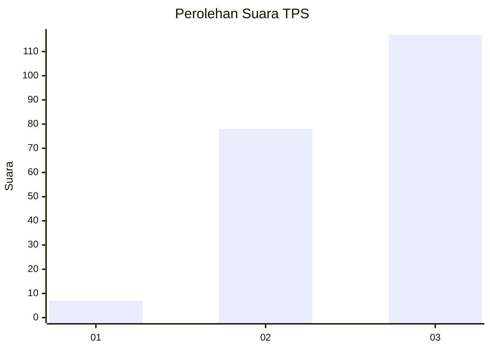
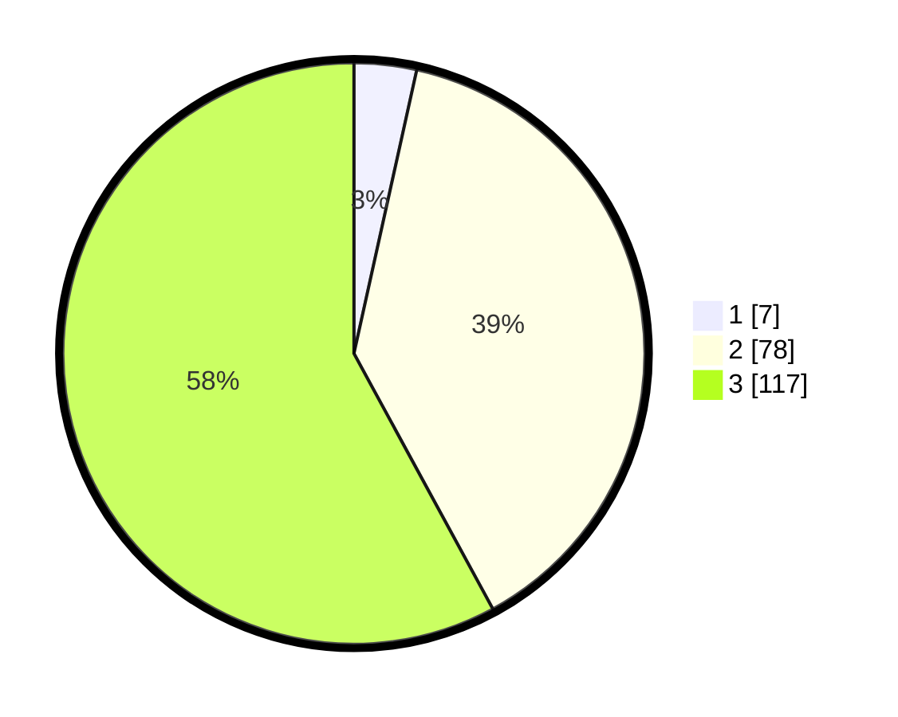

# Hasil

## Grafik

## Tabel

| No. | Nama Paslon    | Suara | Suara (raw) | Persentase |
|:--- |:-------------- | -----:| -----------:| ----------:|
| 1   | ANIES MUHAIMIN | 7     | [7][p-1]    | 3,47       |
| 2   | PRABOWO GIBRAN | 78    | [78][p-2]   | 38,61      |
| 3   | GANJAR MAHFUD  | 117   | [117][p-3]  | 57,92      |

[p-1]: https://github.com/gigit-pemilu/pemilu-2024-51-bali/blob/main/pilpres/hitung-suara/sub/51-bali/sub/02-tabanan/sub/09-baturiti/sub/2005-bangli/sub/010-tps/sub/paslon-1.txt
[p-2]: https://github.com/gigit-pemilu/pemilu-2024-51-bali/blob/main/pilpres/hitung-suara/sub/51-bali/sub/02-tabanan/sub/09-baturiti/sub/2005-bangli/sub/010-tps/sub/paslon-2.txt
[p-3]: https://github.com/gigit-pemilu/pemilu-2024-51-bali/blob/main/pilpres/hitung-suara/sub/51-bali/sub/02-tabanan/sub/09-baturiti/sub/2005-bangli/sub/010-tps/sub/paslon-3.txt

## Foto C Plano

https://sirekap-obj-formc.kpu.go.id/7e9c/pemilu/ppwp/51/02/09/20/05/5102092005010-20240216-145109--30c9d46f-6999-4811-b8e8-34c4c46bf920.jpg

https://sirekap-obj-formc.kpu.go.id/7e9c/pemilu/ppwp/51/02/09/20/05/5102092005010-20240216-151608--bf95bf5a-478c-4559-9e5e-0290d125f3dc.jpg

https://sirekap-obj-formc.kpu.go.id/7e9c/pemilu/ppwp/51/02/09/20/05/5102092005010-20240216-145110--0fb4e5f0-d96e-4fc8-a8d1-2c7225e381bd.jpg

## Metadata

| Key        | Value               |
| ---------- | ------------------- |
| Time Stamp | 2024-02-21 17:00:00 |

## DATA PEMILIH TETAP

Jumlah pemilih dalam DPT: **263**.
 * L: **137**.
 * P: **126**.

## DATA PENGGUNA HAK PILIH

Jumlah pengguna hak pilih dalam DPT: **203**.
 * L: **108**.
 * P: **95**.

Jumlah pengguna hak pilih dalam DPTb: **0**.
 * L: **0**.
 * P: **0**.

Jumlah pengguna hak pilih dalam DPK: **0**.
 * L: **0**.
 * P: **0**.

Jumlah pengguna hak pilih: **203**.
 * L: **108**.
 * P: **95**.

## JUMLAH SUARA SAH DAN TIDAK SAH

JUMLAH SELURUH SUARA SAH: **202**.

JUMLAH SUARA TIDAK SAH: **1**.

JUMLAH SELURUH SUARA SAH DAN SUARA TIDAK SAH: **203**.

