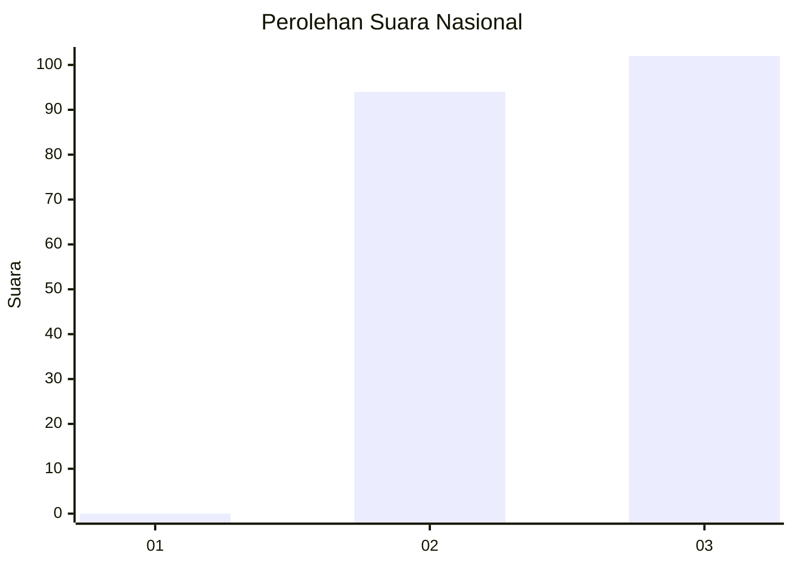
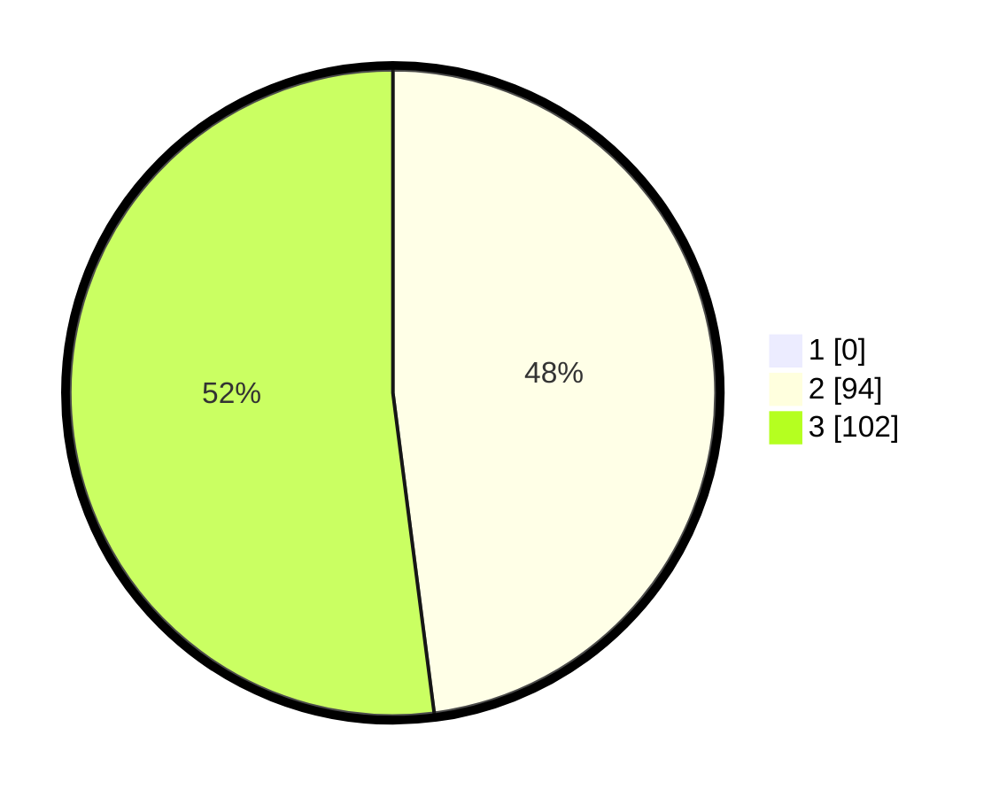

# Hasil

## Grafik

## Tabel

| No. | Nama Paslon    | Suara | Suara (raw) | Persentase |
|:--- |:-------------- | -----:| -----------:| ----------:|
| 1   | ANIES MUHAIMIN | 0     | [0][p-1]    | 0,00       |
| 2   | PRABOWO GIBRAN | 94    | [94][p-2]   | 47,96      |
| 3   | GANJAR MAHFUD  | 102   | [102][p-3]  | 52,04      |

[p-1]: https://github.com/gigit-pemilu/pemilu-2024/blob/main/pilpres/hitung-suara/sub/51-bali/sub/02-tabanan/sub/09-baturiti/sub/2005-bangli/sub/013-tps/sub/paslon-1.txt
[p-2]: https://github.com/gigit-pemilu/pemilu-2024/blob/main/pilpres/hitung-suara/sub/51-bali/sub/02-tabanan/sub/09-baturiti/sub/2005-bangli/sub/013-tps/sub/paslon-2.txt
[p-3]: https://github.com/gigit-pemilu/pemilu-2024/blob/main/pilpres/hitung-suara/sub/51-bali/sub/02-tabanan/sub/09-baturiti/sub/2005-bangli/sub/013-tps/sub/paslon-3.txt

## Foto C Plano

https://sirekap-obj-formc.kpu.go.id/93a6/pemilu/ppwp/51/02/09/20/05/5102092005013-20240216-120707--92c9ed96-6f3b-4ac3-a121-091f0e5f04f8.jpg

https://sirekap-obj-formc.kpu.go.id/93a6/pemilu/ppwp/51/02/09/20/05/5102092005013-20240216-120722--5f348271-c74b-4613-af32-53b505616076.jpg

https://sirekap-obj-formc.kpu.go.id/93a6/pemilu/ppwp/51/02/09/20/05/5102092005013-20240216-120716--d9e105c4-e1b0-403b-9d8f-baa4a675e3da.jpg

## Metadata

| Key        | Value               |
| ---------- | ------------------- |
| Time Stamp | 2024-02-21 11:00:00 |

## DATA PEMILIH TETAP

Jumlah pemilih dalam DPT: **247**.
 * L: **122**.
 * P: **125**.

## DATA PENGGUNA HAK PILIH

Jumlah pengguna hak pilih dalam DPT: **193**.
 * L: **100**.
 * P: **93**.

Jumlah pengguna hak pilih dalam DPTb: **0**.
 * L: **0**.
 * P: **0**.

Jumlah pengguna hak pilih dalam DPK: **13**.
 * L: **7**.
 * P: **6**.

Jumlah pengguna hak pilih: **206**.
 * L: **107**.
 * P: **99**.

## JUMLAH SUARA SAH DAN TIDAK SAH

JUMLAH SELURUH SUARA SAH: **196**.

JUMLAH SUARA TIDAK SAH: **10**.

JUMLAH SELURUH SUARA SAH DAN SUARA TIDAK SAH: **206**.

