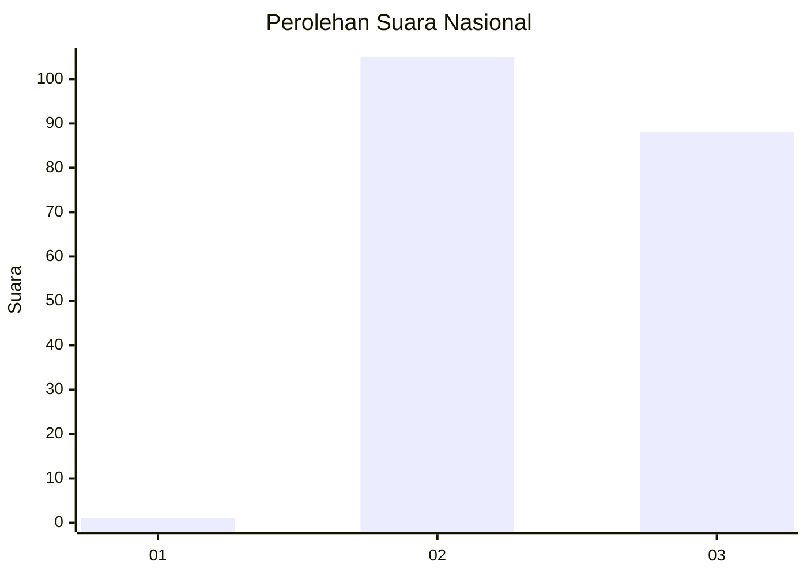
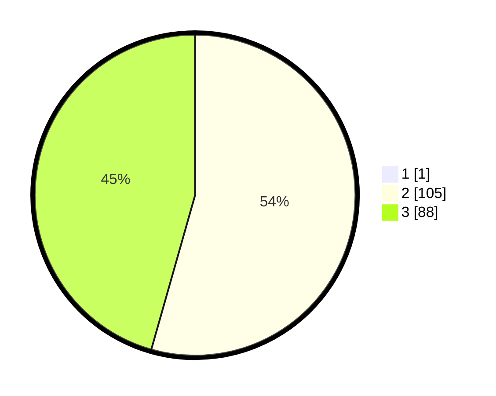

# Hasil

## Grafik

## Tabel

| No. | Nama Paslon    | Suara | Suara (raw) | Persentase |
|:--- |:-------------- | -----:| -----------:| ----------:|
| 1   | ANIES MUHAIMIN | 1     | [1][p-1]    | 0,52       |
| 2   | PRABOWO GIBRAN | 105   | [105][p-2]  | 54,12      |
| 3   | GANJAR MAHFUD  | 88    | [88][p-3]   | 45,36      |

[p-1]: https://github.com/gigit-pemilu/pemilu-2024/blob/main/pilpres/hitung-suara/sub/51-bali/sub/02-tabanan/sub/09-baturiti/sub/2005-bangli/sub/015-tps/sub/paslon-1.txt
[p-2]: https://github.com/gigit-pemilu/pemilu-2024/blob/main/pilpres/hitung-suara/sub/51-bali/sub/02-tabanan/sub/09-baturiti/sub/2005-bangli/sub/015-tps/sub/paslon-2.txt
[p-3]: https://github.com/gigit-pemilu/pemilu-2024/blob/main/pilpres/hitung-suara/sub/51-bali/sub/02-tabanan/sub/09-baturiti/sub/2005-bangli/sub/015-tps/sub/paslon-3.txt

## Foto C Plano

https://sirekap-obj-formc.kpu.go.id/2bbd/pemilu/ppwp/51/02/09/20/05/5102092005015-20240216-061654--88c5ef8d-7107-4d2c-84c4-18b978f031b9.jpg

https://sirekap-obj-formc.kpu.go.id/2bbd/pemilu/ppwp/51/02/09/20/05/5102092005015-20240216-061656--64b74888-531b-4ebb-93e6-fb9cc38cc162.jpg

https://sirekap-obj-formc.kpu.go.id/2bbd/pemilu/ppwp/51/02/09/20/05/5102092005015-20240216-061655--9f2628f0-6dd4-487d-bd0b-f72e5acfdb65.jpg

## Metadata

| Key        | Value               |
| ---------- | ------------------- |
| Time Stamp | 2024-02-21 13:00:00 |

## DATA PEMILIH TETAP

Jumlah pemilih dalam DPT: **253**.
 * L: **130**.
 * P: **123**.

## DATA PENGGUNA HAK PILIH

Jumlah pengguna hak pilih dalam DPT: **194**.
 * L: **106**.
 * P: **88**.

Jumlah pengguna hak pilih dalam DPTb: **0**.
 * L: **0**.
 * P: **0**.

Jumlah pengguna hak pilih dalam DPK: **3**.
 * L: **3**.
 * P: **0**.

Jumlah pengguna hak pilih: **197**.
 * L: **109**.
 * P: **88**.

## JUMLAH SUARA SAH DAN TIDAK SAH

JUMLAH SELURUH SUARA SAH: **194**.

JUMLAH SUARA TIDAK SAH: **3**.

JUMLAH SELURUH SUARA SAH DAN SUARA TIDAK SAH: **197**.

