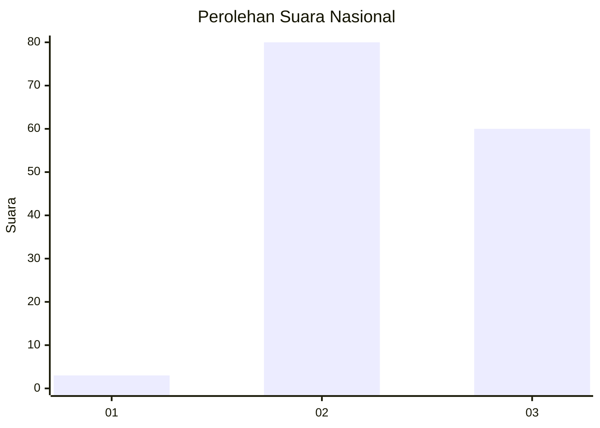
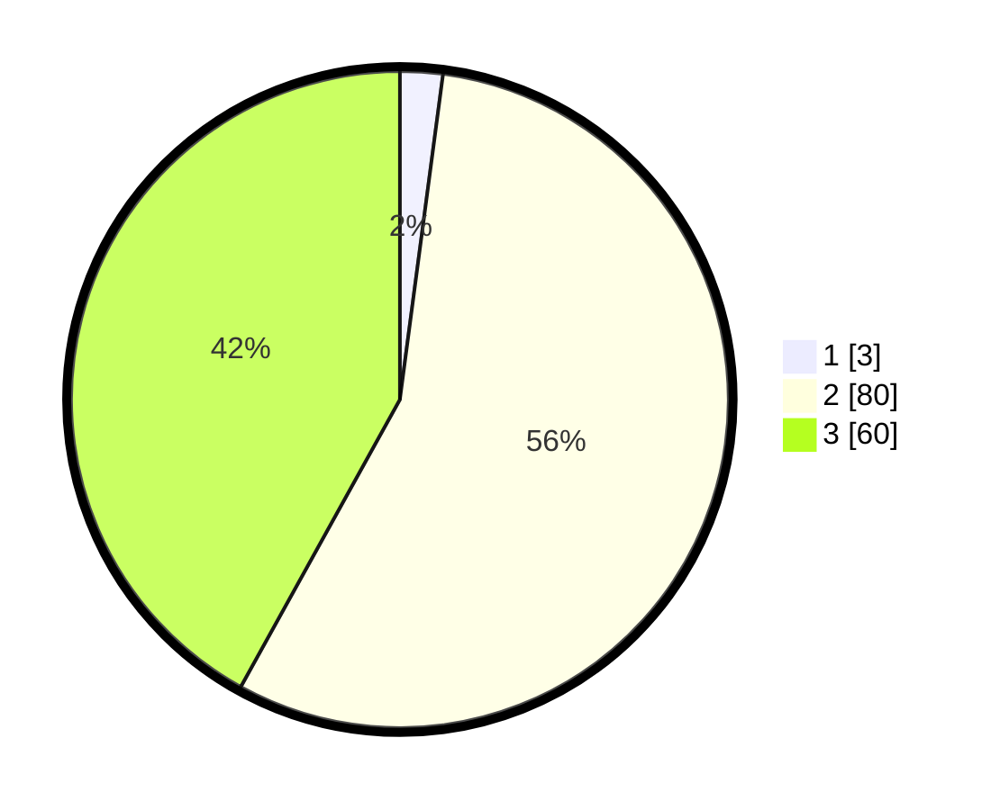

# Hasil

## Grafik

## Tabel

| No. | Nama Paslon    | Suara | Suara (raw) | Persentase |
|:--- |:-------------- | -----:| -----------:| ----------:|
| 1   | ANIES MUHAIMIN | 3     | [3][p-1]    | 2,10       |
| 2   | PRABOWO GIBRAN | 80    | [80][p-2]   | 55,94      |
| 3   | GANJAR MAHFUD  | 60    | [60][p-3]   | 41,96      |

[p-1]: https://github.com/gigit-pemilu/pemilu-2024/blob/main/pilpres/hitung-suara/sub/51-bali/sub/02-tabanan/sub/09-baturiti/sub/2006-baturiti/sub/001-tps/sub/paslon-1.txt
[p-2]: https://github.com/gigit-pemilu/pemilu-2024/blob/main/pilpres/hitung-suara/sub/51-bali/sub/02-tabanan/sub/09-baturiti/sub/2006-baturiti/sub/001-tps/sub/paslon-2.txt
[p-3]: https://github.com/gigit-pemilu/pemilu-2024/blob/main/pilpres/hitung-suara/sub/51-bali/sub/02-tabanan/sub/09-baturiti/sub/2006-baturiti/sub/001-tps/sub/paslon-3.txt

## Foto C Plano

https://sirekap-obj-formc.kpu.go.id/1c31/pemilu/ppwp/51/02/09/20/06/5102092006001-20240214-205645--5939061b-b3ec-4053-baf9-32f41dbb9101.jpg

https://sirekap-obj-formc.kpu.go.id/1c31/pemilu/ppwp/51/02/09/20/06/5102092006001-20240214-210301--c023a83f-10ad-467a-a64c-3418e9e7cfb8.jpg

https://sirekap-obj-formc.kpu.go.id/1c31/pemilu/ppwp/51/02/09/20/06/5102092006001-20240216-173523--8e597504-ad91-4e6c-88e7-dfec3aad7c72.jpg

## Metadata

| Key        | Value               |
| ---------- | ------------------- |
| Time Stamp | 2024-02-24 22:31:28 |

## DATA PEMILIH TETAP

Jumlah pemilih dalam DPT: **159**.
 * L: **89**.
 * P: **70**.

## DATA PENGGUNA HAK PILIH

Jumlah pengguna hak pilih dalam DPT: **141**.
 * L: **84**.
 * P: **57**.

Jumlah pengguna hak pilih dalam DPTb: **0**.
 * L: **0**.
 * P: **0**.

Jumlah pengguna hak pilih dalam DPK: **4**.
 * L: **1**.
 * P: **3**.

Jumlah pengguna hak pilih: **145**.
 * L: **85**.
 * P: **60**.

## JUMLAH SUARA SAH DAN TIDAK SAH

JUMLAH SELURUH SUARA SAH: **145**.

JUMLAH SUARA TIDAK SAH: **20**.

JUMLAH SELURUH SUARA SAH DAN SUARA TIDAK SAH: **165**.

