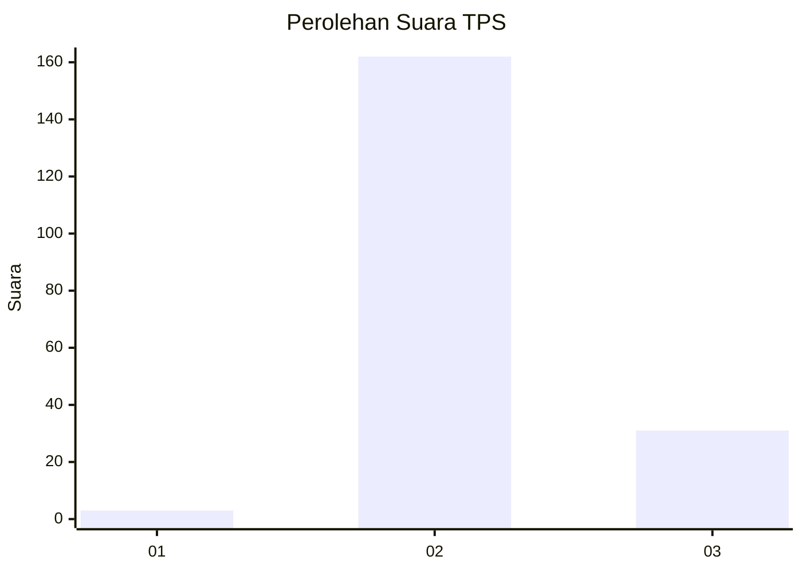
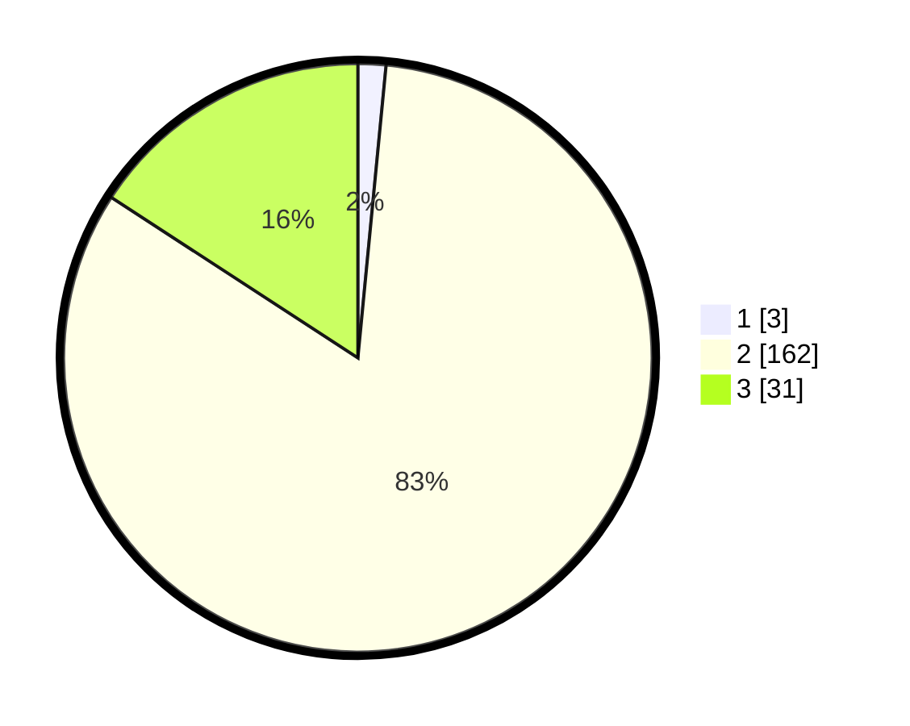

# Hasil

## Grafik

## Tabel

| No. | Nama Paslon    | Suara | Suara (raw) | Persentase |
|:--- |:-------------- | -----:| -----------:| ----------:|
| 1   | ANIES MUHAIMIN | 3     | [3][p-1]    | 1,53       |
| 2   | PRABOWO GIBRAN | 162   | [162][p-2]  | 82,65      |
| 3   | GANJAR MAHFUD  | 31    | [31][p-3]   | 15,82      |

[p-1]: https://github.com/gigit-pemilu/pemilu-2024-51-bali/blob/main/pilpres/hitung-suara/sub/51-bali/sub/02-tabanan/sub/09-baturiti/sub/2006-baturiti/sub/002-tps/sub/paslon-1.txt
[p-2]: https://github.com/gigit-pemilu/pemilu-2024-51-bali/blob/main/pilpres/hitung-suara/sub/51-bali/sub/02-tabanan/sub/09-baturiti/sub/2006-baturiti/sub/002-tps/sub/paslon-2.txt
[p-3]: https://github.com/gigit-pemilu/pemilu-2024-51-bali/blob/main/pilpres/hitung-suara/sub/51-bali/sub/02-tabanan/sub/09-baturiti/sub/2006-baturiti/sub/002-tps/sub/paslon-3.txt

## Foto C Plano

https://sirekap-obj-formc.kpu.go.id/51a3/pemilu/ppwp/51/02/09/20/06/5102092006002-20240216-142621--bd89ee8b-8a97-49e7-8720-3f20241c6fee.jpg

https://sirekap-obj-formc.kpu.go.id/51a3/pemilu/ppwp/51/02/09/20/06/5102092006002-20240216-142623--399f3bf1-3f18-4b43-802f-e01962d5bcde.jpg

https://sirekap-obj-formc.kpu.go.id/51a3/pemilu/ppwp/51/02/09/20/06/5102092006002-20240216-142622--7099717d-6edc-4e1a-8905-33fbe6c150e8.jpg

## Metadata

| Key        | Value               |
| ---------- | ------------------- |
| Time Stamp | 2024-02-21 16:00:00 |

## DATA PEMILIH TETAP

Jumlah pemilih dalam DPT: **218**.
 * L: **111**.
 * P: **107**.

## DATA PENGGUNA HAK PILIH

Jumlah pengguna hak pilih dalam DPT: **192**.
 * L: **96**.
 * P: **96**.

Jumlah pengguna hak pilih dalam DPTb: **3**.
 * L: **3**.
 * P: **0**.

Jumlah pengguna hak pilih dalam DPK: **2**.
 * L: **1**.
 * P: **1**.

Jumlah pengguna hak pilih: **197**.
 * L: **100**.
 * P: **97**.

## JUMLAH SUARA SAH DAN TIDAK SAH

JUMLAH SELURUH SUARA SAH: **196**.

JUMLAH SUARA TIDAK SAH: **1**.

JUMLAH SELURUH SUARA SAH DAN SUARA TIDAK SAH: **197**.

