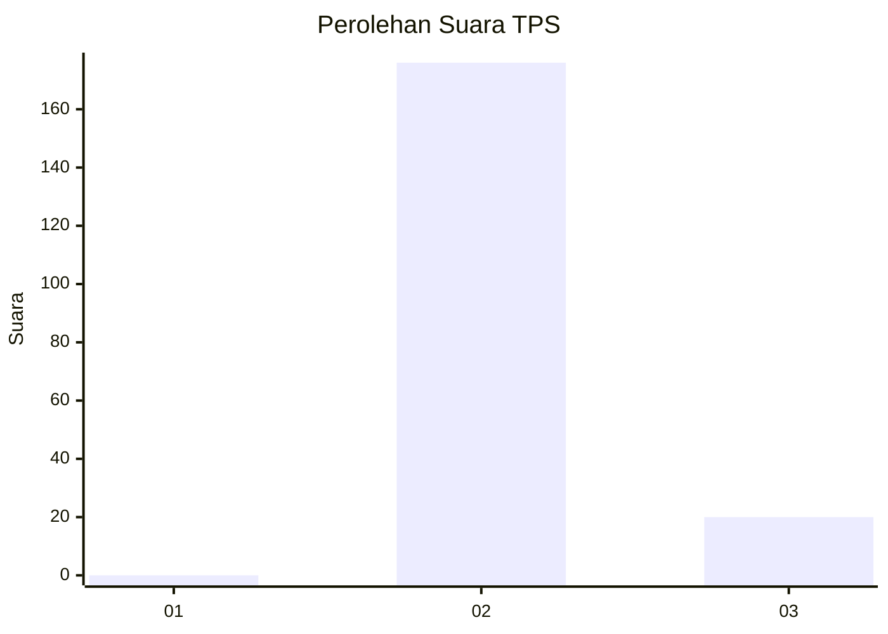
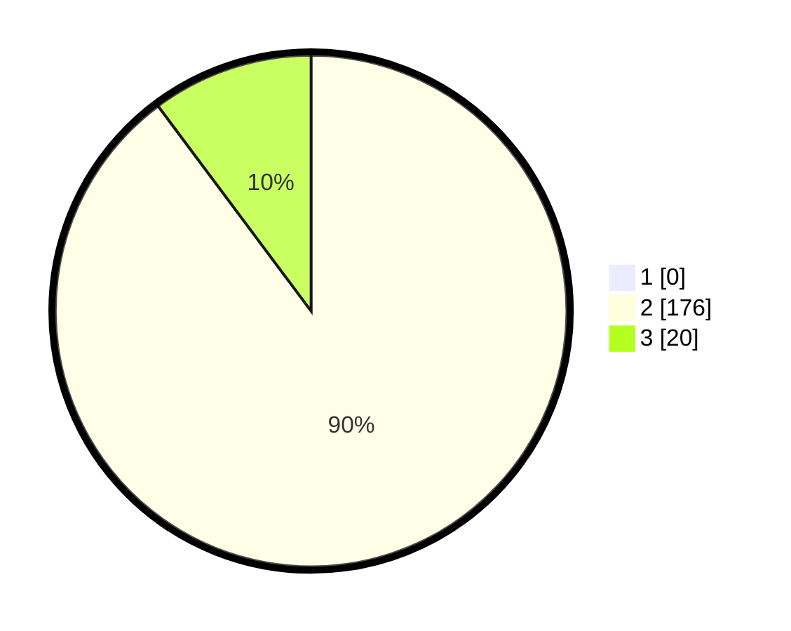

# Hasil

## Grafik

## Tabel

| No. | Nama Paslon    | Suara | Suara (raw) | Persentase |
|:--- |:-------------- | -----:| -----------:| ----------:|
| 1   | ANIES MUHAIMIN | 0     | [0][p-1]    | 0,00       |
| 2   | PRABOWO GIBRAN | 176   | [176][p-2]  | 89,80      |
| 3   | GANJAR MAHFUD  | 20    | [20][p-3]   | 10,20      |

[p-1]: https://github.com/gigit-pemilu/pemilu-2024-51-bali/blob/main/pilpres/hitung-suara/sub/51-bali/sub/02-tabanan/sub/09-baturiti/sub/2006-baturiti/sub/003-tps/sub/paslon-1.txt
[p-2]: https://github.com/gigit-pemilu/pemilu-2024-51-bali/blob/main/pilpres/hitung-suara/sub/51-bali/sub/02-tabanan/sub/09-baturiti/sub/2006-baturiti/sub/003-tps/sub/paslon-2.txt
[p-3]: https://github.com/gigit-pemilu/pemilu-2024-51-bali/blob/main/pilpres/hitung-suara/sub/51-bali/sub/02-tabanan/sub/09-baturiti/sub/2006-baturiti/sub/003-tps/sub/paslon-3.txt

## Foto C Plano

https://sirekap-obj-formc.kpu.go.id/79f8/pemilu/ppwp/51/02/09/20/06/5102092006003-20240215-225729--a52d059e-40cc-47db-9271-e0a5ee531fce.jpg

https://sirekap-obj-formc.kpu.go.id/79f8/pemilu/ppwp/51/02/09/20/06/5102092006003-20240215-225733--327a60be-7a0b-4fd3-a0a1-e4e1c3719c77.jpg

https://sirekap-obj-formc.kpu.go.id/79f8/pemilu/ppwp/51/02/09/20/06/5102092006003-20240215-224740--3399cb91-5cd1-49ad-b150-e37c4d784d81.jpg

## Metadata

| Key        | Value               |
| ---------- | ------------------- |
| Time Stamp | 2024-02-21 16:00:00 |

## DATA PEMILIH TETAP

Jumlah pemilih dalam DPT: **217**.
 * L: **113**.
 * P: **104**.

## DATA PENGGUNA HAK PILIH

Jumlah pengguna hak pilih dalam DPT: **197**.
 * L: **107**.
 * P: **90**.

Jumlah pengguna hak pilih dalam DPTb: **3**.
 * L: **3**.
 * P: **0**.

Jumlah pengguna hak pilih dalam DPK: **0**.
 * L: **0**.
 * P: **0**.

Jumlah pengguna hak pilih: **200**.
 * L: **110**.
 * P: **90**.

## JUMLAH SUARA SAH DAN TIDAK SAH

JUMLAH SELURUH SUARA SAH: **196**.

JUMLAH SUARA TIDAK SAH: **4**.

JUMLAH SELURUH SUARA SAH DAN SUARA TIDAK SAH: **200**.

