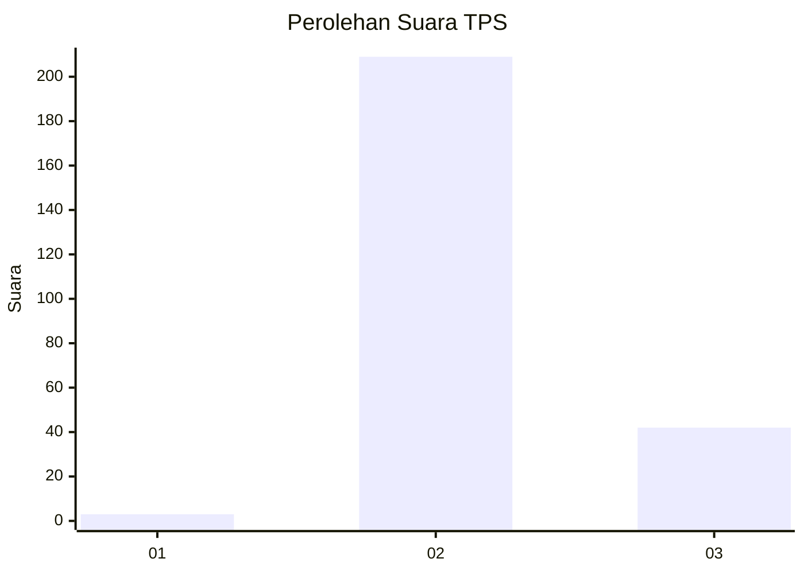
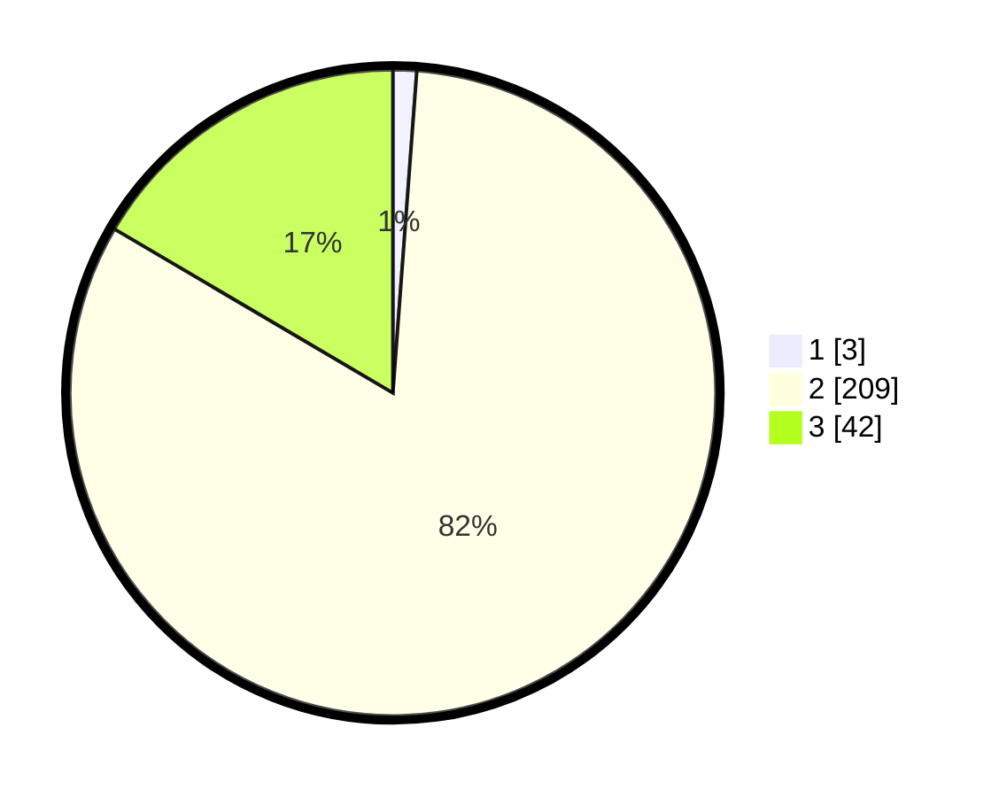

# Hasil

## Grafik

## Tabel

| No. | Nama Paslon    | Suara | Suara (raw) | Persentase |
|:--- |:-------------- | -----:| -----------:| ----------:|
| 1   | ANIES MUHAIMIN | 3     | [3][p-1]    | 1,18       |
| 2   | PRABOWO GIBRAN | 209   | [209][p-2]  | 82,28      |
| 3   | GANJAR MAHFUD  | 42    | [42][p-3]   | 16,54      |

[p-1]: https://github.com/gigit-pemilu/pemilu-2024-51-bali/blob/main/pilpres/hitung-suara/sub/51-bali/sub/02-tabanan/sub/09-baturiti/sub/2006-baturiti/sub/004-tps/sub/paslon-1.txt
[p-2]: https://github.com/gigit-pemilu/pemilu-2024-51-bali/blob/main/pilpres/hitung-suara/sub/51-bali/sub/02-tabanan/sub/09-baturiti/sub/2006-baturiti/sub/004-tps/sub/paslon-2.txt
[p-3]: https://github.com/gigit-pemilu/pemilu-2024-51-bali/blob/main/pilpres/hitung-suara/sub/51-bali/sub/02-tabanan/sub/09-baturiti/sub/2006-baturiti/sub/004-tps/sub/paslon-3.txt

## Foto C Plano

https://sirekap-obj-formc.kpu.go.id/7582/pemilu/ppwp/51/02/09/20/06/5102092006004-20240216-145430--321b7ff4-b6c2-4584-8e61-0524a1f81a88.jpg

https://sirekap-obj-formc.kpu.go.id/7582/pemilu/ppwp/51/02/09/20/06/5102092006004-20240216-145434--f2b245e6-6a0f-4c07-bed0-7981d0fbf7e4.jpg

https://sirekap-obj-formc.kpu.go.id/7582/pemilu/ppwp/51/02/09/20/06/5102092006004-20240216-145433--fa6046d2-fc93-4c9f-beba-9f78dbf29108.jpg

## Metadata

| Key        | Value               |
| ---------- | ------------------- |
| Time Stamp | 2024-02-24 22:31:28 |

## DATA PEMILIH TETAP

Jumlah pemilih dalam DPT: **288**.
 * L: **143**.
 * P: **145**.

## DATA PENGGUNA HAK PILIH

Jumlah pengguna hak pilih dalam DPT: **260**.
 * L: **129**.
 * P: **131**.

Jumlah pengguna hak pilih dalam DPTb: **2**.
 * L: **1**.
 * P: **1**.

Jumlah pengguna hak pilih dalam DPK: **0**.
 * L: **0**.
 * P: **0**.

Jumlah pengguna hak pilih: **262**.
 * L: **130**.
 * P: **132**.

## JUMLAH SUARA SAH DAN TIDAK SAH

JUMLAH SELURUH SUARA SAH: **254**.

JUMLAH SUARA TIDAK SAH: **8**.

JUMLAH SELURUH SUARA SAH DAN SUARA TIDAK SAH: **262**.

