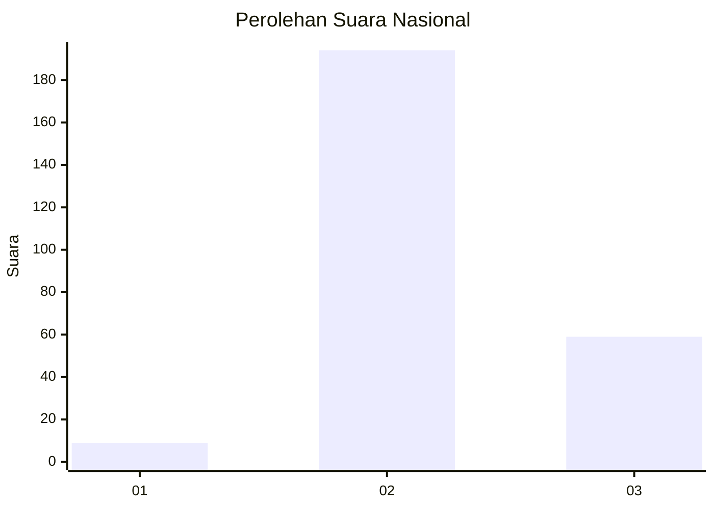
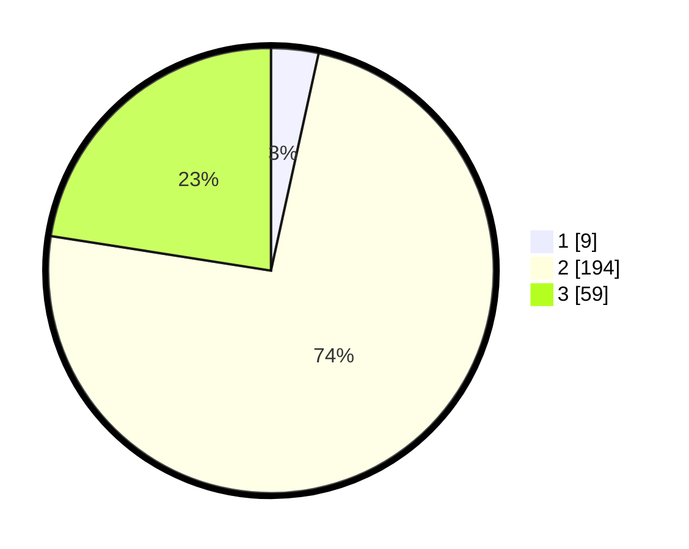

# Hasil

## Grafik

## Tabel

| No. | Nama Paslon    | Suara | Suara (raw) | Persentase |
|:--- |:-------------- | -----:| -----------:| ----------:|
| 1   | ANIES MUHAIMIN | 9     | [9][p-1]    | 3,44       |
| 2   | PRABOWO GIBRAN | 194   | [194][p-2]  | 74,05      |
| 3   | GANJAR MAHFUD  | 59    | [59][p-3]   | 22,52      |

[p-1]: https://github.com/gigit-pemilu/pemilu-2024/blob/main/pilpres/hitung-suara/sub/51-bali/sub/02-tabanan/sub/09-baturiti/sub/2006-baturiti/sub/006-tps/sub/paslon-1.txt
[p-2]: https://github.com/gigit-pemilu/pemilu-2024/blob/main/pilpres/hitung-suara/sub/51-bali/sub/02-tabanan/sub/09-baturiti/sub/2006-baturiti/sub/006-tps/sub/paslon-2.txt
[p-3]: https://github.com/gigit-pemilu/pemilu-2024/blob/main/pilpres/hitung-suara/sub/51-bali/sub/02-tabanan/sub/09-baturiti/sub/2006-baturiti/sub/006-tps/sub/paslon-3.txt

## Foto C Plano

https://sirekap-obj-formc.kpu.go.id/7170/pemilu/ppwp/51/02/09/20/06/5102092006006-20240216-152458--f4dbd2b8-846b-43df-b0b1-e39e4d5fb4e6.jpg

https://sirekap-obj-formc.kpu.go.id/7170/pemilu/ppwp/51/02/09/20/06/5102092006006-20240216-152459--5f215024-4385-4f49-b319-eba233ccb99f.jpg

https://sirekap-obj-formc.kpu.go.id/7170/pemilu/ppwp/51/02/09/20/06/5102092006006-20240216-152458--d49fda84-e6fa-491f-b61b-0ae69d9784bf.jpg

## Metadata

| Key        | Value               |
| ---------- | ------------------- |
| Time Stamp | 2024-02-21 11:00:00 |

## DATA PEMILIH TETAP

Jumlah pemilih dalam DPT: **286**.
 * L: **142**.
 * P: **144**.

## DATA PENGGUNA HAK PILIH

Jumlah pengguna hak pilih dalam DPT: **259**.
 * L: **134**.
 * P: **125**.

Jumlah pengguna hak pilih dalam DPTb: **0**.
 * L: **0**.
 * P: **0**.

Jumlah pengguna hak pilih dalam DPK: **7**.
 * L: **2**.
 * P: **5**.

Jumlah pengguna hak pilih: **266**.
 * L: **136**.
 * P: **130**.

## JUMLAH SUARA SAH DAN TIDAK SAH

JUMLAH SELURUH SUARA SAH: **262**.

JUMLAH SUARA TIDAK SAH: **4**.

JUMLAH SELURUH SUARA SAH DAN SUARA TIDAK SAH: **266**.

