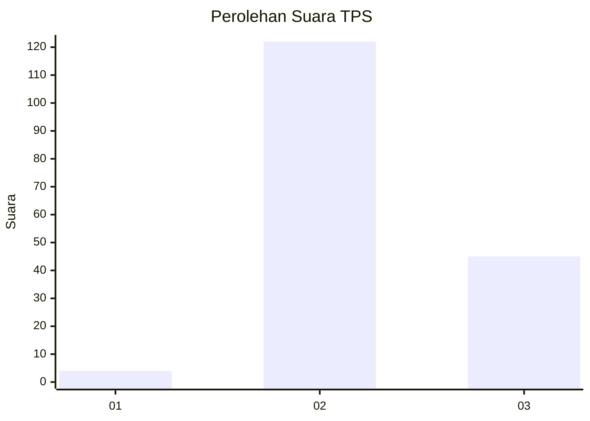
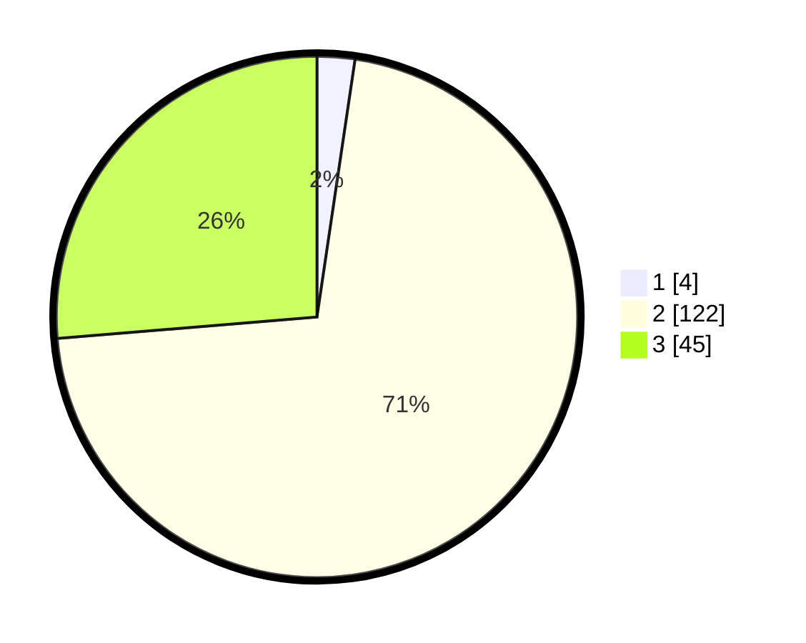

# Hasil

## Grafik

## Tabel

| No. | Nama Paslon    | Suara | Suara (raw) | Persentase |
|:--- |:-------------- | -----:| -----------:| ----------:|
| 1   | ANIES MUHAIMIN | 4     | [4][p-1]    | 2,34       |
| 2   | PRABOWO GIBRAN | 122   | [122][p-2]  | 71,35      |
| 3   | GANJAR MAHFUD  | 45    | [45][p-3]   | 26,32      |

[p-1]: https://github.com/gigit-pemilu/pemilu-2024-51-bali/blob/main/pilpres/hitung-suara/sub/51-bali/sub/02-tabanan/sub/09-baturiti/sub/2006-baturiti/sub/007-tps/sub/paslon-1.txt
[p-2]: https://github.com/gigit-pemilu/pemilu-2024-51-bali/blob/main/pilpres/hitung-suara/sub/51-bali/sub/02-tabanan/sub/09-baturiti/sub/2006-baturiti/sub/007-tps/sub/paslon-2.txt
[p-3]: https://github.com/gigit-pemilu/pemilu-2024-51-bali/blob/main/pilpres/hitung-suara/sub/51-bali/sub/02-tabanan/sub/09-baturiti/sub/2006-baturiti/sub/007-tps/sub/paslon-3.txt

## Foto C Plano

https://sirekap-obj-formc.kpu.go.id/94c0/pemilu/ppwp/51/02/09/20/06/5102092006007-20240216-143642--d923af86-94d5-4690-8f45-480c1ac5cf88.jpg

https://sirekap-obj-formc.kpu.go.id/94c0/pemilu/ppwp/51/02/09/20/06/5102092006007-20240216-143644--57c05fc6-ff3f-4de1-8500-4b604afe5733.jpg

https://sirekap-obj-formc.kpu.go.id/94c0/pemilu/ppwp/51/02/09/20/06/5102092006007-20240216-143643--1ee945ca-cdc2-4fdc-a22f-de79cb37afe7.jpg

## Metadata

| Key        | Value               |
| ---------- | ------------------- |
| Time Stamp | 2024-02-21 16:00:00 |

## DATA PEMILIH TETAP

Jumlah pemilih dalam DPT: **209**.
 * L: **110**.
 * P: **99**.

## DATA PENGGUNA HAK PILIH

Jumlah pengguna hak pilih dalam DPT: **177**.
 * L: **95**.
 * P: **82**.

Jumlah pengguna hak pilih dalam DPTb: **0**.
 * L: **0**.
 * P: **0**.

Jumlah pengguna hak pilih dalam DPK: **0**.
 * L: **0**.
 * P: **0**.

Jumlah pengguna hak pilih: **177**.
 * L: **95**.
 * P: **82**.

## JUMLAH SUARA SAH DAN TIDAK SAH

JUMLAH SELURUH SUARA SAH: **171**.

JUMLAH SUARA TIDAK SAH: **6**.

JUMLAH SELURUH SUARA SAH DAN SUARA TIDAK SAH: **177**.

