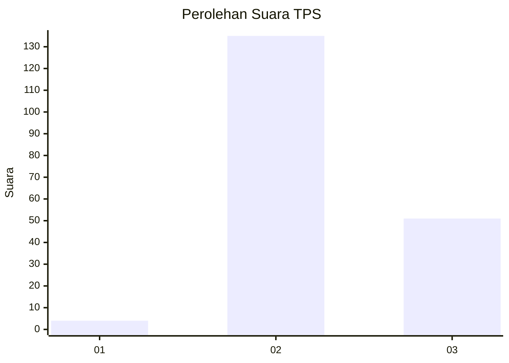
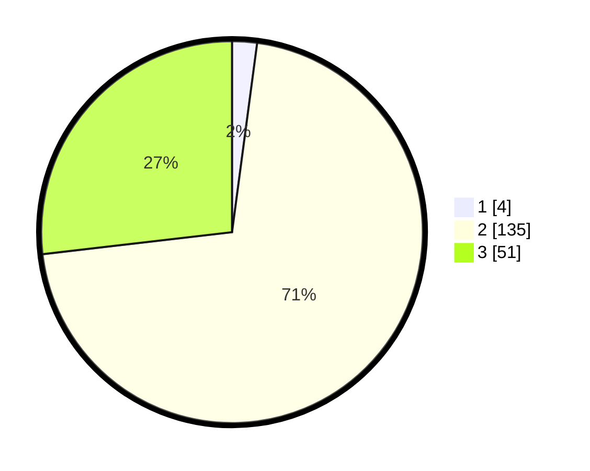

# Hasil

## Grafik

## Tabel

| No. | Nama Paslon    | Suara | Suara (raw) | Persentase |
|:--- |:-------------- | -----:| -----------:| ----------:|
| 1   | ANIES MUHAIMIN | 4     | [4][p-1]    | 2,11       |
| 2   | PRABOWO GIBRAN | 135   | [135][p-2]  | 71,05      |
| 3   | GANJAR MAHFUD  | 51    | [51][p-3]   | 26,84      |

[p-1]: https://github.com/gigit-pemilu/pemilu-2024-51-bali/blob/main/pilpres/hitung-suara/sub/51-bali/sub/02-tabanan/sub/09-baturiti/sub/2006-baturiti/sub/009-tps/sub/paslon-1.txt
[p-2]: https://github.com/gigit-pemilu/pemilu-2024-51-bali/blob/main/pilpres/hitung-suara/sub/51-bali/sub/02-tabanan/sub/09-baturiti/sub/2006-baturiti/sub/009-tps/sub/paslon-2.txt
[p-3]: https://github.com/gigit-pemilu/pemilu-2024-51-bali/blob/main/pilpres/hitung-suara/sub/51-bali/sub/02-tabanan/sub/09-baturiti/sub/2006-baturiti/sub/009-tps/sub/paslon-3.txt

## Foto C Plano

https://sirekap-obj-formc.kpu.go.id/aa12/pemilu/ppwp/51/02/09/20/06/5102092006009-20240216-153846--76993a1d-e744-4732-b213-5758b74fe0a7.jpg

https://sirekap-obj-formc.kpu.go.id/aa12/pemilu/ppwp/51/02/09/20/06/5102092006009-20240216-153847--8b747230-1961-41a3-aea4-7868fdaec7e2.jpg

https://sirekap-obj-formc.kpu.go.id/aa12/pemilu/ppwp/51/02/09/20/06/5102092006009-20240216-153846--51d3e229-c62f-43cb-ab4d-8bce1c119d03.jpg

## Metadata

| Key        | Value               |
| ---------- | ------------------- |
| Time Stamp | 2024-02-21 17:00:00 |

## DATA PEMILIH TETAP

Jumlah pemilih dalam DPT: **228**.
 * L: **113**.
 * P: **115**.

## DATA PENGGUNA HAK PILIH

Jumlah pengguna hak pilih dalam DPT: **193**.
 * L: **94**.
 * P: **99**.

Jumlah pengguna hak pilih dalam DPTb: **2**.
 * L: **2**.
 * P: **0**.

Jumlah pengguna hak pilih dalam DPK: **0**.
 * L: **0**.
 * P: **0**.

Jumlah pengguna hak pilih: **195**.
 * L: **96**.
 * P: **99**.

## JUMLAH SUARA SAH DAN TIDAK SAH

JUMLAH SELURUH SUARA SAH: **190**.

JUMLAH SUARA TIDAK SAH: **5**.

JUMLAH SELURUH SUARA SAH DAN SUARA TIDAK SAH: **195**.

