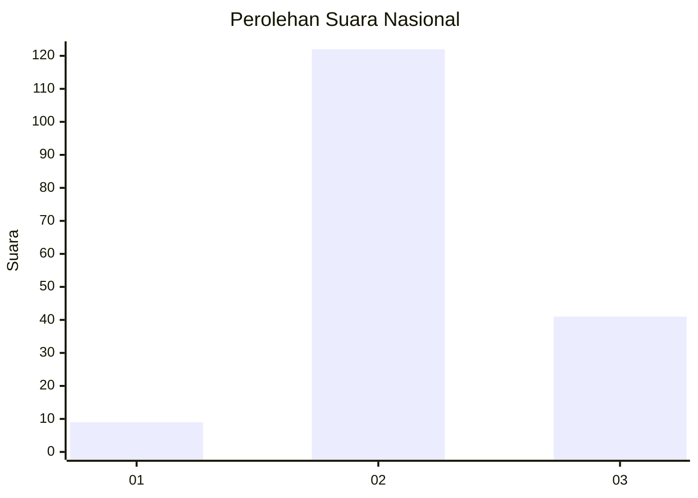
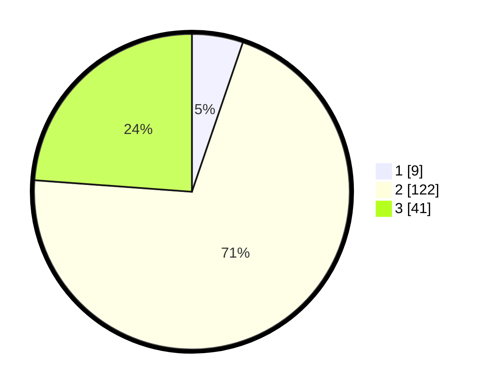

# Hasil

## Grafik

## Tabel

| No. | Nama Paslon    | Suara | Suara (raw) | Persentase |
|:--- |:-------------- | -----:| -----------:| ----------:|
| 1   | ANIES MUHAIMIN | 9     | [9][p-1]    | 5,23       |
| 2   | PRABOWO GIBRAN | 122   | [122][p-2]  | 70,93      |
| 3   | GANJAR MAHFUD  | 41    | [41][p-3]   | 23,84      |

[p-1]: https://github.com/gigit-pemilu/pemilu-2024/blob/main/pilpres/hitung-suara/sub/51-bali/sub/02-tabanan/sub/09-baturiti/sub/2006-baturiti/sub/010-tps/sub/paslon-1.txt
[p-2]: https://github.com/gigit-pemilu/pemilu-2024/blob/main/pilpres/hitung-suara/sub/51-bali/sub/02-tabanan/sub/09-baturiti/sub/2006-baturiti/sub/010-tps/sub/paslon-2.txt
[p-3]: https://github.com/gigit-pemilu/pemilu-2024/blob/main/pilpres/hitung-suara/sub/51-bali/sub/02-tabanan/sub/09-baturiti/sub/2006-baturiti/sub/010-tps/sub/paslon-3.txt

## Foto C Plano

https://sirekap-obj-formc.kpu.go.id/18b9/pemilu/ppwp/51/02/09/20/06/5102092006010-20240216-142101--9438451c-ce58-457a-86df-19c97b81ddc6.jpg

https://sirekap-obj-formc.kpu.go.id/18b9/pemilu/ppwp/51/02/09/20/06/5102092006010-20240216-142102--00e5673a-8f8c-4503-ab30-d52040636efc.jpg

https://sirekap-obj-formc.kpu.go.id/18b9/pemilu/ppwp/51/02/09/20/06/5102092006010-20240216-142102--60579d49-d040-4cd9-998e-1dcdb6c55483.jpg

## Metadata

| Key        | Value               |
| ---------- | ------------------- |
| Time Stamp | 2024-02-21 10:00:00 |

## DATA PEMILIH TETAP

Jumlah pemilih dalam DPT: **225**.
 * L: **109**.
 * P: **116**.

## DATA PENGGUNA HAK PILIH

Jumlah pengguna hak pilih dalam DPT: **170**.
 * L: **86**.
 * P: **84**.

Jumlah pengguna hak pilih dalam DPTb: **0**.
 * L: **0**.
 * P: **0**.

Jumlah pengguna hak pilih dalam DPK: **2**.
 * L: **0**.
 * P: **2**.

Jumlah pengguna hak pilih: **172**.
 * L: **86**.
 * P: **86**.

## JUMLAH SUARA SAH DAN TIDAK SAH

JUMLAH SELURUH SUARA SAH: **172**.

JUMLAH SUARA TIDAK SAH: **0**.

JUMLAH SELURUH SUARA SAH DAN SUARA TIDAK SAH: **172**.

