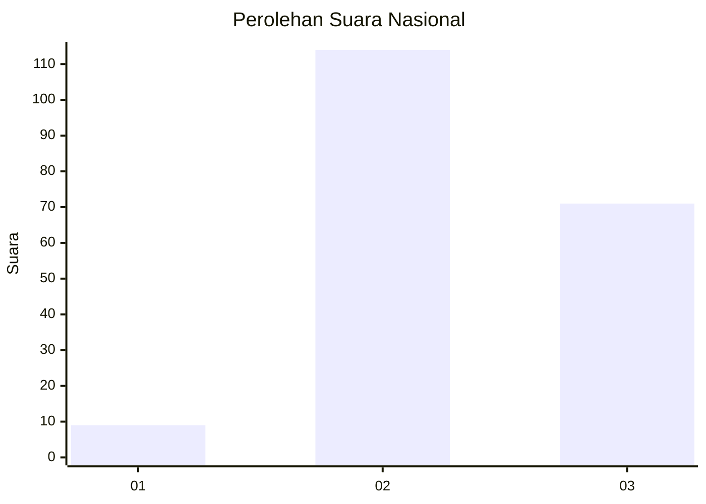
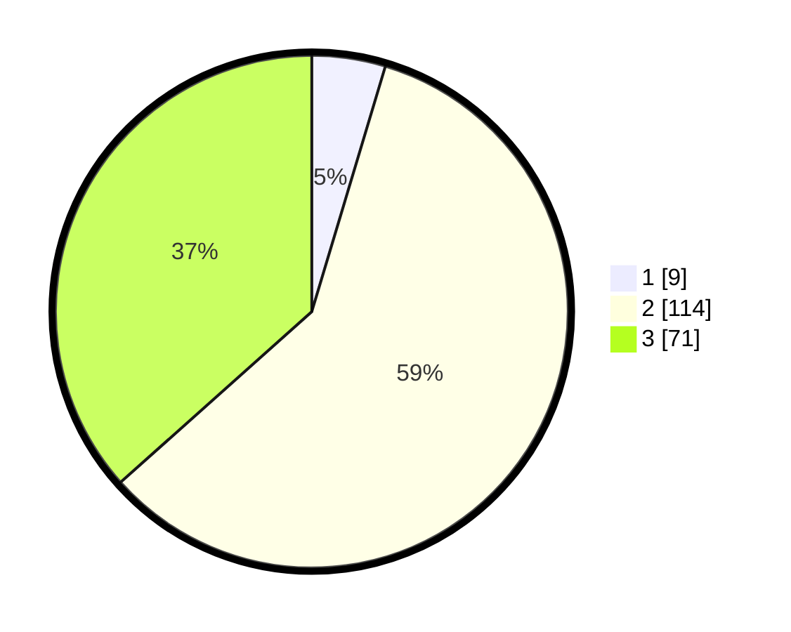

# Hasil

## Grafik

## Tabel

| No. | Nama Paslon    | Suara | Suara (raw) | Persentase |
|:--- |:-------------- | -----:| -----------:| ----------:|
| 1   | ANIES MUHAIMIN | 9     | [9][p-1]    | 4,64       |
| 2   | PRABOWO GIBRAN | 114   | [114][p-2]  | 58,76      |
| 3   | GANJAR MAHFUD  | 71    | [71][p-3]   | 36,60      |

[p-1]: https://github.com/gigit-pemilu/pemilu-2024/blob/main/pilpres/hitung-suara/sub/51-bali/sub/02-tabanan/sub/09-baturiti/sub/2006-baturiti/sub/012-tps/sub/paslon-1.txt
[p-2]: https://github.com/gigit-pemilu/pemilu-2024/blob/main/pilpres/hitung-suara/sub/51-bali/sub/02-tabanan/sub/09-baturiti/sub/2006-baturiti/sub/012-tps/sub/paslon-2.txt
[p-3]: https://github.com/gigit-pemilu/pemilu-2024/blob/main/pilpres/hitung-suara/sub/51-bali/sub/02-tabanan/sub/09-baturiti/sub/2006-baturiti/sub/012-tps/sub/paslon-3.txt

## Foto C Plano

https://sirekap-obj-formc.kpu.go.id/0627/pemilu/ppwp/51/02/09/20/06/5102092006012-20240216-141520--d902e219-f49d-4a4f-a17d-84dc9c0f0b1d.jpg

https://sirekap-obj-formc.kpu.go.id/0627/pemilu/ppwp/51/02/09/20/06/5102092006012-20240216-141522--6744ce3e-b068-41ff-8395-ff84e1d20aff.jpg

https://sirekap-obj-formc.kpu.go.id/0627/pemilu/ppwp/51/02/09/20/06/5102092006012-20240216-141521--41154313-fe1a-4b36-a0ba-fd6a87d0e7b0.jpg

## Metadata

| Key        | Value               |
| ---------- | ------------------- |
| Time Stamp | 2024-02-21 20:00:00 |

## DATA PEMILIH TETAP

Jumlah pemilih dalam DPT: **235**.
 * L: **119**.
 * P: **116**.

## DATA PENGGUNA HAK PILIH

Jumlah pengguna hak pilih dalam DPT: **193**.
 * L: **100**.
 * P: **93**.

Jumlah pengguna hak pilih dalam DPTb: **0**.
 * L: **0**.
 * P: **0**.

Jumlah pengguna hak pilih dalam DPK: **2**.
 * L: **1**.
 * P: **1**.

Jumlah pengguna hak pilih: **195**.
 * L: **101**.
 * P: **94**.

## JUMLAH SUARA SAH DAN TIDAK SAH

JUMLAH SELURUH SUARA SAH: **194**.

JUMLAH SUARA TIDAK SAH: **1**.

JUMLAH SELURUH SUARA SAH DAN SUARA TIDAK SAH: **195**.

