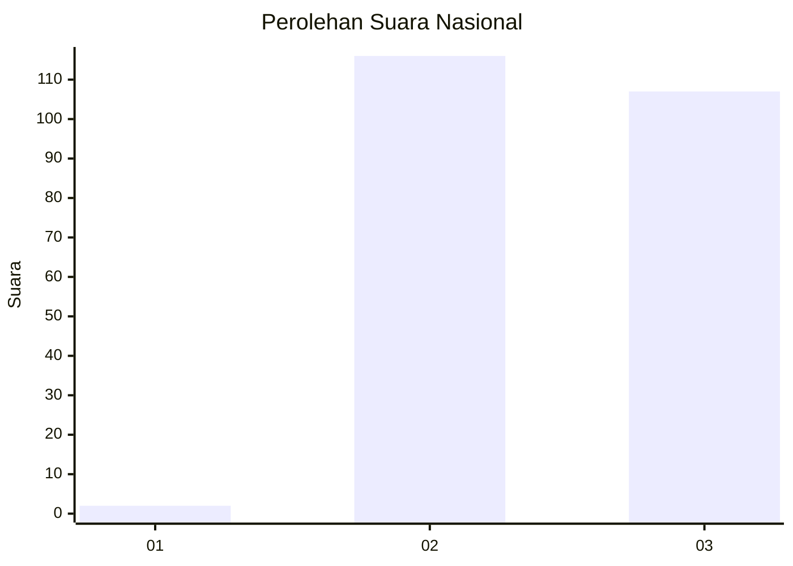
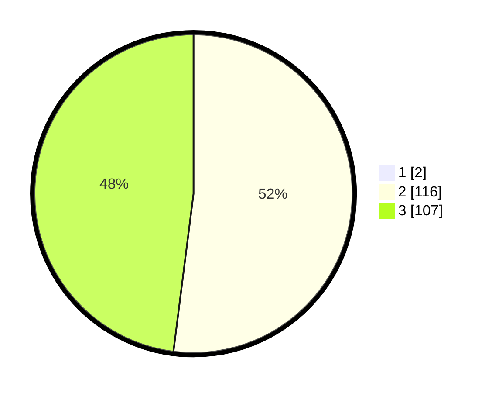

# Hasil

## Grafik

## Tabel

| No. | Nama Paslon    | Suara | Suara (raw) | Persentase |
|:--- |:-------------- | -----:| -----------:| ----------:|
| 1   | ANIES MUHAIMIN | 2     | [2][p-1]    | 0,89       |
| 2   | PRABOWO GIBRAN | 116   | [116][p-2]  | 51,56      |
| 3   | GANJAR MAHFUD  | 107   | [107][p-3]  | 47,56      |

[p-1]: https://github.com/gigit-pemilu/pemilu-2024/blob/main/pilpres/hitung-suara/sub/51-bali/sub/02-tabanan/sub/09-baturiti/sub/2006-baturiti/sub/014-tps/sub/paslon-1.txt
[p-2]: https://github.com/gigit-pemilu/pemilu-2024/blob/main/pilpres/hitung-suara/sub/51-bali/sub/02-tabanan/sub/09-baturiti/sub/2006-baturiti/sub/014-tps/sub/paslon-2.txt
[p-3]: https://github.com/gigit-pemilu/pemilu-2024/blob/main/pilpres/hitung-suara/sub/51-bali/sub/02-tabanan/sub/09-baturiti/sub/2006-baturiti/sub/014-tps/sub/paslon-3.txt

## Foto C Plano

https://sirekap-obj-formc.kpu.go.id/670b/pemilu/ppwp/51/02/09/20/06/5102092006014-20240216-165142--080ae19e-c29b-4386-b67d-a42d87e9c6c8.jpg

https://sirekap-obj-formc.kpu.go.id/670b/pemilu/ppwp/51/02/09/20/06/5102092006014-20240216-165144--58fc32aa-67e4-4ecb-a22d-70b14767ea13.jpg

https://sirekap-obj-formc.kpu.go.id/670b/pemilu/ppwp/51/02/09/20/06/5102092006014-20240216-165143--abd771ff-5e63-4947-8e72-577f71e85ae3.jpg

## Metadata

| Key        | Value               |
| ---------- | ------------------- |
| Time Stamp | 2024-02-21 21:00:04 |

## DATA PEMILIH TETAP

Jumlah pemilih dalam DPT: **259**.
 * L: **131**.
 * P: **128**.

## DATA PENGGUNA HAK PILIH

Jumlah pengguna hak pilih dalam DPT: **214**.
 * L: **112**.
 * P: **102**.

Jumlah pengguna hak pilih dalam DPTb: **1**.
 * L: **0**.
 * P: **1**.

Jumlah pengguna hak pilih dalam DPK: **14**.
 * L: **5**.
 * P: **9**.

Jumlah pengguna hak pilih: **229**.
 * L: **117**.
 * P: **112**.

## JUMLAH SUARA SAH DAN TIDAK SAH

JUMLAH SELURUH SUARA SAH: **225**.

JUMLAH SUARA TIDAK SAH: **4**.

JUMLAH SELURUH SUARA SAH DAN SUARA TIDAK SAH: **229**.

