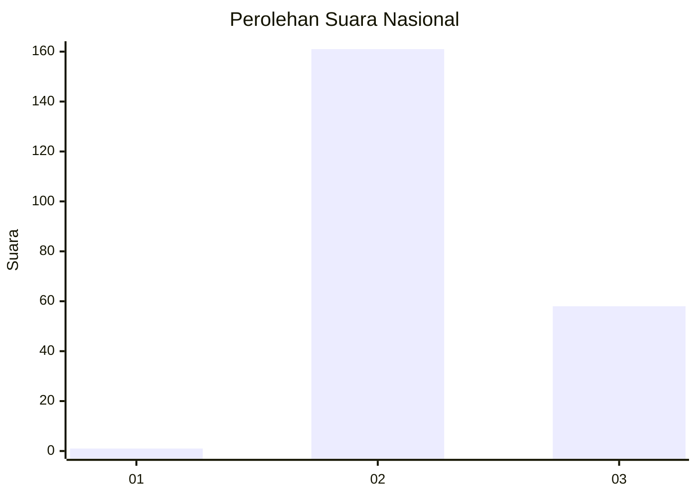
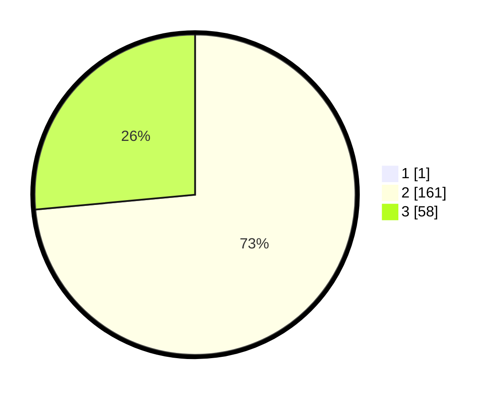

# Hasil

## Grafik

## Tabel

| No. | Nama Paslon    | Suara | Suara (raw) | Persentase |
|:--- |:-------------- | -----:| -----------:| ----------:|
| 1   | ANIES MUHAIMIN | 1     | [1][p-1]    | 0,45       |
| 2   | PRABOWO GIBRAN | 161   | [161][p-2]  | 73,18      |
| 3   | GANJAR MAHFUD  | 58    | [58][p-3]   | 26,36      |

[p-1]: https://github.com/gigit-pemilu/pemilu-2024/blob/main/pilpres/hitung-suara/sub/51-bali/sub/02-tabanan/sub/09-baturiti/sub/2006-baturiti/sub/019-tps/sub/paslon-1.txt
[p-2]: https://github.com/gigit-pemilu/pemilu-2024/blob/main/pilpres/hitung-suara/sub/51-bali/sub/02-tabanan/sub/09-baturiti/sub/2006-baturiti/sub/019-tps/sub/paslon-2.txt
[p-3]: https://github.com/gigit-pemilu/pemilu-2024/blob/main/pilpres/hitung-suara/sub/51-bali/sub/02-tabanan/sub/09-baturiti/sub/2006-baturiti/sub/019-tps/sub/paslon-3.txt

## Foto C Plano

https://sirekap-obj-formc.kpu.go.id/9c3e/pemilu/ppwp/51/02/09/20/06/5102092006019-20240216-121525--e152f9bb-e11d-4c33-b831-240a61c6ad9e.jpg

https://sirekap-obj-formc.kpu.go.id/9c3e/pemilu/ppwp/51/02/09/20/06/5102092006019-20240216-091301--10b1e7dc-97e2-41f9-a069-4a61802f7678.jpg

https://sirekap-obj-formc.kpu.go.id/9c3e/pemilu/ppwp/51/02/09/20/06/5102092006019-20240216-091254--665f0990-fde4-49ce-94df-3c8c5a286ca6.jpg

## Metadata

| Key        | Value               |
| ---------- | ------------------- |
| Time Stamp | 2024-02-21 21:00:04 |

## DATA PEMILIH TETAP

Jumlah pemilih dalam DPT: **223**.
 * L: **110**.
 * P: **113**.

## DATA PENGGUNA HAK PILIH

Jumlah pengguna hak pilih dalam DPT: **210**.
 * L: **101**.
 * P: **109**.

Jumlah pengguna hak pilih dalam DPTb: **0**.
 * L: **0**.
 * P: **0**.

Jumlah pengguna hak pilih dalam DPK: **11**.
 * L: **7**.
 * P: **4**.

Jumlah pengguna hak pilih: **221**.
 * L: **108**.
 * P: **113**.

## JUMLAH SUARA SAH DAN TIDAK SAH

JUMLAH SELURUH SUARA SAH: **220**.

JUMLAH SUARA TIDAK SAH: **1**.

JUMLAH SELURUH SUARA SAH DAN SUARA TIDAK SAH: **221**.

