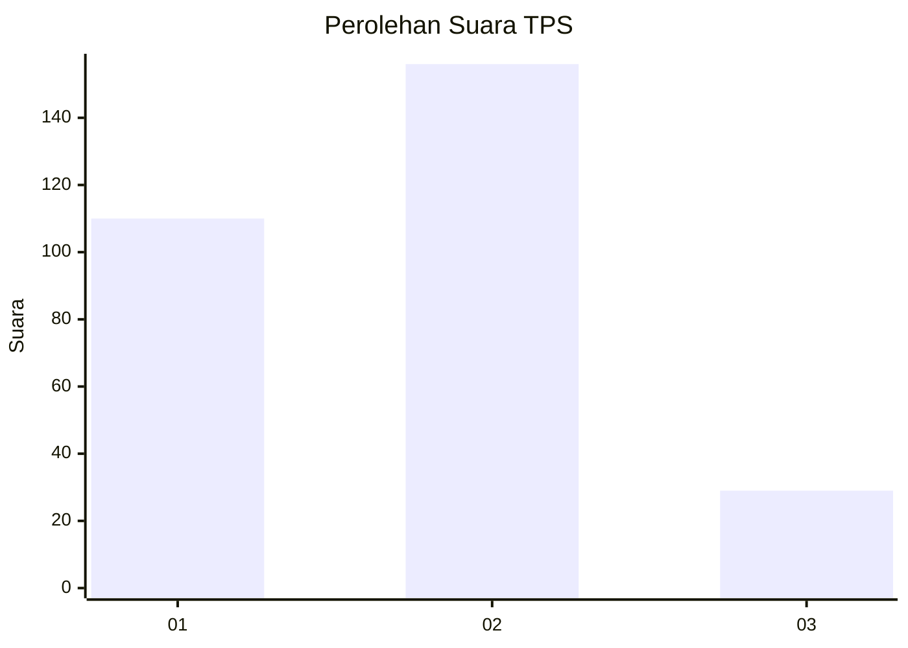

# Hasil

## Grafik

## Tabel

| No. | Nama Paslon    | Suara | Suara (raw) | Persentase |
|:--- |:-------------- | -----:| -----------:| ----------:|
| 1   | ANIES MUHAIMIN | 110   | [110][p-1]  | 37,29      |
| 2   | PRABOWO GIBRAN | 156   | [156][p-2]  | 52,88      |
| 3   | GANJAR MAHFUD  | 29    | [29][p-3]   | 9,83       |

[p-1]: https://github.com/gigit-pemilu/pemilu-2024-51-bali/blob/main/pilpres/hitung-suara/sub/51-bali/sub/02-tabanan/sub/09-baturiti/sub/2008-candikuning/sub/009-tps/sub/paslon-1.txt
[p-2]: https://github.com/gigit-pemilu/pemilu-2024-51-bali/blob/main/pilpres/hitung-suara/sub/51-bali/sub/02-tabanan/sub/09-baturiti/sub/2008-candikuning/sub/009-tps/sub/paslon-2.txt
[p-3]: https://github.com/gigit-pemilu/pemilu-2024-51-bali/blob/main/pilpres/hitung-suara/sub/51-bali/sub/02-tabanan/sub/09-baturiti/sub/2008-candikuning/sub/009-tps/sub/paslon-3.txt

## Foto C Plano

https://sirekap-obj-formc.kpu.go.id/162b/pemilu/ppwp/51/02/09/20/08/5102092008009-20240215-223422--79a29384-d0dc-40bf-8ef2-5f154431d6ca.jpg

https://sirekap-obj-formc.kpu.go.id/162b/pemilu/ppwp/51/02/09/20/08/5102092008009-20240215-223424--5d40d8da-84a3-4601-97bf-8e50f01da70b.jpg

https://sirekap-obj-formc.kpu.go.id/162b/pemilu/ppwp/51/02/09/20/08/5102092008009-20240215-223423--57ef98a3-9ded-4b97-8e55-d9e1cc974a11.jpg

## Metadata

| Key        | Value               |
| ---------- | ------------------- |
| Time Stamp | 2024-02-21 16:00:00 |

## DATA PEMILIH TETAP

Jumlah pemilih dalam DPT: **298**.
 * L: **144**.
 * P: **154**.

## DATA PENGGUNA HAK PILIH

Jumlah pengguna hak pilih dalam DPT: **298**.
 * L: **144**.
 * P: **154**.

Jumlah pengguna hak pilih dalam DPTb: **0**.
 * L: **0**.
 * P: **0**.

Jumlah pengguna hak pilih dalam DPK: **0**.
 * L: **0**.
 * P: **0**.

Jumlah pengguna hak pilih: **298**.
 * L: **144**.
 * P: **154**.

## JUMLAH SUARA SAH DAN TIDAK SAH

JUMLAH SELURUH SUARA SAH: **295**.

JUMLAH SUARA TIDAK SAH: **3**.

JUMLAH SELURUH SUARA SAH DAN SUARA TIDAK SAH: **298**.

