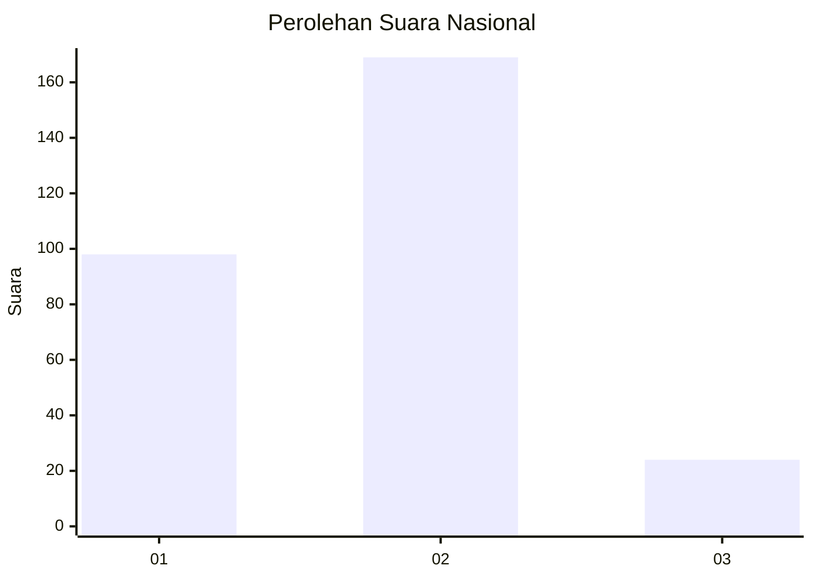
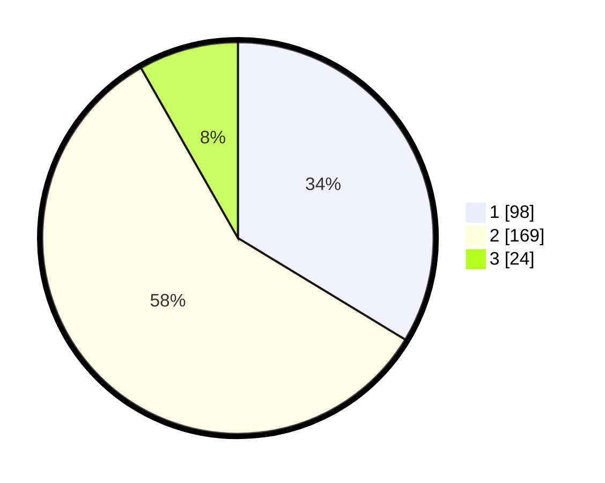

# Hasil

## Grafik

## Tabel

| No. | Nama Paslon    | Suara | Suara (raw) | Persentase |
|:--- |:-------------- | -----:| -----------:| ----------:|
| 1   | ANIES MUHAIMIN | 98    | [98][p-1]   | 33,68      |
| 2   | PRABOWO GIBRAN | 169   | [169][p-2]  | 58,08      |
| 3   | GANJAR MAHFUD  | 24    | [24][p-3]   | 8,25       |

[p-1]: https://github.com/gigit-pemilu/pemilu-2024/blob/main/pilpres/hitung-suara/sub/51-bali/sub/02-tabanan/sub/09-baturiti/sub/2008-candikuning/sub/013-tps/sub/paslon-1.txt
[p-2]: https://github.com/gigit-pemilu/pemilu-2024/blob/main/pilpres/hitung-suara/sub/51-bali/sub/02-tabanan/sub/09-baturiti/sub/2008-candikuning/sub/013-tps/sub/paslon-2.txt
[p-3]: https://github.com/gigit-pemilu/pemilu-2024/blob/main/pilpres/hitung-suara/sub/51-bali/sub/02-tabanan/sub/09-baturiti/sub/2008-candikuning/sub/013-tps/sub/paslon-3.txt

## Foto C Plano

https://sirekap-obj-formc.kpu.go.id/7224/pemilu/ppwp/51/02/09/20/08/5102092008013-20240216-035733--287b1619-d6fb-42bf-b645-165884adb217.jpg

https://sirekap-obj-formc.kpu.go.id/7224/pemilu/ppwp/51/02/09/20/08/5102092008013-20240216-035734--8e9884ea-3686-4b91-9ec0-81e7a359976b.jpg

https://sirekap-obj-formc.kpu.go.id/7224/pemilu/ppwp/51/02/09/20/08/5102092008013-20240216-035733--7c0b224d-1eda-4217-970f-04acffff97ee.jpg

## Metadata

| Key        | Value               |
| ---------- | ------------------- |
| Time Stamp | 2024-02-21 21:00:04 |

## DATA PEMILIH TETAP

Jumlah pemilih dalam DPT: **293**.
 * L: **156**.
 * P: **137**.

## DATA PENGGUNA HAK PILIH

Jumlah pengguna hak pilih dalam DPT: **293**.
 * L: **156**.
 * P: **137**.

Jumlah pengguna hak pilih dalam DPTb: **0**.
 * L: **0**.
 * P: **0**.

Jumlah pengguna hak pilih dalam DPK: **1**.
 * L: **1**.
 * P: **0**.

Jumlah pengguna hak pilih: **294**.
 * L: **157**.
 * P: **137**.

## JUMLAH SUARA SAH DAN TIDAK SAH

JUMLAH SELURUH SUARA SAH: **291**.

JUMLAH SUARA TIDAK SAH: **3**.

JUMLAH SELURUH SUARA SAH DAN SUARA TIDAK SAH: **294**.

