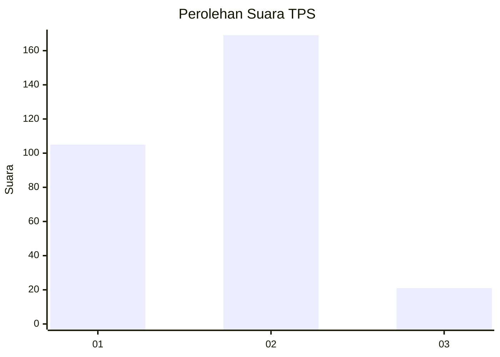
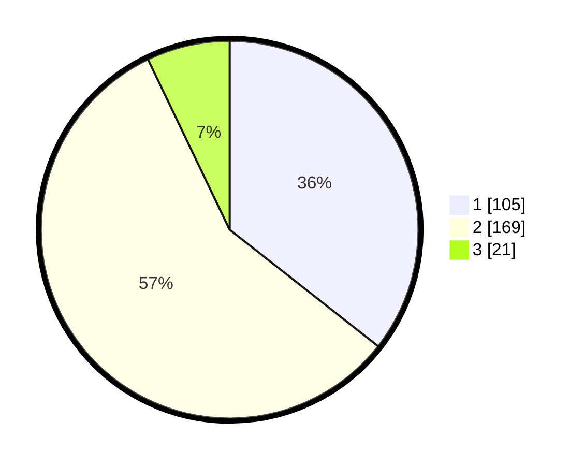

# Hasil

## Grafik

## Tabel

| No. | Nama Paslon    | Suara | Suara (raw) | Persentase |
|:--- |:-------------- | -----:| -----------:| ----------:|
| 1   | ANIES MUHAIMIN | 105   | [105][p-1]  | 35,59      |
| 2   | PRABOWO GIBRAN | 169   | [169][p-2]  | 57,29      |
| 3   | GANJAR MAHFUD  | 21    | [21][p-3]   | 7,12       |

[p-1]: https://github.com/gigit-pemilu/pemilu-2024-51-bali/blob/main/pilpres/hitung-suara/sub/51-bali/sub/02-tabanan/sub/09-baturiti/sub/2008-candikuning/sub/014-tps/sub/paslon-1.txt
[p-2]: https://github.com/gigit-pemilu/pemilu-2024-51-bali/blob/main/pilpres/hitung-suara/sub/51-bali/sub/02-tabanan/sub/09-baturiti/sub/2008-candikuning/sub/014-tps/sub/paslon-2.txt
[p-3]: https://github.com/gigit-pemilu/pemilu-2024-51-bali/blob/main/pilpres/hitung-suara/sub/51-bali/sub/02-tabanan/sub/09-baturiti/sub/2008-candikuning/sub/014-tps/sub/paslon-3.txt

## Foto C Plano

https://sirekap-obj-formc.kpu.go.id/8873/pemilu/ppwp/51/02/09/20/08/5102092008014-20240216-020803--8889d0ce-c708-4761-9d59-ce753400c296.jpg

https://sirekap-obj-formc.kpu.go.id/8873/pemilu/ppwp/51/02/09/20/08/5102092008014-20240216-021213--c94c08b1-03f2-42c7-9392-a61af1005f88.jpg

https://sirekap-obj-formc.kpu.go.id/8873/pemilu/ppwp/51/02/09/20/08/5102092008014-20240216-020807--d12e9ead-39cc-4a0d-9c10-963f05ee0468.jpg

## Metadata

| Key        | Value               |
| ---------- | ------------------- |
| Time Stamp | 2024-02-21 12:00:00 |

## DATA PEMILIH TETAP

Jumlah pemilih dalam DPT: **297**.
 * L: **148**.
 * P: **149**.

## DATA PENGGUNA HAK PILIH

Jumlah pengguna hak pilih dalam DPT: **297**.
 * L: **148**.
 * P: **149**.

Jumlah pengguna hak pilih dalam DPTb: **0**.
 * L: **0**.
 * P: **0**.

Jumlah pengguna hak pilih dalam DPK: **0**.
 * L: **0**.
 * P: **0**.

Jumlah pengguna hak pilih: **297**.
 * L: **148**.
 * P: **149**.

## JUMLAH SUARA SAH DAN TIDAK SAH

JUMLAH SELURUH SUARA SAH: **295**.

JUMLAH SUARA TIDAK SAH: **2**.

JUMLAH SELURUH SUARA SAH DAN SUARA TIDAK SAH: **297**.

