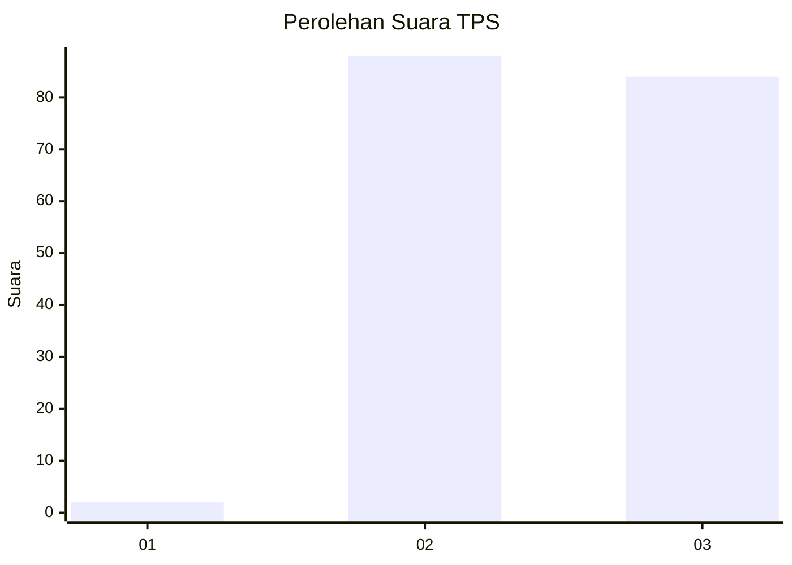
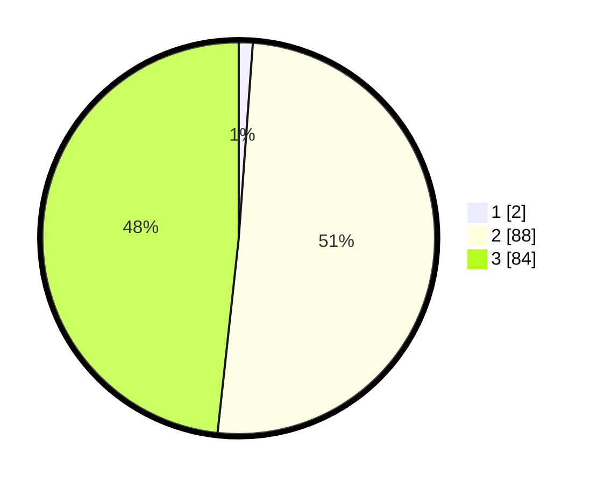

# Hasil

## Grafik

## Tabel

| No. | Nama Paslon    | Suara | Suara (raw) | Persentase |
|:--- |:-------------- | -----:| -----------:| ----------:|
| 1   | ANIES MUHAIMIN | 2     | [2][p-1]    | 1,15       |
| 2   | PRABOWO GIBRAN | 88    | [88][p-2]   | 50,57      |
| 3   | GANJAR MAHFUD  | 84    | [84][p-3]   | 48,28      |

[p-1]: https://github.com/gigit-pemilu/pemilu-2024-51-bali/blob/main/pilpres/hitung-suara/sub/51-bali/sub/02-tabanan/sub/09-baturiti/sub/2008-candikuning/sub/015-tps/sub/paslon-1.txt
[p-2]: https://github.com/gigit-pemilu/pemilu-2024-51-bali/blob/main/pilpres/hitung-suara/sub/51-bali/sub/02-tabanan/sub/09-baturiti/sub/2008-candikuning/sub/015-tps/sub/paslon-2.txt
[p-3]: https://github.com/gigit-pemilu/pemilu-2024-51-bali/blob/main/pilpres/hitung-suara/sub/51-bali/sub/02-tabanan/sub/09-baturiti/sub/2008-candikuning/sub/015-tps/sub/paslon-3.txt

## Foto C Plano

https://sirekap-obj-formc.kpu.go.id/bbca/pemilu/ppwp/51/02/09/20/08/5102092008015-20240215-221704--e0a6c755-2575-4872-a471-5d82f55f804b.jpg

https://sirekap-obj-formc.kpu.go.id/bbca/pemilu/ppwp/51/02/09/20/08/5102092008015-20240215-221705--14d0181a-379c-45bc-ad91-98caaa011dad.jpg

https://sirekap-obj-formc.kpu.go.id/bbca/pemilu/ppwp/51/02/09/20/08/5102092008015-20240215-221705--20f8b581-d6b5-4a80-97bc-ebb9e9740969.jpg

## Metadata

| Key        | Value               |
| ---------- | ------------------- |
| Time Stamp | 2024-02-21 09:00:00 |

## DATA PEMILIH TETAP

Jumlah pemilih dalam DPT: **211**.
 * L: **102**.
 * P: **109**.

## DATA PENGGUNA HAK PILIH

Jumlah pengguna hak pilih dalam DPT: **172**.
 * L: **82**.
 * P: **90**.

Jumlah pengguna hak pilih dalam DPTb: **0**.
 * L: **0**.
 * P: **0**.

Jumlah pengguna hak pilih dalam DPK: **3**.
 * L: **2**.
 * P: **1**.

Jumlah pengguna hak pilih: **175**.
 * L: **84**.
 * P: **91**.

## JUMLAH SUARA SAH DAN TIDAK SAH

JUMLAH SELURUH SUARA SAH: **174**.

JUMLAH SUARA TIDAK SAH: **1**.

JUMLAH SELURUH SUARA SAH DAN SUARA TIDAK SAH: **175**.

