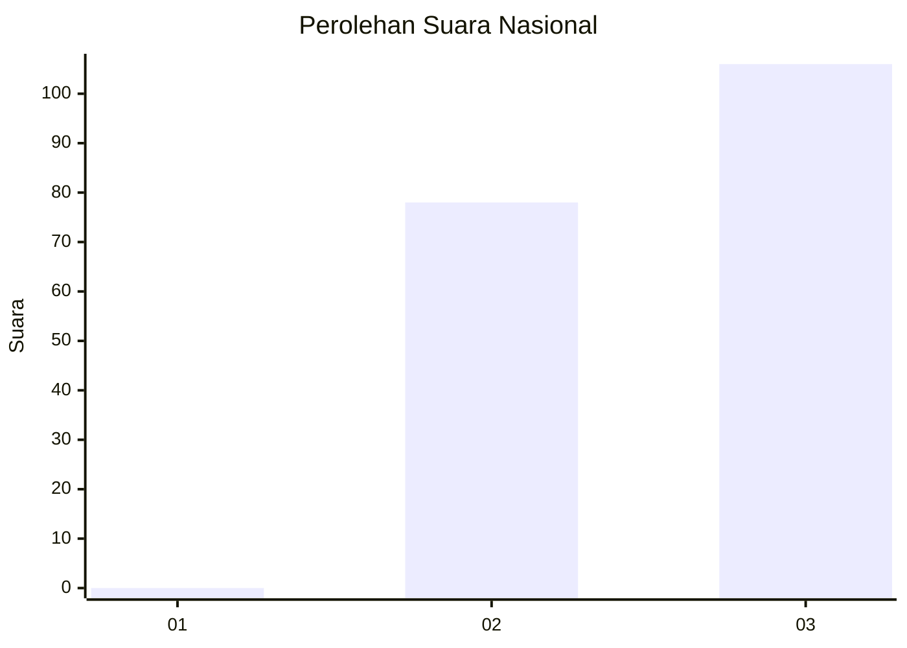
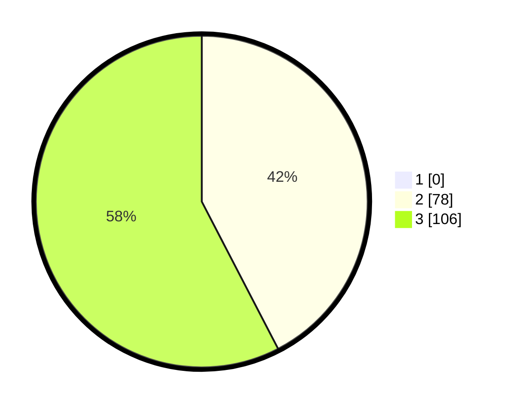

# Hasil

## Grafik

## Tabel

| No. | Nama Paslon    | Suara | Suara (raw) | Persentase |
|:--- |:-------------- | -----:| -----------:| ----------:|
| 1   | ANIES MUHAIMIN | 0     | [0][p-1]    | 0,00       |
| 2   | PRABOWO GIBRAN | 78    | [78][p-2]   | 42,39      |
| 3   | GANJAR MAHFUD  | 106   | [106][p-3]  | 57,61      |

[p-1]: https://github.com/gigit-pemilu/pemilu-2024/blob/main/pilpres/hitung-suara/sub/51-bali/sub/02-tabanan/sub/09-baturiti/sub/2008-candikuning/sub/017-tps/sub/paslon-1.txt
[p-2]: https://github.com/gigit-pemilu/pemilu-2024/blob/main/pilpres/hitung-suara/sub/51-bali/sub/02-tabanan/sub/09-baturiti/sub/2008-candikuning/sub/017-tps/sub/paslon-2.txt
[p-3]: https://github.com/gigit-pemilu/pemilu-2024/blob/main/pilpres/hitung-suara/sub/51-bali/sub/02-tabanan/sub/09-baturiti/sub/2008-candikuning/sub/017-tps/sub/paslon-3.txt

## Foto C Plano

https://sirekap-obj-formc.kpu.go.id/1191/pemilu/ppwp/51/02/09/20/08/5102092008017-20240216-035428--5a998767-076b-4f89-a7b0-2cc28d413795.jpg

https://sirekap-obj-formc.kpu.go.id/1191/pemilu/ppwp/51/02/09/20/08/5102092008017-20240216-035440--8447e377-6a97-4208-bb7c-621ede69fd44.jpg

https://sirekap-obj-formc.kpu.go.id/1191/pemilu/ppwp/51/02/09/20/08/5102092008017-20240216-040715--1852c90b-cec3-4a12-9722-fa42e65e1e50.jpg

## Metadata

| Key        | Value               |
| ---------- | ------------------- |
| Time Stamp | 2024-02-21 22:00:00 |

## DATA PEMILIH TETAP

Jumlah pemilih dalam DPT: **229**.
 * L: **119**.
 * P: **110**.

## DATA PENGGUNA HAK PILIH

Jumlah pengguna hak pilih dalam DPT: **190**.
 * L: **100**.
 * P: **90**.

Jumlah pengguna hak pilih dalam DPTb: **0**.
 * L: **2**.
 * P: **0**.

Jumlah pengguna hak pilih dalam DPK: **0**.
 * L: **0**.
 * P: **0**.

Jumlah pengguna hak pilih: **192**.
 * L: **102**.
 * P: **90**.

## JUMLAH SUARA SAH DAN TIDAK SAH

JUMLAH SELURUH SUARA SAH: **184**.

JUMLAH SUARA TIDAK SAH: **8**.

JUMLAH SELURUH SUARA SAH DAN SUARA TIDAK SAH: **192**.

