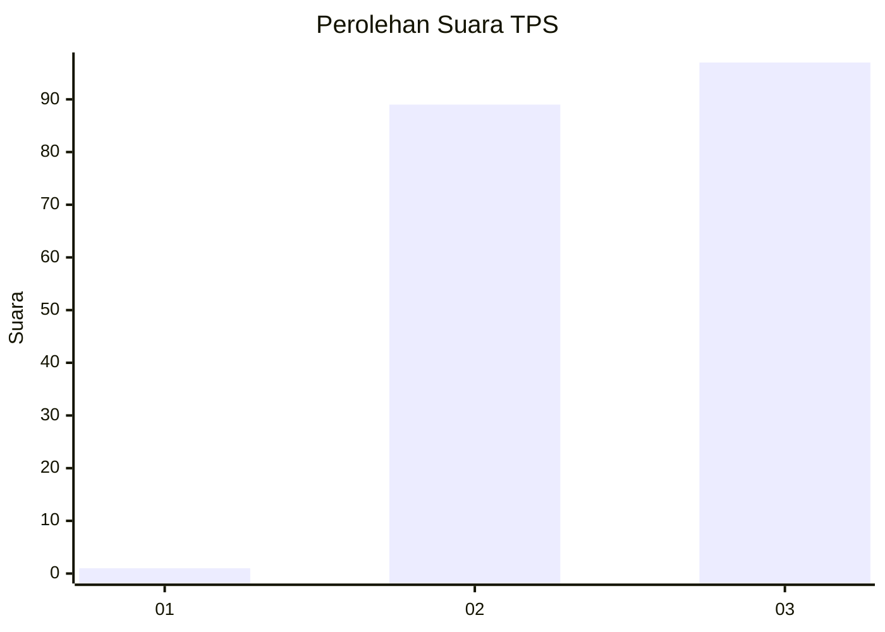
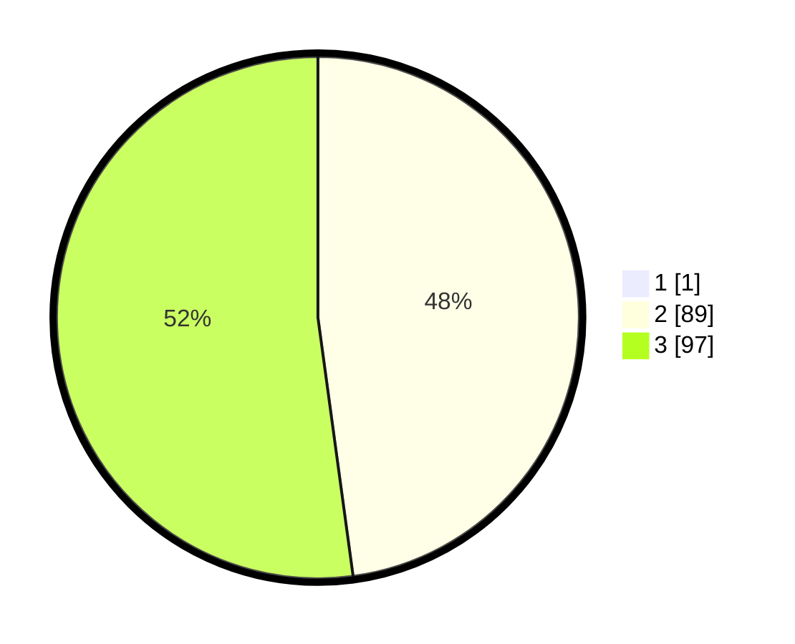

# Hasil

## Grafik

## Tabel

| No. | Nama Paslon    | Suara | Suara (raw) | Persentase |
|:--- |:-------------- | -----:| -----------:| ----------:|
| 1   | ANIES MUHAIMIN | 1     | [1][p-1]    | 0,53       |
| 2   | PRABOWO GIBRAN | 89    | [89][p-2]   | 47,59      |
| 3   | GANJAR MAHFUD  | 97    | [97][p-3]   | 51,87      |

[p-1]: https://github.com/gigit-pemilu/pemilu-2024-51-bali/blob/main/pilpres/hitung-suara/sub/51-bali/sub/02-tabanan/sub/09-baturiti/sub/2008-candikuning/sub/018-tps/sub/paslon-1.txt
[p-2]: https://github.com/gigit-pemilu/pemilu-2024-51-bali/blob/main/pilpres/hitung-suara/sub/51-bali/sub/02-tabanan/sub/09-baturiti/sub/2008-candikuning/sub/018-tps/sub/paslon-2.txt
[p-3]: https://github.com/gigit-pemilu/pemilu-2024-51-bali/blob/main/pilpres/hitung-suara/sub/51-bali/sub/02-tabanan/sub/09-baturiti/sub/2008-candikuning/sub/018-tps/sub/paslon-3.txt

## Foto C Plano

https://sirekap-obj-formc.kpu.go.id/1892/pemilu/ppwp/51/02/09/20/08/5102092008018-20240215-230649--0862fb8e-8daa-461d-a4f2-ccd2d2f1e454.jpg

https://sirekap-obj-formc.kpu.go.id/1892/pemilu/ppwp/51/02/09/20/08/5102092008018-20240215-230651--3d983721-2043-4831-9ea8-6751b59bd21c.jpg

https://sirekap-obj-formc.kpu.go.id/1892/pemilu/ppwp/51/02/09/20/08/5102092008018-20240215-230650--de7c10fd-9b84-4ffa-84bd-1b7b4be57f34.jpg

## Metadata

| Key        | Value               |
| ---------- | ------------------- |
| Time Stamp | 2024-02-21 20:00:00 |

## DATA PEMILIH TETAP

Jumlah pemilih dalam DPT: **216**.
 * L: **108**.
 * P: **108**.

## DATA PENGGUNA HAK PILIH

Jumlah pengguna hak pilih dalam DPT: **189**.
 * L: **100**.
 * P: **89**.

Jumlah pengguna hak pilih dalam DPTb: **1**.
 * L: **0**.
 * P: **1**.

Jumlah pengguna hak pilih dalam DPK: **0**.
 * L: **0**.
 * P: **0**.

Jumlah pengguna hak pilih: **190**.
 * L: **100**.
 * P: **90**.

## JUMLAH SUARA SAH DAN TIDAK SAH

JUMLAH SELURUH SUARA SAH: **187**.

JUMLAH SUARA TIDAK SAH: **3**.

JUMLAH SELURUH SUARA SAH DAN SUARA TIDAK SAH: **190**.

