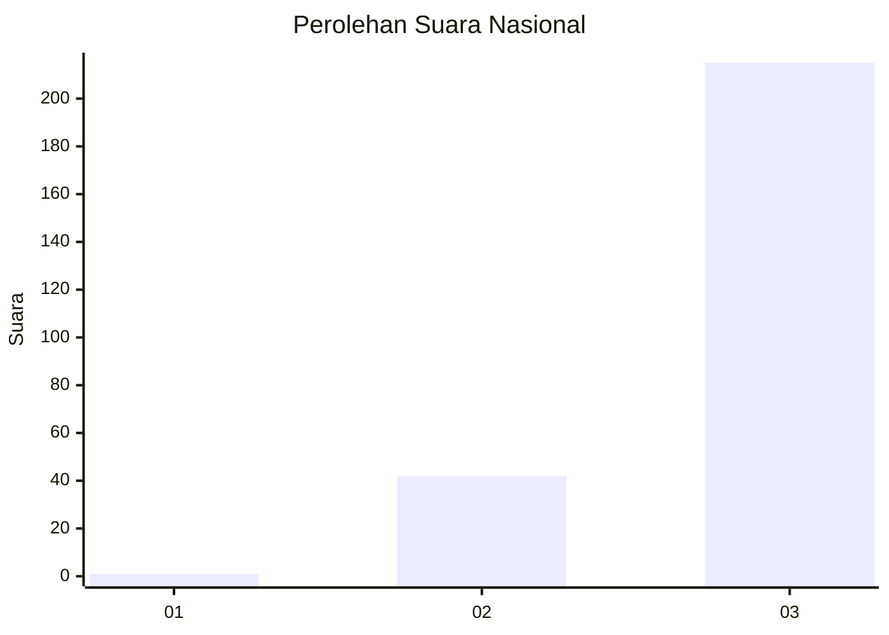
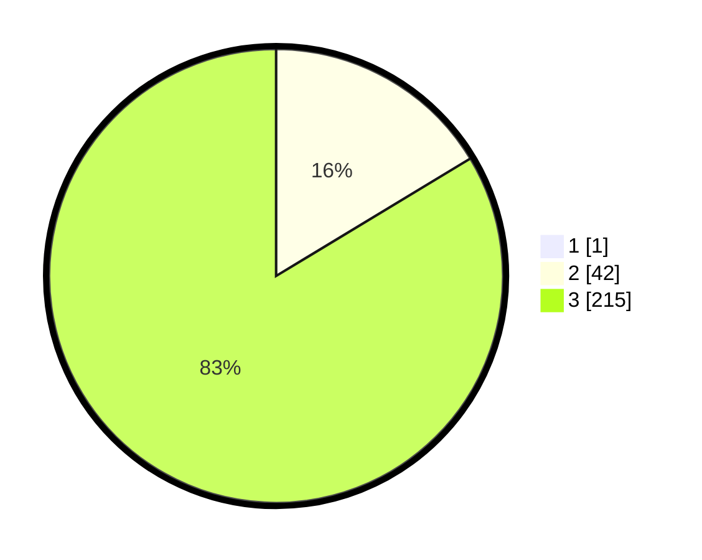

# Hasil

## Grafik

## Tabel

| No. | Nama Paslon    | Suara | Suara (raw) | Persentase |
|:--- |:-------------- | -----:| -----------:| ----------:|
| 1   | ANIES MUHAIMIN | 1     | [1][p-1]    | 0,39       |
| 2   | PRABOWO GIBRAN | 42    | [42][p-2]   | 16,28      |
| 3   | GANJAR MAHFUD  | 215   | [215][p-3]  | 83,33      |

[p-1]: https://github.com/gigit-pemilu/pemilu-2024/blob/main/pilpres/hitung-suara/sub/51-bali/sub/02-tabanan/sub/09-baturiti/sub/2008-candikuning/sub/024-tps/sub/paslon-1.txt
[p-2]: https://github.com/gigit-pemilu/pemilu-2024/blob/main/pilpres/hitung-suara/sub/51-bali/sub/02-tabanan/sub/09-baturiti/sub/2008-candikuning/sub/024-tps/sub/paslon-2.txt
[p-3]: https://github.com/gigit-pemilu/pemilu-2024/blob/main/pilpres/hitung-suara/sub/51-bali/sub/02-tabanan/sub/09-baturiti/sub/2008-candikuning/sub/024-tps/sub/paslon-3.txt

## Foto C Plano

https://sirekap-obj-formc.kpu.go.id/b621/pemilu/ppwp/51/02/09/20/08/5102092008024-20240215-210630--55ee0ce8-ed6a-47cb-9383-4e38f640d158.jpg

https://sirekap-obj-formc.kpu.go.id/b621/pemilu/ppwp/51/02/09/20/08/5102092008024-20240215-210632--45752581-6788-4f39-8ede-a2a1a1aef363.jpg

https://sirekap-obj-formc.kpu.go.id/b621/pemilu/ppwp/51/02/09/20/08/5102092008024-20240215-210631--bf93f0aa-8d4b-458a-ad55-c428bb384c5e.jpg

## Metadata

| Key        | Value               |
| ---------- | ------------------- |
| Time Stamp | 2024-02-21 21:00:04 |

## DATA PEMILIH TETAP

Jumlah pemilih dalam DPT: **275**.
 * L: **134**.
 * P: **141**.

## DATA PENGGUNA HAK PILIH

Jumlah pengguna hak pilih dalam DPT: **259**.
 * L: **126**.
 * P: **133**.

Jumlah pengguna hak pilih dalam DPTb: **2**.
 * L: **1**.
 * P: **1**.

Jumlah pengguna hak pilih dalam DPK: **0**.
 * L: **0**.
 * P: **0**.

Jumlah pengguna hak pilih: **261**.
 * L: **127**.
 * P: **134**.

## JUMLAH SUARA SAH DAN TIDAK SAH

JUMLAH SELURUH SUARA SAH: **258**.

JUMLAH SUARA TIDAK SAH: **3**.

JUMLAH SELURUH SUARA SAH DAN SUARA TIDAK SAH: **261**.

