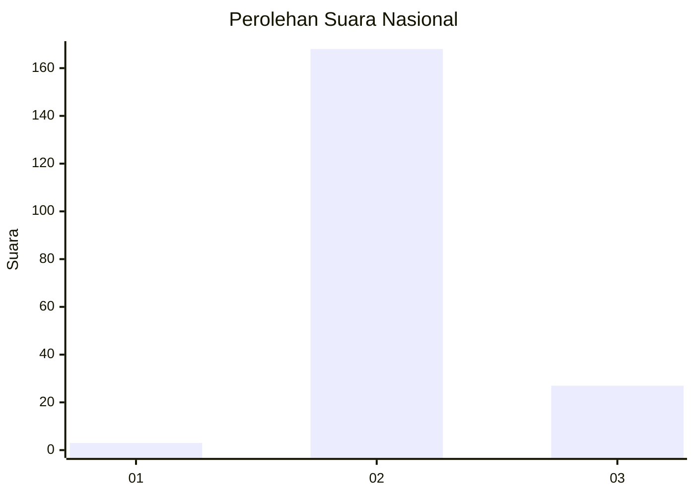
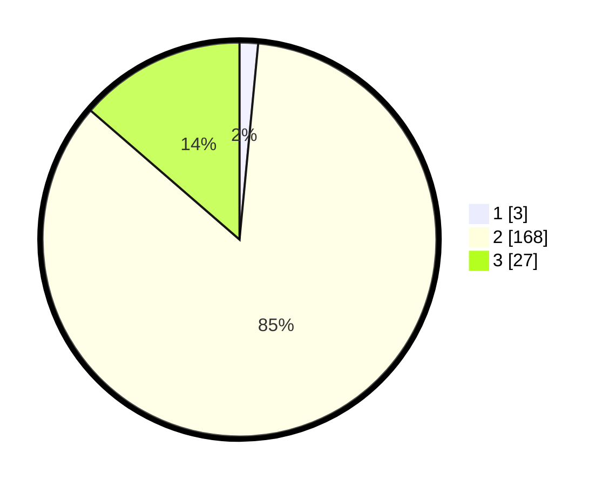

# Hasil

## Grafik

## Tabel

| No. | Nama Paslon    | Suara | Suara (raw) | Persentase |
|:--- |:-------------- | -----:| -----------:| ----------:|
| 1   | ANIES MUHAIMIN | 3     | [3][p-1]    | 1,52       |
| 2   | PRABOWO GIBRAN | 168   | [168][p-2]  | 84,85      |
| 3   | GANJAR MAHFUD  | 27    | [27][p-3]   | 13,64      |

[p-1]: https://github.com/gigit-pemilu/pemilu-2024/blob/main/pilpres/hitung-suara/sub/51-bali/sub/02-tabanan/sub/09-baturiti/sub/2009-mekarsari/sub/011-tps/sub/paslon-1.txt
[p-2]: https://github.com/gigit-pemilu/pemilu-2024/blob/main/pilpres/hitung-suara/sub/51-bali/sub/02-tabanan/sub/09-baturiti/sub/2009-mekarsari/sub/011-tps/sub/paslon-2.txt
[p-3]: https://github.com/gigit-pemilu/pemilu-2024/blob/main/pilpres/hitung-suara/sub/51-bali/sub/02-tabanan/sub/09-baturiti/sub/2009-mekarsari/sub/011-tps/sub/paslon-3.txt

## Foto C Plano

https://sirekap-obj-formc.kpu.go.id/1a91/pemilu/ppwp/51/02/09/20/09/5102092009011-20240217-010419--9e63e0c4-ad90-4ab7-a9e0-324647ceff38.jpg

https://sirekap-obj-formc.kpu.go.id/1a91/pemilu/ppwp/51/02/09/20/09/5102092009011-20240216-064325--153de7c4-3a3b-47ac-a6a7-916c20aafb63.jpg

https://sirekap-obj-formc.kpu.go.id/1a91/pemilu/ppwp/51/02/09/20/09/5102092009011-20240216-064324--10526da6-a703-4f8c-bd18-509f4d9bdcfd.jpg

## Metadata

| Key        | Value               |
| ---------- | ------------------- |
| Time Stamp | 2024-02-21 15:00:00 |

## DATA PEMILIH TETAP

Jumlah pemilih dalam DPT: **259**.
 * L: **131**.
 * P: **128**.

## DATA PENGGUNA HAK PILIH

Jumlah pengguna hak pilih dalam DPT: **218**.
 * L: **118**.
 * P: **100**.

Jumlah pengguna hak pilih dalam DPTb: **0**.
 * L: **0**.
 * P: **0**.

Jumlah pengguna hak pilih dalam DPK: **0**.
 * L: **0**.
 * P: **0**.

Jumlah pengguna hak pilih: **218**.
 * L: **118**.
 * P: **100**.

## JUMLAH SUARA SAH DAN TIDAK SAH

JUMLAH SELURUH SUARA SAH: **198**.

JUMLAH SUARA TIDAK SAH: **20**.

JUMLAH SELURUH SUARA SAH DAN SUARA TIDAK SAH: **218**.

