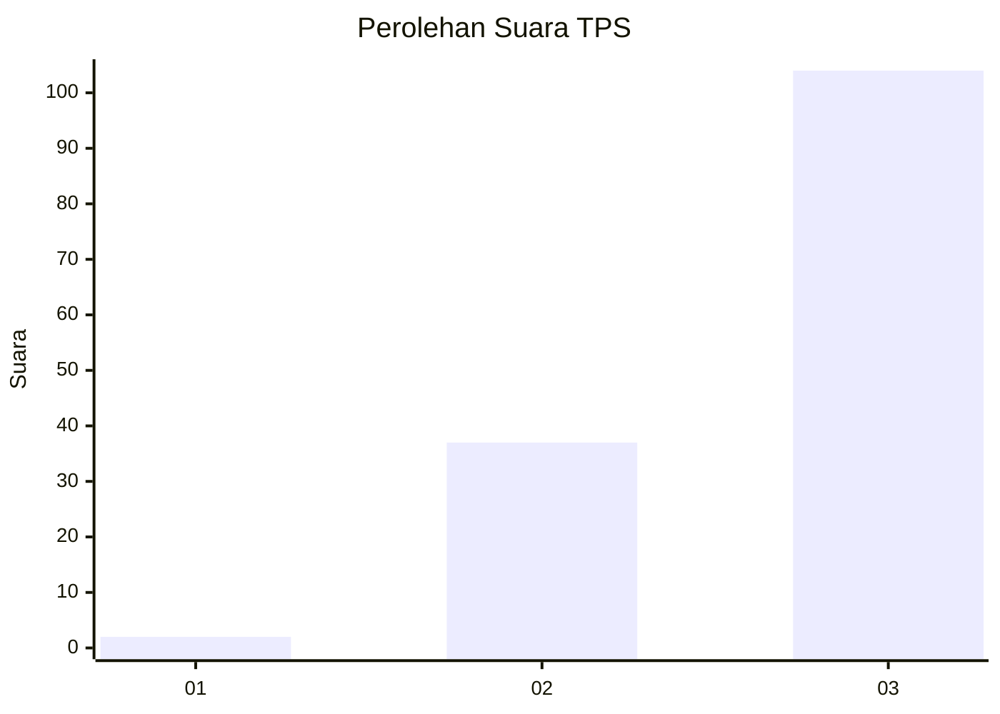
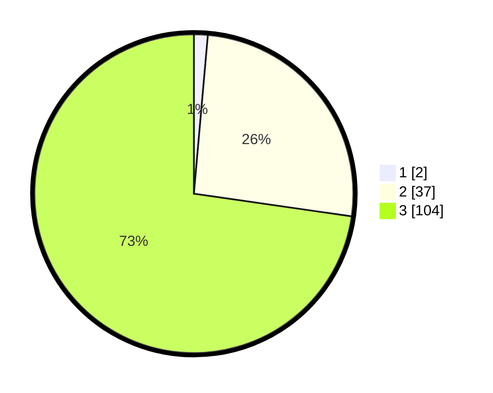

# Hasil

## Grafik

## Tabel

| No. | Nama Paslon    | Suara | Suara (raw) | Persentase |
|:--- |:-------------- | -----:| -----------:| ----------:|
| 1   | ANIES MUHAIMIN | 2     | [2][p-1]    | 1,40       |
| 2   | PRABOWO GIBRAN | 37    | [37][p-2]   | 25,87      |
| 3   | GANJAR MAHFUD  | 104   | [104][p-3]  | 72,73      |

[p-1]: https://github.com/gigit-pemilu/pemilu-2024-51-bali/blob/main/pilpres/hitung-suara/sub/51-bali/sub/02-tabanan/sub/09-baturiti/sub/2009-mekarsari/sub/015-tps/sub/paslon-1.txt
[p-2]: https://github.com/gigit-pemilu/pemilu-2024-51-bali/blob/main/pilpres/hitung-suara/sub/51-bali/sub/02-tabanan/sub/09-baturiti/sub/2009-mekarsari/sub/015-tps/sub/paslon-2.txt
[p-3]: https://github.com/gigit-pemilu/pemilu-2024-51-bali/blob/main/pilpres/hitung-suara/sub/51-bali/sub/02-tabanan/sub/09-baturiti/sub/2009-mekarsari/sub/015-tps/sub/paslon-3.txt

## Foto C Plano

https://sirekap-obj-formc.kpu.go.id/f7e1/pemilu/ppwp/51/02/09/20/09/5102092009015-20240216-185602--54424cdf-ab31-4e62-a3fa-8307fe6967a3.jpg

https://sirekap-obj-formc.kpu.go.id/f7e1/pemilu/ppwp/51/02/09/20/09/5102092009015-20240214-132422--eb75bfec-3a5f-48c5-bba3-324d4453dd74.jpg

https://sirekap-obj-formc.kpu.go.id/f7e1/pemilu/ppwp/51/02/09/20/09/5102092009015-20240216-185602--853e43b7-a3cb-4304-886a-47ff88fdef43.jpg

## Metadata

| Key        | Value               |
| ---------- | ------------------- |
| Time Stamp | 2024-02-16 21:01:00 |

## DATA PEMILIH TETAP

Jumlah pemilih dalam DPT: **181**.
 * L: **92**.
 * P: **89**.

## DATA PENGGUNA HAK PILIH

Jumlah pengguna hak pilih dalam DPT: **148**.
 * L: **81**.
 * P: **67**.

Jumlah pengguna hak pilih dalam DPTb: **0**.
 * L: **0**.
 * P: **0**.

Jumlah pengguna hak pilih dalam DPK: **2**.
 * L: **0**.
 * P: **2**.

Jumlah pengguna hak pilih: **150**.
 * L: **81**.
 * P: **69**.

## JUMLAH SUARA SAH DAN TIDAK SAH

JUMLAH SELURUH SUARA SAH: **143**.

JUMLAH SUARA TIDAK SAH: **7**.

JUMLAH SELURUH SUARA SAH DAN SUARA TIDAK SAH: **150**.

