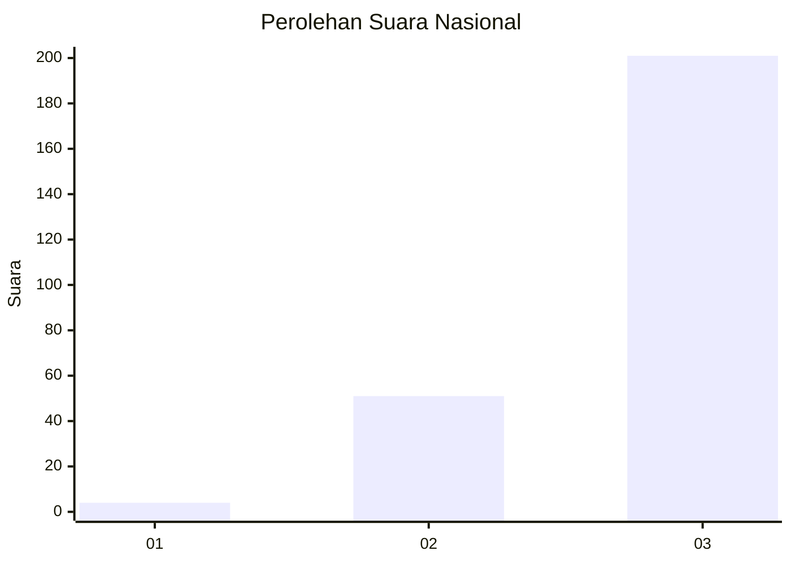
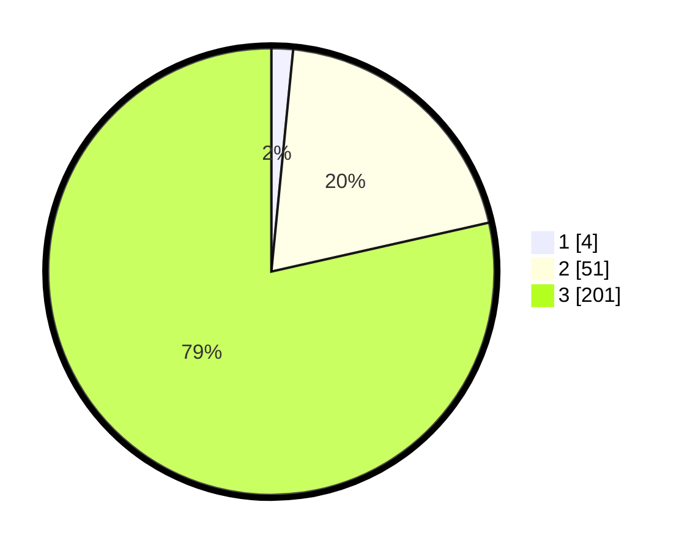

# Hasil

## Grafik

## Tabel

| No. | Nama Paslon    | Suara | Suara (raw) | Persentase |
|:--- |:-------------- | -----:| -----------:| ----------:|
| 1   | ANIES MUHAIMIN | 4     | [4][p-1]    | 1,56       |
| 2   | PRABOWO GIBRAN | 51    | [51][p-2]   | 19,92      |
| 3   | GANJAR MAHFUD  | 201   | [201][p-3]  | 78,52      |

[p-1]: https://github.com/gigit-pemilu/pemilu-2024/blob/main/pilpres/hitung-suara/sub/51-bali/sub/02-tabanan/sub/09-baturiti/sub/2010-batunya/sub/002-tps/sub/paslon-1.txt
[p-2]: https://github.com/gigit-pemilu/pemilu-2024/blob/main/pilpres/hitung-suara/sub/51-bali/sub/02-tabanan/sub/09-baturiti/sub/2010-batunya/sub/002-tps/sub/paslon-2.txt
[p-3]: https://github.com/gigit-pemilu/pemilu-2024/blob/main/pilpres/hitung-suara/sub/51-bali/sub/02-tabanan/sub/09-baturiti/sub/2010-batunya/sub/002-tps/sub/paslon-3.txt

## Foto C Plano

https://sirekap-obj-formc.kpu.go.id/4251/pemilu/ppwp/51/02/09/20/10/5102092010002-20240214-141216--dc3de6d6-e85d-4c66-adfb-6d997060cc89.jpg

https://sirekap-obj-formc.kpu.go.id/4251/pemilu/ppwp/51/02/09/20/10/5102092010002-20240214-141232--8a62f2a1-512a-4368-9a57-107db30b96be.jpg

https://sirekap-obj-formc.kpu.go.id/4251/pemilu/ppwp/51/02/09/20/10/5102092010002-20240214-141252--1fd08713-a1fe-4154-a6c6-3d51e658f553.jpg

## Metadata

| Key        | Value               |
| ---------- | ------------------- |
| Time Stamp | 2024-02-21 20:00:00 |

## DATA PEMILIH TETAP

Jumlah pemilih dalam DPT: **287**.
 * L: **147**.
 * P: **140**.

## DATA PENGGUNA HAK PILIH

Jumlah pengguna hak pilih dalam DPT: **258**.
 * L: **131**.
 * P: **127**.

Jumlah pengguna hak pilih dalam DPTb: **0**.
 * L: **0**.
 * P: **0**.

Jumlah pengguna hak pilih dalam DPK: **0**.
 * L: **0**.
 * P: **0**.

Jumlah pengguna hak pilih: **258**.
 * L: **131**.
 * P: **127**.

## JUMLAH SUARA SAH DAN TIDAK SAH

JUMLAH SELURUH SUARA SAH: **256**.

JUMLAH SUARA TIDAK SAH: **2**.

JUMLAH SELURUH SUARA SAH DAN SUARA TIDAK SAH: **258**.

