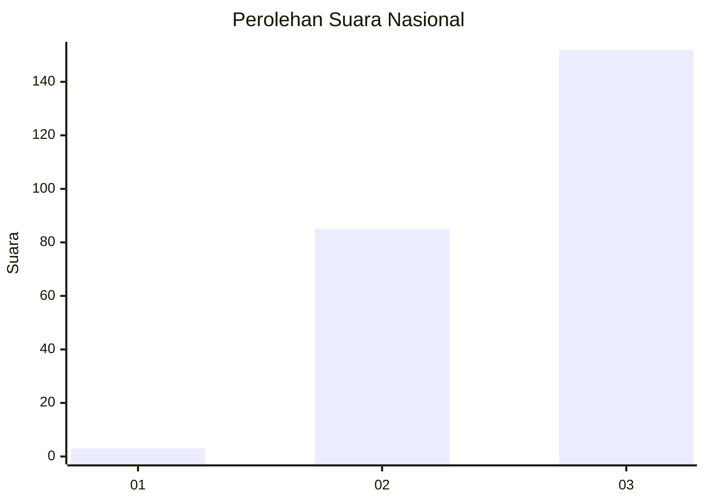
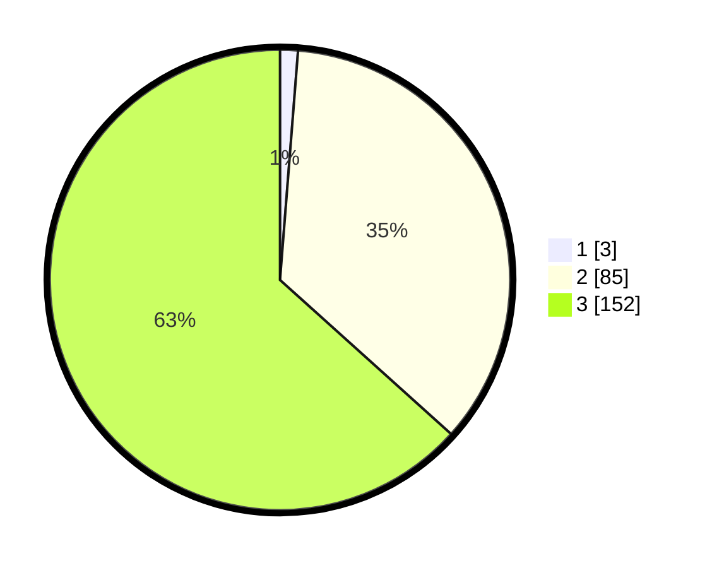

# Hasil

## Grafik

## Tabel

| No. | Nama Paslon    | Suara | Suara (raw) | Persentase |
|:--- |:-------------- | -----:| -----------:| ----------:|
| 1   | ANIES MUHAIMIN | 3     | [3][p-1]    | 1,25       |
| 2   | PRABOWO GIBRAN | 85    | [85][p-2]   | 35,42      |
| 3   | GANJAR MAHFUD  | 152   | [152][p-3]  | 63,33      |

[p-1]: https://github.com/gigit-pemilu/pemilu-2024/blob/main/pilpres/hitung-suara/sub/51-bali/sub/02-tabanan/sub/09-baturiti/sub/2010-batunya/sub/005-tps/sub/paslon-1.txt
[p-2]: https://github.com/gigit-pemilu/pemilu-2024/blob/main/pilpres/hitung-suara/sub/51-bali/sub/02-tabanan/sub/09-baturiti/sub/2010-batunya/sub/005-tps/sub/paslon-2.txt
[p-3]: https://github.com/gigit-pemilu/pemilu-2024/blob/main/pilpres/hitung-suara/sub/51-bali/sub/02-tabanan/sub/09-baturiti/sub/2010-batunya/sub/005-tps/sub/paslon-3.txt

## Foto C Plano

https://sirekap-obj-formc.kpu.go.id/98af/pemilu/ppwp/51/02/09/20/10/5102092010005-20240215-211922--53a18e36-baf9-4c48-b1ed-6bb9af4f1966.jpg

https://sirekap-obj-formc.kpu.go.id/98af/pemilu/ppwp/51/02/09/20/10/5102092010005-20240215-211925--d8b7efbe-21d7-4c8f-a1fb-c5106b90b8c4.jpg

https://sirekap-obj-formc.kpu.go.id/98af/pemilu/ppwp/51/02/09/20/10/5102092010005-20240215-213520--caf4a91e-d165-49a2-bf97-f36fac253458.jpg

## Metadata

| Key        | Value               |
| ---------- | ------------------- |
| Time Stamp | 2024-02-21 22:00:00 |

## DATA PEMILIH TETAP

Jumlah pemilih dalam DPT: **285**.
 * L: **151**.
 * P: **134**.

## DATA PENGGUNA HAK PILIH

Jumlah pengguna hak pilih dalam DPT: **244**.
 * L: **132**.
 * P: **112**.

Jumlah pengguna hak pilih dalam DPTb: **0**.
 * L: **0**.
 * P: **0**.

Jumlah pengguna hak pilih dalam DPK: **0**.
 * L: **0**.
 * P: **0**.

Jumlah pengguna hak pilih: **244**.
 * L: **132**.
 * P: **112**.

## JUMLAH SUARA SAH DAN TIDAK SAH

JUMLAH SELURUH SUARA SAH: **240**.

JUMLAH SUARA TIDAK SAH: **4**.

JUMLAH SELURUH SUARA SAH DAN SUARA TIDAK SAH: **244**.

