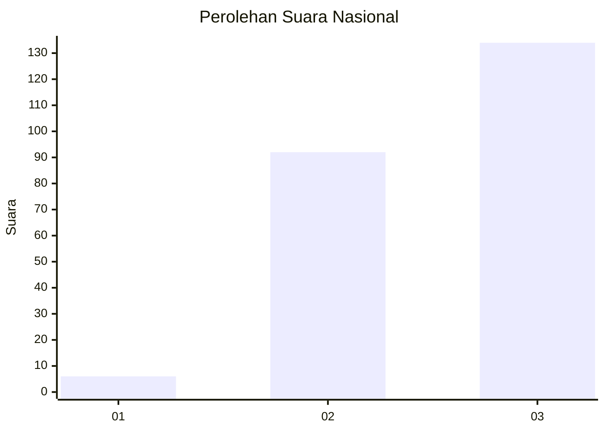
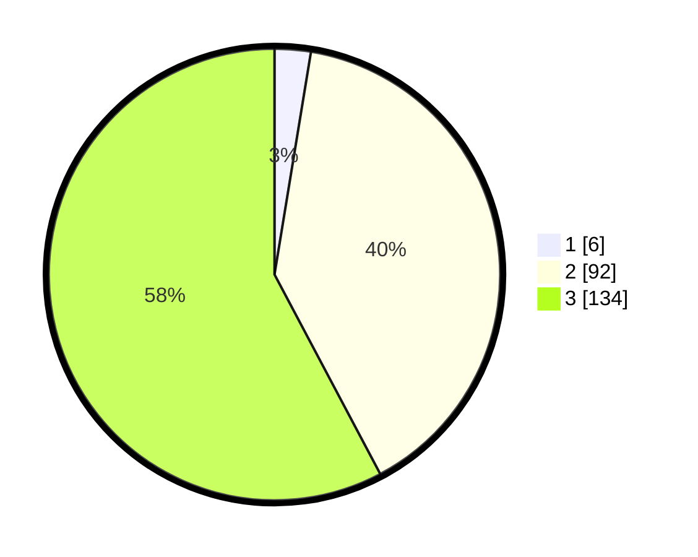

# Hasil

## Grafik

## Tabel

| No. | Nama Paslon    | Suara | Suara (raw) | Persentase |
|:--- |:-------------- | -----:| -----------:| ----------:|
| 1   | ANIES MUHAIMIN | 6     | [6][p-1]    | 2,59       |
| 2   | PRABOWO GIBRAN | 92    | [92][p-2]   | 39,66      |
| 3   | GANJAR MAHFUD  | 134   | [134][p-3]  | 57,76      |

[p-1]: https://github.com/gigit-pemilu/pemilu-2024/blob/main/pilpres/hitung-suara/sub/51-bali/sub/02-tabanan/sub/09-baturiti/sub/2011-perean-tengah/sub/005-tps/sub/paslon-1.txt
[p-2]: https://github.com/gigit-pemilu/pemilu-2024/blob/main/pilpres/hitung-suara/sub/51-bali/sub/02-tabanan/sub/09-baturiti/sub/2011-perean-tengah/sub/005-tps/sub/paslon-2.txt
[p-3]: https://github.com/gigit-pemilu/pemilu-2024/blob/main/pilpres/hitung-suara/sub/51-bali/sub/02-tabanan/sub/09-baturiti/sub/2011-perean-tengah/sub/005-tps/sub/paslon-3.txt

## Foto C Plano

https://sirekap-obj-formc.kpu.go.id/268f/pemilu/ppwp/51/02/09/20/11/5102092011005-20240216-134229--79f62991-df5c-4164-8448-687e2d8b2985.jpg

https://sirekap-obj-formc.kpu.go.id/268f/pemilu/ppwp/51/02/09/20/11/5102092011005-20240216-134231--a20fdf39-6916-4e99-8388-0657a74c9acd.jpg

https://sirekap-obj-formc.kpu.go.id/268f/pemilu/ppwp/51/02/09/20/11/5102092011005-20240216-134230--21a35bb4-4691-45a7-b550-b6fb0f009fff.jpg

## Metadata

| Key        | Value               |
| ---------- | ------------------- |
| Time Stamp | 2024-02-21 11:00:00 |

## DATA PEMILIH TETAP

Jumlah pemilih dalam DPT: **269**.
 * L: **126**.
 * P: **143**.

## DATA PENGGUNA HAK PILIH

Jumlah pengguna hak pilih dalam DPT: **237**.
 * L: **111**.
 * P: **126**.

Jumlah pengguna hak pilih dalam DPTb: **1**.
 * L: **0**.
 * P: **1**.

Jumlah pengguna hak pilih dalam DPK: **1**.
 * L: **0**.
 * P: **1**.

Jumlah pengguna hak pilih: **239**.
 * L: **111**.
 * P: **128**.

## JUMLAH SUARA SAH DAN TIDAK SAH

JUMLAH SELURUH SUARA SAH: **232**.

JUMLAH SUARA TIDAK SAH: **7**.

JUMLAH SELURUH SUARA SAH DAN SUARA TIDAK SAH: **239**.

