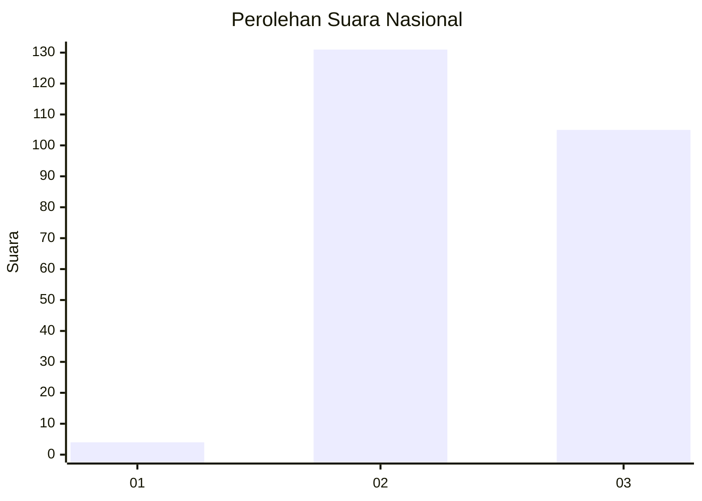
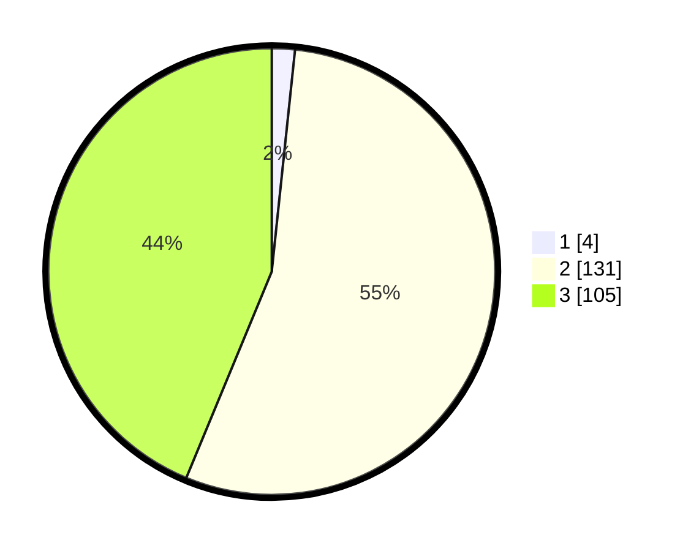

# Hasil

## Grafik

## Tabel

| No. | Nama Paslon    | Suara | Suara (raw) | Persentase |
|:--- |:-------------- | -----:| -----------:| ----------:|
| 1   | ANIES MUHAIMIN | 4     | [4][p-1]    | 1,67       |
| 2   | PRABOWO GIBRAN | 131   | [131][p-2]  | 54,58      |
| 3   | GANJAR MAHFUD  | 105   | [105][p-3]  | 43,75      |

[p-1]: https://github.com/gigit-pemilu/pemilu-2024/blob/main/pilpres/hitung-suara/sub/51-bali/sub/02-tabanan/sub/09-baturiti/sub/2012-perean-kangin/sub/002-tps/sub/paslon-1.txt
[p-2]: https://github.com/gigit-pemilu/pemilu-2024/blob/main/pilpres/hitung-suara/sub/51-bali/sub/02-tabanan/sub/09-baturiti/sub/2012-perean-kangin/sub/002-tps/sub/paslon-2.txt
[p-3]: https://github.com/gigit-pemilu/pemilu-2024/blob/main/pilpres/hitung-suara/sub/51-bali/sub/02-tabanan/sub/09-baturiti/sub/2012-perean-kangin/sub/002-tps/sub/paslon-3.txt

## Foto C Plano

https://sirekap-obj-formc.kpu.go.id/a65a/pemilu/ppwp/51/02/09/20/12/5102092012002-20240216-103001--5b40c94d-1d1f-48ab-96b0-3cdc539edbf5.jpg

https://sirekap-obj-formc.kpu.go.id/a65a/pemilu/ppwp/51/02/09/20/12/5102092012002-20240216-103003--327aba88-612e-48ab-ad5a-5eaa5fb74c58.jpg

https://sirekap-obj-formc.kpu.go.id/a65a/pemilu/ppwp/51/02/09/20/12/5102092012002-20240216-063834--add6734b-587f-4279-a3f3-a6bfeba6b155.jpg

## Metadata

| Key        | Value               |
| ---------- | ------------------- |
| Time Stamp | 2024-02-21 17:00:00 |

## DATA PEMILIH TETAP

Jumlah pemilih dalam DPT: **283**.
 * L: **143**.
 * P: **140**.

## DATA PENGGUNA HAK PILIH

Jumlah pengguna hak pilih dalam DPT: **242**.
 * L: **122**.
 * P: **120**.

Jumlah pengguna hak pilih dalam DPTb: **0**.
 * L: **0**.
 * P: **0**.

Jumlah pengguna hak pilih dalam DPK: **0**.
 * L: **0**.
 * P: **0**.

Jumlah pengguna hak pilih: **242**.
 * L: **122**.
 * P: **120**.

## JUMLAH SUARA SAH DAN TIDAK SAH

JUMLAH SELURUH SUARA SAH: **240**.

JUMLAH SUARA TIDAK SAH: **2**.

JUMLAH SELURUH SUARA SAH DAN SUARA TIDAK SAH: **242**.

