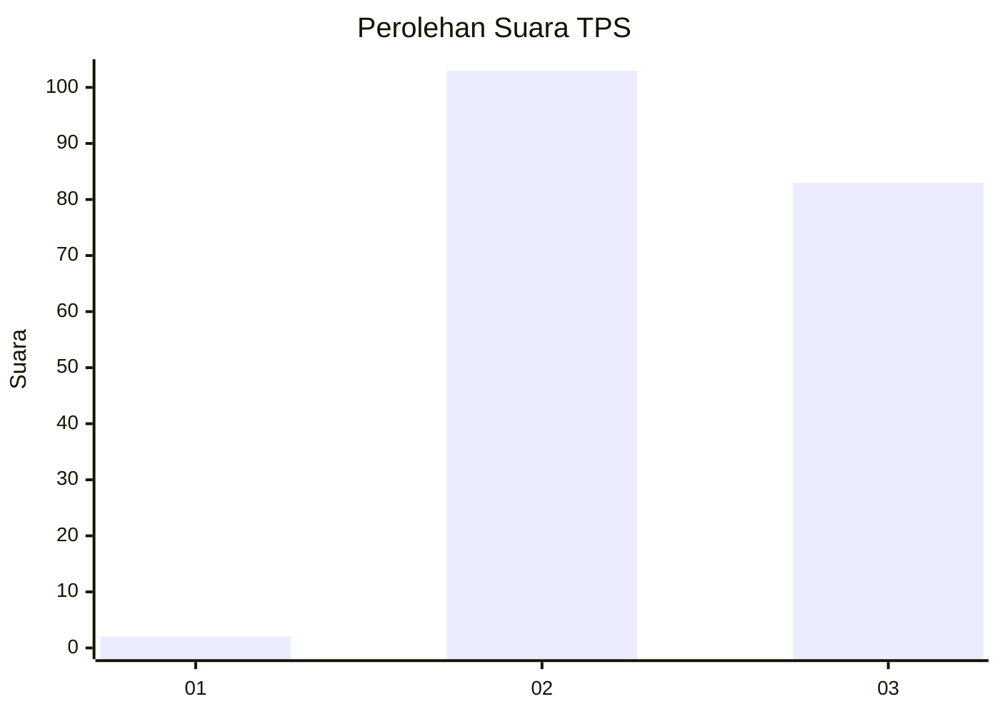
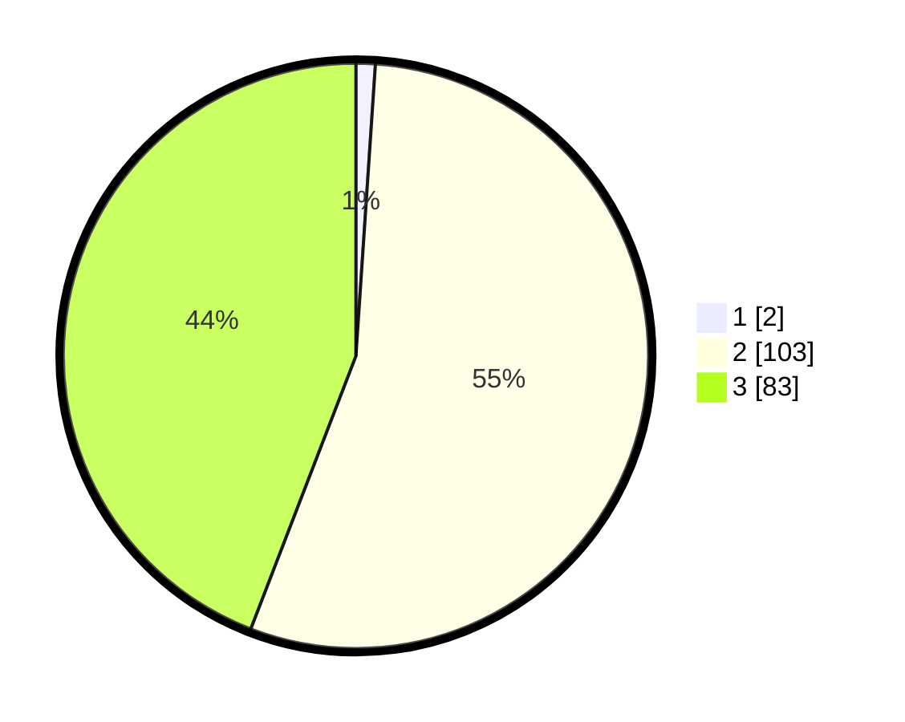

# Hasil

## Grafik

## Tabel

| No. | Nama Paslon    | Suara | Suara (raw) | Persentase |
|:--- |:-------------- | -----:| -----------:| ----------:|
| 1   | ANIES MUHAIMIN | 2     | [2][p-1]    | 1,06       |
| 2   | PRABOWO GIBRAN | 103   | [103][p-2]  | 54,79      |
| 3   | GANJAR MAHFUD  | 83    | [83][p-3]   | 44,15      |

[p-1]: https://github.com/gigit-pemilu/pemilu-2024-51-bali/blob/main/pilpres/hitung-suara/sub/51-bali/sub/02-tabanan/sub/09-baturiti/sub/2012-perean-kangin/sub/009-tps/sub/paslon-1.txt
[p-2]: https://github.com/gigit-pemilu/pemilu-2024-51-bali/blob/main/pilpres/hitung-suara/sub/51-bali/sub/02-tabanan/sub/09-baturiti/sub/2012-perean-kangin/sub/009-tps/sub/paslon-2.txt
[p-3]: https://github.com/gigit-pemilu/pemilu-2024-51-bali/blob/main/pilpres/hitung-suara/sub/51-bali/sub/02-tabanan/sub/09-baturiti/sub/2012-perean-kangin/sub/009-tps/sub/paslon-3.txt

## Foto C Plano

https://sirekap-obj-formc.kpu.go.id/08fa/pemilu/ppwp/51/02/09/20/12/5102092012009-20240215-101317--3c0ea206-19b2-4fb1-8176-7ae110904dc4.jpg

https://sirekap-obj-formc.kpu.go.id/08fa/pemilu/ppwp/51/02/09/20/12/5102092012009-20240215-101525--e7d45012-03d5-4a18-bbfa-b695a4bdfb85.jpg

https://sirekap-obj-formc.kpu.go.id/08fa/pemilu/ppwp/51/02/09/20/12/5102092012009-20240215-101654--8ff3a25c-4758-44d8-964e-1e53b562f49b.jpg

## Metadata

| Key        | Value               |
| ---------- | ------------------- |
| Time Stamp | 2024-02-15 23:29:50 |

