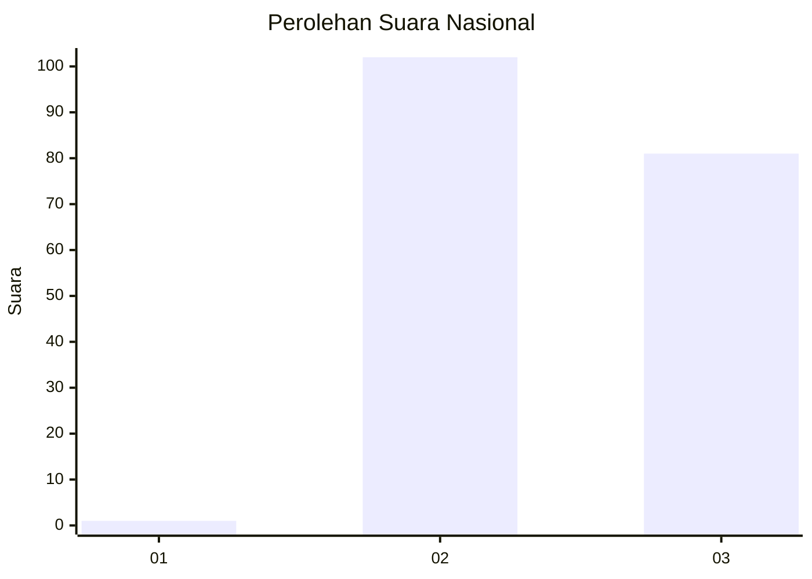
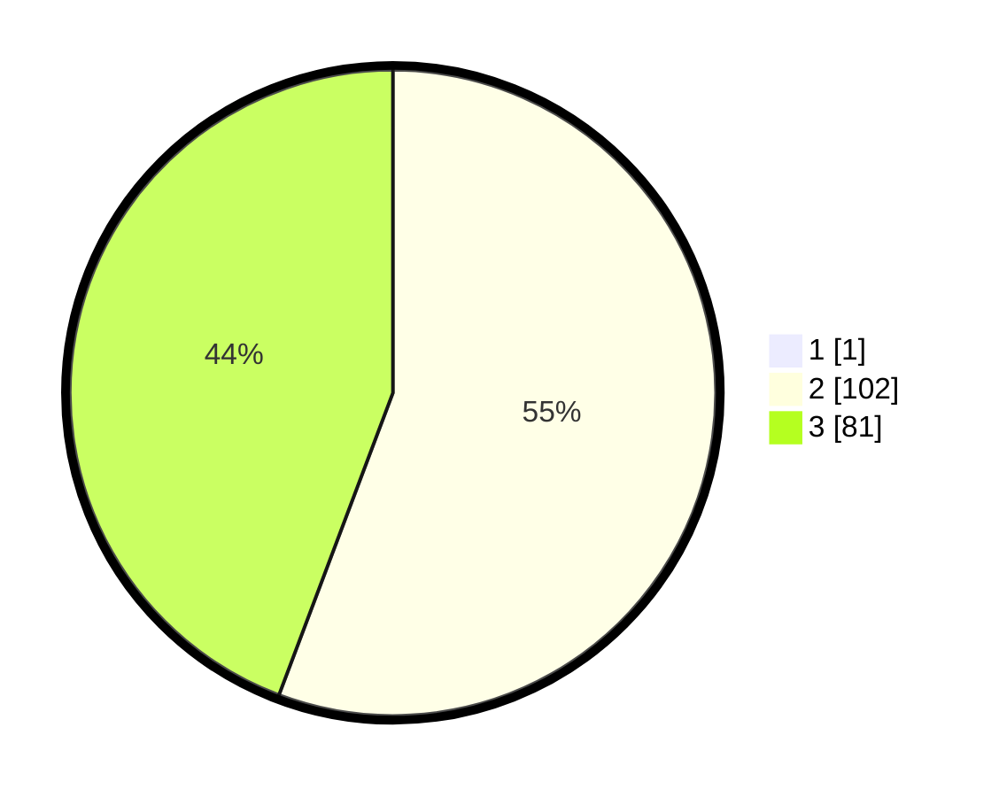

# Hasil

## Grafik

## Tabel

| No. | Nama Paslon    | Suara | Suara (raw) | Persentase |
|:--- |:-------------- | -----:| -----------:| ----------:|
| 1   | ANIES MUHAIMIN | 1     | [1][p-1]    | 0,54       |
| 2   | PRABOWO GIBRAN | 102   | [102][p-2]  | 55,43      |
| 3   | GANJAR MAHFUD  | 81    | [81][p-3]   | 44,02      |

[p-1]: https://github.com/gigit-pemilu/pemilu-2024/blob/main/pilpres/hitung-suara/sub/51-bali/sub/02-tabanan/sub/10-pupuan/sub/2001-belimbing/sub/001-tps/sub/paslon-1.txt
[p-2]: https://github.com/gigit-pemilu/pemilu-2024/blob/main/pilpres/hitung-suara/sub/51-bali/sub/02-tabanan/sub/10-pupuan/sub/2001-belimbing/sub/001-tps/sub/paslon-2.txt
[p-3]: https://github.com/gigit-pemilu/pemilu-2024/blob/main/pilpres/hitung-suara/sub/51-bali/sub/02-tabanan/sub/10-pupuan/sub/2001-belimbing/sub/001-tps/sub/paslon-3.txt

## Foto C Plano

https://sirekap-obj-formc.kpu.go.id/e4f0/pemilu/ppwp/51/02/10/20/01/5102102001001-20240214-140941--97ba441d-5a21-4d5f-b725-2812e0f2eca2.jpg

https://sirekap-obj-formc.kpu.go.id/e4f0/pemilu/ppwp/51/02/10/20/01/5102102001001-20240214-141048--8535b363-3e25-4cb5-9438-06ebb674db13.jpg

https://sirekap-obj-formc.kpu.go.id/e4f0/pemilu/ppwp/51/02/10/20/01/5102102001001-20240215-012748--0ce89bff-61e0-4f88-9dde-01608564aed5.jpg

## Metadata

| Key        | Value               |
| ---------- | ------------------- |
| Time Stamp | 2024-02-15 18:30:25 |

## DATA PEMILIH TETAP

Jumlah pemilih dalam DPT: **202**.
 * L: **95**.
 * P: **107**.

## DATA PENGGUNA HAK PILIH

Jumlah pengguna hak pilih dalam DPT: **185**.
 * L: **86**.
 * P: **99**.

Jumlah pengguna hak pilih dalam DPTb: **0**.
 * L: **0**.
 * P: **0**.

Jumlah pengguna hak pilih dalam DPK: **0**.
 * L: **0**.
 * P: **0**.

Jumlah pengguna hak pilih: **185**.
 * L: **86**.
 * P: **99**.

## JUMLAH SUARA SAH DAN TIDAK SAH

JUMLAH SELURUH SUARA SAH: **184**.

JUMLAH SUARA TIDAK SAH: **1**.

JUMLAH SELURUH SUARA SAH DAN SUARA TIDAK SAH: **185**.

