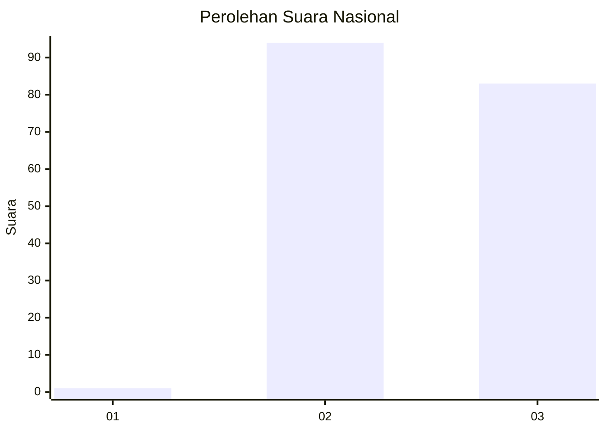
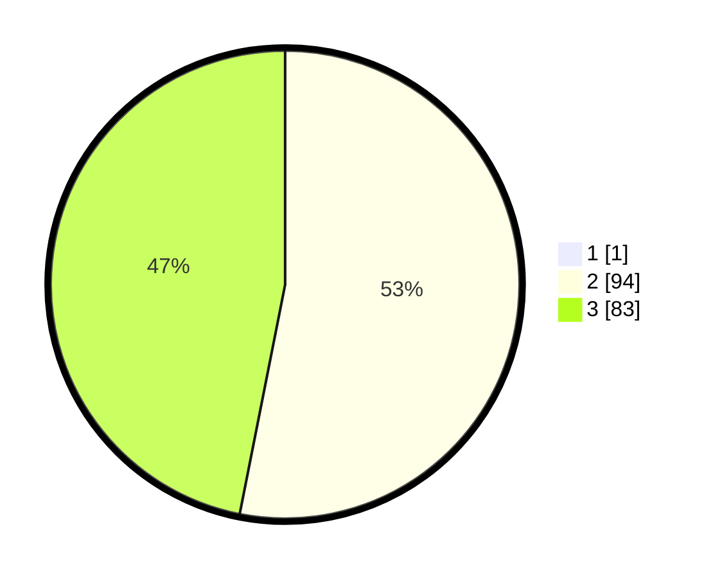

# Hasil

## Grafik

## Tabel

| No. | Nama Paslon    | Suara | Suara (raw) | Persentase |
|:--- |:-------------- | -----:| -----------:| ----------:|
| 1   | ANIES MUHAIMIN | 1     | [1][p-1]    | 0,56       |
| 2   | PRABOWO GIBRAN | 94    | [94][p-2]   | 52,81      |
| 3   | GANJAR MAHFUD  | 83    | [83][p-3]   | 46,63      |

[p-1]: https://github.com/gigit-pemilu/pemilu-2024/blob/main/pilpres/hitung-suara/sub/51-bali/sub/02-tabanan/sub/10-pupuan/sub/2001-belimbing/sub/002-tps/sub/paslon-1.txt
[p-2]: https://github.com/gigit-pemilu/pemilu-2024/blob/main/pilpres/hitung-suara/sub/51-bali/sub/02-tabanan/sub/10-pupuan/sub/2001-belimbing/sub/002-tps/sub/paslon-2.txt
[p-3]: https://github.com/gigit-pemilu/pemilu-2024/blob/main/pilpres/hitung-suara/sub/51-bali/sub/02-tabanan/sub/10-pupuan/sub/2001-belimbing/sub/002-tps/sub/paslon-3.txt

## Foto C Plano

https://sirekap-obj-formc.kpu.go.id/3507/pemilu/ppwp/51/02/10/20/01/5102102001002-20240216-154213--42c5284b-dfe7-42c2-a2d0-37729a4eb1ca.jpg

https://sirekap-obj-formc.kpu.go.id/3507/pemilu/ppwp/51/02/10/20/01/5102102001002-20240216-154214--e38e0d4e-34ef-4cf3-b1be-f9b53099b875.jpg

https://sirekap-obj-formc.kpu.go.id/3507/pemilu/ppwp/51/02/10/20/01/5102102001002-20240216-154214--cea4d6a7-1fcd-4dd9-88a1-f446cdaadebf.jpg

## Metadata

| Key        | Value               |
| ---------- | ------------------- |
| Time Stamp | 2024-02-16 16:25:10 |

## DATA PEMILIH TETAP

Jumlah pemilih dalam DPT: **205**.
 * L: **104**.
 * P: **101**.

## DATA PENGGUNA HAK PILIH

Jumlah pengguna hak pilih dalam DPT: **186**.
 * L: **92**.
 * P: **94**.

Jumlah pengguna hak pilih dalam DPTb: **0**.
 * L: **0**.
 * P: **0**.

Jumlah pengguna hak pilih dalam DPK: **0**.
 * L: **0**.
 * P: **0**.

Jumlah pengguna hak pilih: **186**.
 * L: **92**.
 * P: **94**.

## JUMLAH SUARA SAH DAN TIDAK SAH

JUMLAH SELURUH SUARA SAH: **178**.

JUMLAH SUARA TIDAK SAH: **8**.

JUMLAH SELURUH SUARA SAH DAN SUARA TIDAK SAH: **186**.

