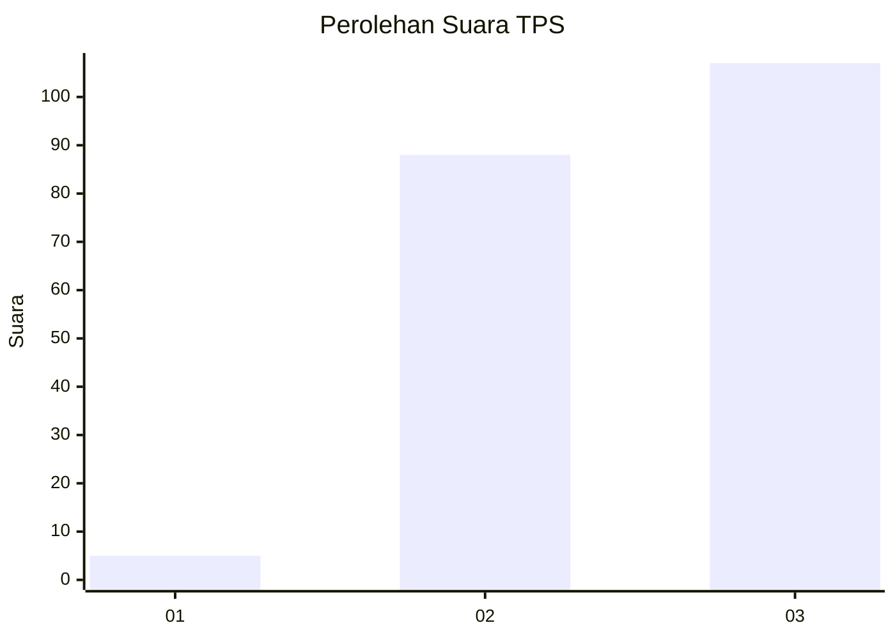
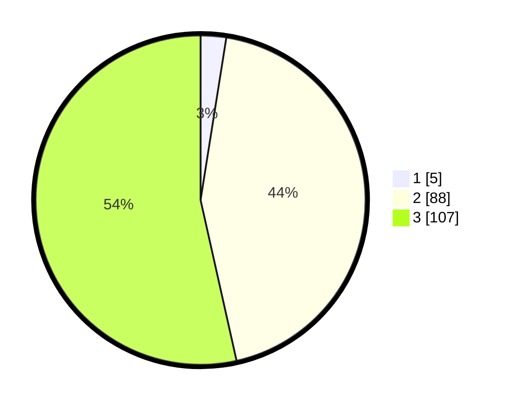

# Hasil

## Grafik

## Tabel

| No. | Nama Paslon    | Suara | Suara (raw) | Persentase |
|:--- |:-------------- | -----:| -----------:| ----------:|
| 1   | ANIES MUHAIMIN | 5     | [5][p-1]    | 2,50       |
| 2   | PRABOWO GIBRAN | 88    | [88][p-2]   | 44,00      |
| 3   | GANJAR MAHFUD  | 107   | [107][p-3]  | 53,50      |

[p-1]: https://github.com/gigit-pemilu/pemilu-2024-51-bali/blob/main/pilpres/hitung-suara/sub/51-bali/sub/02-tabanan/sub/10-pupuan/sub/2001-belimbing/sub/003-tps/sub/paslon-1.txt
[p-2]: https://github.com/gigit-pemilu/pemilu-2024-51-bali/blob/main/pilpres/hitung-suara/sub/51-bali/sub/02-tabanan/sub/10-pupuan/sub/2001-belimbing/sub/003-tps/sub/paslon-2.txt
[p-3]: https://github.com/gigit-pemilu/pemilu-2024-51-bali/blob/main/pilpres/hitung-suara/sub/51-bali/sub/02-tabanan/sub/10-pupuan/sub/2001-belimbing/sub/003-tps/sub/paslon-3.txt

## Foto C Plano

https://sirekap-obj-formc.kpu.go.id/f311/pemilu/ppwp/51/02/10/20/01/5102102001003-20240216-143133--948b1346-7159-4793-a990-d111c6f212cc.jpg

https://sirekap-obj-formc.kpu.go.id/f311/pemilu/ppwp/51/02/10/20/01/5102102001003-20240216-143134--61c348e5-bdb7-4eea-8f04-390823e7256f.jpg

https://sirekap-obj-formc.kpu.go.id/f311/pemilu/ppwp/51/02/10/20/01/5102102001003-20240216-143133--5d05e561-356f-4dda-bb89-1d69eb01575e.jpg

## Metadata

| Key        | Value               |
| ---------- | ------------------- |
| Time Stamp | 2024-02-16 16:25:10 |

## DATA PEMILIH TETAP

Jumlah pemilih dalam DPT: **215**.
 * L: **98**.
 * P: **117**.

## DATA PENGGUNA HAK PILIH

Jumlah pengguna hak pilih dalam DPT: **200**.
 * L: **94**.
 * P: **106**.

Jumlah pengguna hak pilih dalam DPTb: **1**.
 * L: **1**.
 * P: **0**.

Jumlah pengguna hak pilih dalam DPK: **0**.
 * L: **0**.
 * P: **0**.

Jumlah pengguna hak pilih: **201**.
 * L: **95**.
 * P: **106**.

## JUMLAH SUARA SAH DAN TIDAK SAH

JUMLAH SELURUH SUARA SAH: **200**.

JUMLAH SUARA TIDAK SAH: **1**.

JUMLAH SELURUH SUARA SAH DAN SUARA TIDAK SAH: **201**.

