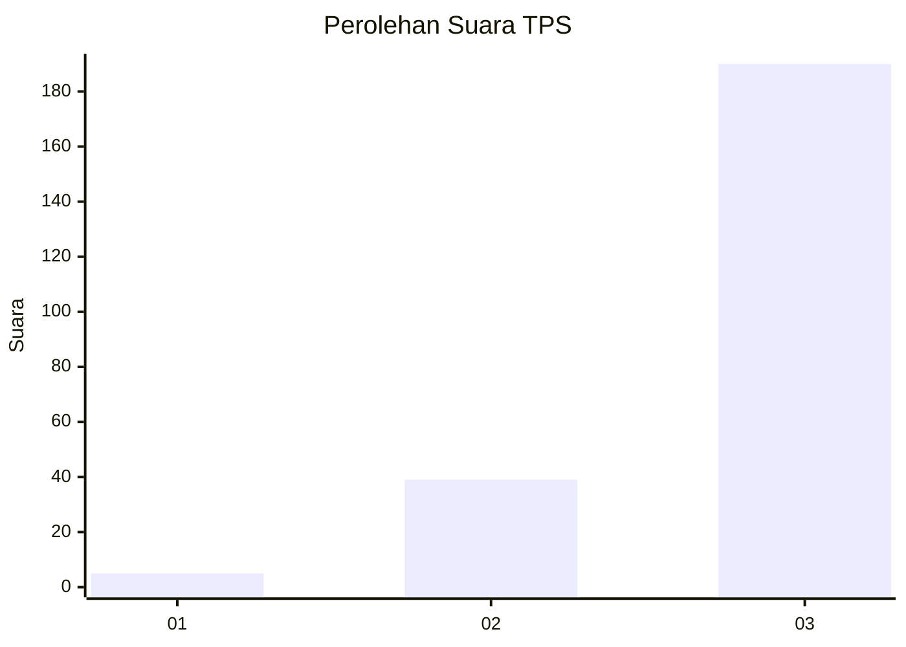
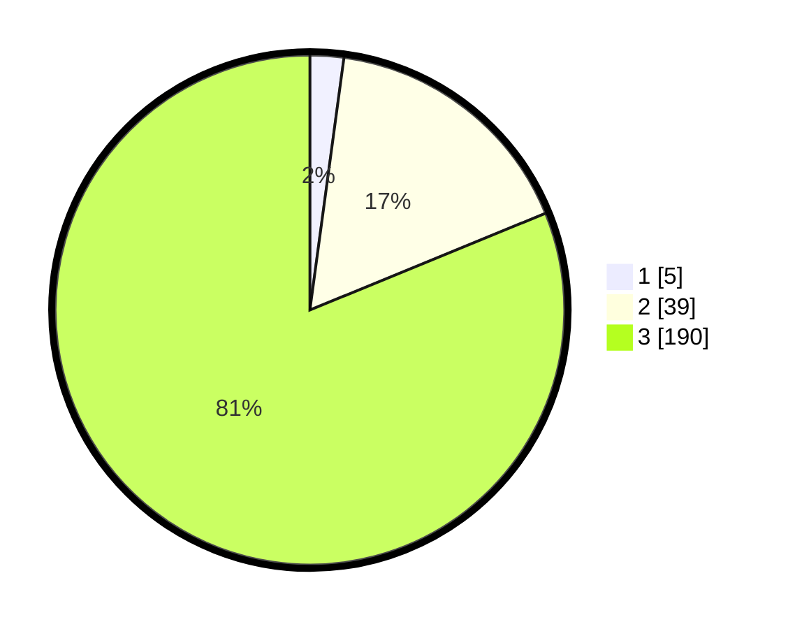

# Hasil

## Grafik

## Tabel

| No. | Nama Paslon    | Suara | Suara (raw) | Persentase |
|:--- |:-------------- | -----:| -----------:| ----------:|
| 1   | ANIES MUHAIMIN | 5     | [5][p-1]    | 2,14       |
| 2   | PRABOWO GIBRAN | 39    | [39][p-2]   | 16,67      |
| 3   | GANJAR MAHFUD  | 190   | [190][p-3]  | 81,20      |

[p-1]: https://github.com/gigit-pemilu/pemilu-2024-51-bali/blob/main/pilpres/hitung-suara/sub/51-bali/sub/02-tabanan/sub/10-pupuan/sub/2001-belimbing/sub/006-tps/sub/paslon-1.txt
[p-2]: https://github.com/gigit-pemilu/pemilu-2024-51-bali/blob/main/pilpres/hitung-suara/sub/51-bali/sub/02-tabanan/sub/10-pupuan/sub/2001-belimbing/sub/006-tps/sub/paslon-2.txt
[p-3]: https://github.com/gigit-pemilu/pemilu-2024-51-bali/blob/main/pilpres/hitung-suara/sub/51-bali/sub/02-tabanan/sub/10-pupuan/sub/2001-belimbing/sub/006-tps/sub/paslon-3.txt

## Foto C Plano

https://sirekap-obj-formc.kpu.go.id/12a8/pemilu/ppwp/51/02/10/20/01/5102102001006-20240216-140229--fcb169a8-7852-4939-b28f-ca4ebf35f2f2.jpg

https://sirekap-obj-formc.kpu.go.id/12a8/pemilu/ppwp/51/02/10/20/01/5102102001006-20240216-140231--957f1d63-f501-48fc-a69a-5be893b46658.jpg

https://sirekap-obj-formc.kpu.go.id/12a8/pemilu/ppwp/51/02/10/20/01/5102102001006-20240216-140230--6c08d7db-0435-4ace-9fa8-e564a05bb3ec.jpg

## Metadata

| Key        | Value               |
| ---------- | ------------------- |
| Time Stamp | 2024-02-16 16:25:10 |

## DATA PEMILIH TETAP

Jumlah pemilih dalam DPT: **250**.
 * L: **118**.
 * P: **132**.

## DATA PENGGUNA HAK PILIH

Jumlah pengguna hak pilih dalam DPT: **239**.
 * L: **115**.
 * P: **124**.

Jumlah pengguna hak pilih dalam DPTb: **0**.
 * L: **0**.
 * P: **0**.

Jumlah pengguna hak pilih dalam DPK: **0**.
 * L: **0**.
 * P: **0**.

Jumlah pengguna hak pilih: **239**.
 * L: **115**.
 * P: **124**.

## JUMLAH SUARA SAH DAN TIDAK SAH

JUMLAH SELURUH SUARA SAH: **234**.

JUMLAH SUARA TIDAK SAH: **5**.

JUMLAH SELURUH SUARA SAH DAN SUARA TIDAK SAH: **239**.

