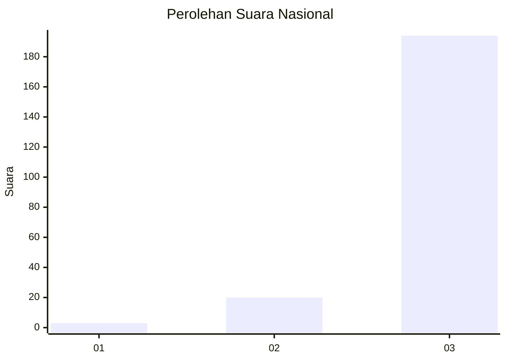
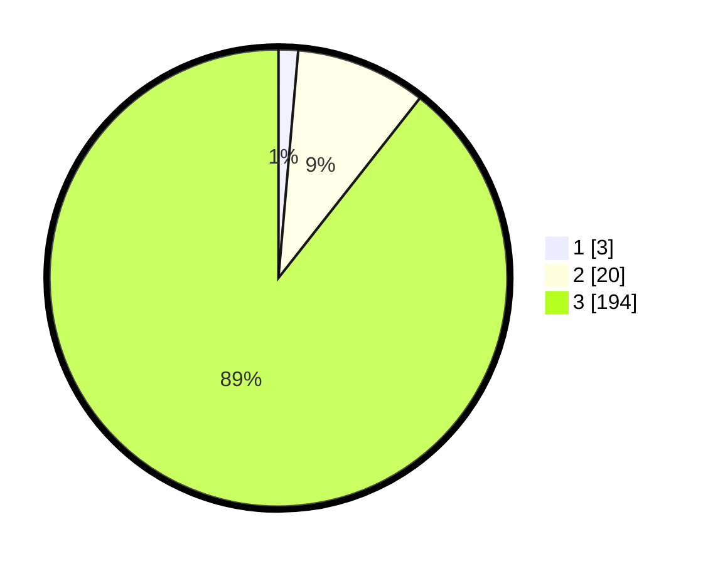

# Hasil

## Grafik

## Tabel

| No. | Nama Paslon    | Suara | Suara (raw) | Persentase |
|:--- |:-------------- | -----:| -----------:| ----------:|
| 1   | ANIES MUHAIMIN | 3     | [3][p-1]    | 1,38       |
| 2   | PRABOWO GIBRAN | 20    | [20][p-2]   | 9,22       |
| 3   | GANJAR MAHFUD  | 194   | [194][p-3]  | 89,40      |

[p-1]: https://github.com/gigit-pemilu/pemilu-2024/blob/main/pilpres/hitung-suara/sub/51-bali/sub/02-tabanan/sub/10-pupuan/sub/2001-belimbing/sub/015-tps/sub/paslon-1.txt
[p-2]: https://github.com/gigit-pemilu/pemilu-2024/blob/main/pilpres/hitung-suara/sub/51-bali/sub/02-tabanan/sub/10-pupuan/sub/2001-belimbing/sub/015-tps/sub/paslon-2.txt
[p-3]: https://github.com/gigit-pemilu/pemilu-2024/blob/main/pilpres/hitung-suara/sub/51-bali/sub/02-tabanan/sub/10-pupuan/sub/2001-belimbing/sub/015-tps/sub/paslon-3.txt

## Foto C Plano

https://sirekap-obj-formc.kpu.go.id/3ba4/pemilu/ppwp/51/02/10/20/01/5102102001015-20240216-141906--73ccb8cd-f109-4d48-92e4-2026e6b554bb.jpg

https://sirekap-obj-formc.kpu.go.id/3ba4/pemilu/ppwp/51/02/10/20/01/5102102001015-20240216-141907--5bdaa5d6-9f65-45af-bd0a-7a1ddbe3543c.jpg

https://sirekap-obj-formc.kpu.go.id/3ba4/pemilu/ppwp/51/02/10/20/01/5102102001015-20240216-141907--ee3f6cb6-4e12-404a-8dc2-24ccdbcd0a9b.jpg

## Metadata

| Key        | Value               |
| ---------- | ------------------- |
| Time Stamp | 2024-02-16 16:25:10 |

## DATA PEMILIH TETAP

Jumlah pemilih dalam DPT: **214**.
 * L: **95**.
 * P: **119**.

## DATA PENGGUNA HAK PILIH

Jumlah pengguna hak pilih dalam DPT: **213**.
 * L: **94**.
 * P: **119**.

Jumlah pengguna hak pilih dalam DPTb: **1**.
 * L: **0**.
 * P: **1**.

Jumlah pengguna hak pilih dalam DPK: **3**.
 * L: **0**.
 * P: **3**.

Jumlah pengguna hak pilih: **217**.
 * L: **94**.
 * P: **123**.

## JUMLAH SUARA SAH DAN TIDAK SAH

JUMLAH SELURUH SUARA SAH: **217**.

JUMLAH SUARA TIDAK SAH: **0**.

JUMLAH SELURUH SUARA SAH DAN SUARA TIDAK SAH: **217**.

