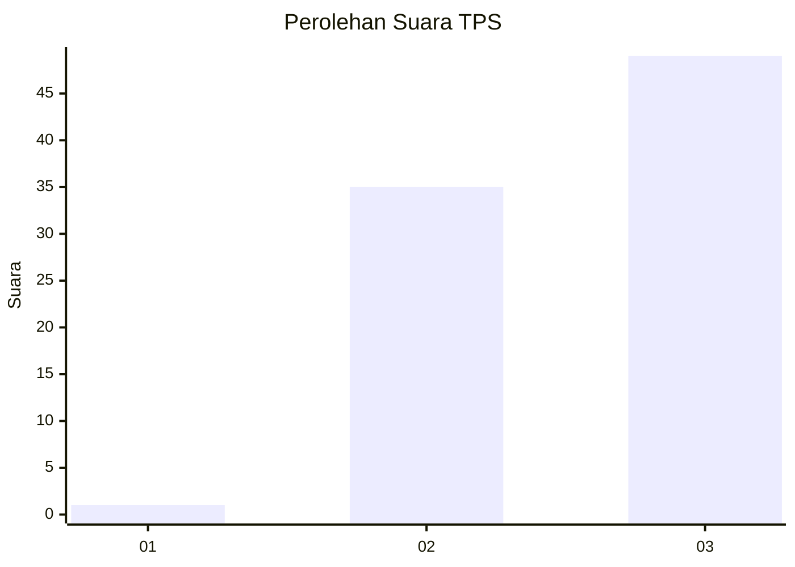
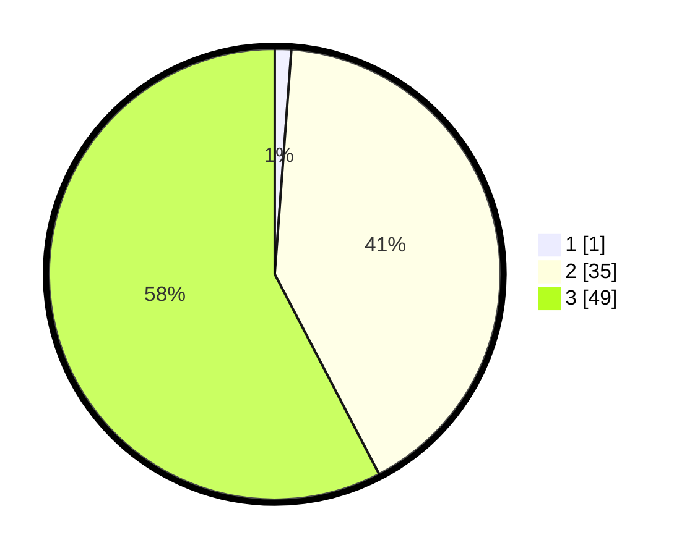

# Hasil

## Grafik

## Tabel

| No. | Nama Paslon    | Suara | Suara (raw) | Persentase |
|:--- |:-------------- | -----:| -----------:| ----------:|
| 1   | ANIES MUHAIMIN | 1     | [1][p-1]    | 1,18       |
| 2   | PRABOWO GIBRAN | 35    | [35][p-2]   | 41,18      |
| 3   | GANJAR MAHFUD  | 49    | [49][p-3]   | 57,65      |

[p-1]: https://github.com/gigit-pemilu/pemilu-2024-51-bali/blob/main/pilpres/hitung-suara/sub/51-bali/sub/02-tabanan/sub/10-pupuan/sub/2002-sanda/sub/001-tps/sub/paslon-1.txt
[p-2]: https://github.com/gigit-pemilu/pemilu-2024-51-bali/blob/main/pilpres/hitung-suara/sub/51-bali/sub/02-tabanan/sub/10-pupuan/sub/2002-sanda/sub/001-tps/sub/paslon-2.txt
[p-3]: https://github.com/gigit-pemilu/pemilu-2024-51-bali/blob/main/pilpres/hitung-suara/sub/51-bali/sub/02-tabanan/sub/10-pupuan/sub/2002-sanda/sub/001-tps/sub/paslon-3.txt

## Foto C Plano

https://sirekap-obj-formc.kpu.go.id/3dfd/pemilu/ppwp/51/02/10/20/02/5102102002001-20240216-142555--46990999-a069-4ef4-b1bd-90a8d4fa9895.jpg

https://sirekap-obj-formc.kpu.go.id/3dfd/pemilu/ppwp/51/02/10/20/02/5102102002001-20240216-142556--a74d8cf5-2eac-4c6d-aae7-ae0eff2da270.jpg

https://sirekap-obj-formc.kpu.go.id/3dfd/pemilu/ppwp/51/02/10/20/02/5102102002001-20240216-142555--cfdfebb6-596f-4343-9489-8e706592f791.jpg

## Metadata

| Key        | Value               |
| ---------- | ------------------- |
| Time Stamp | 2024-02-16 16:25:10 |

## DATA PEMILIH TETAP

Jumlah pemilih dalam DPT: **191**.
 * L: **96**.
 * P: **95**.

## DATA PENGGUNA HAK PILIH

Jumlah pengguna hak pilih dalam DPT: **155**.
 * L: **77**.
 * P: **78**.

Jumlah pengguna hak pilih dalam DPTb: **0**.
 * L: **0**.
 * P: **0**.

Jumlah pengguna hak pilih dalam DPK: **0**.
 * L: **0**.
 * P: **0**.

Jumlah pengguna hak pilih: **155**.
 * L: **77**.
 * P: **78**.

## JUMLAH SUARA SAH DAN TIDAK SAH

JUMLAH SELURUH SUARA SAH: **145**.

JUMLAH SUARA TIDAK SAH: **10**.

JUMLAH SELURUH SUARA SAH DAN SUARA TIDAK SAH: **155**.

