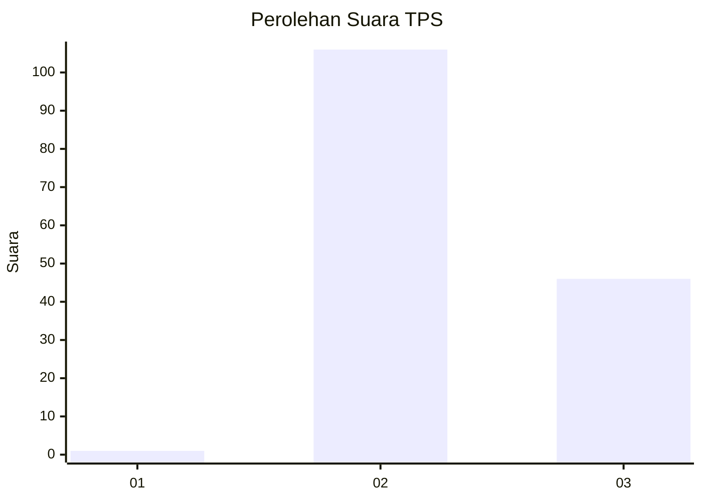
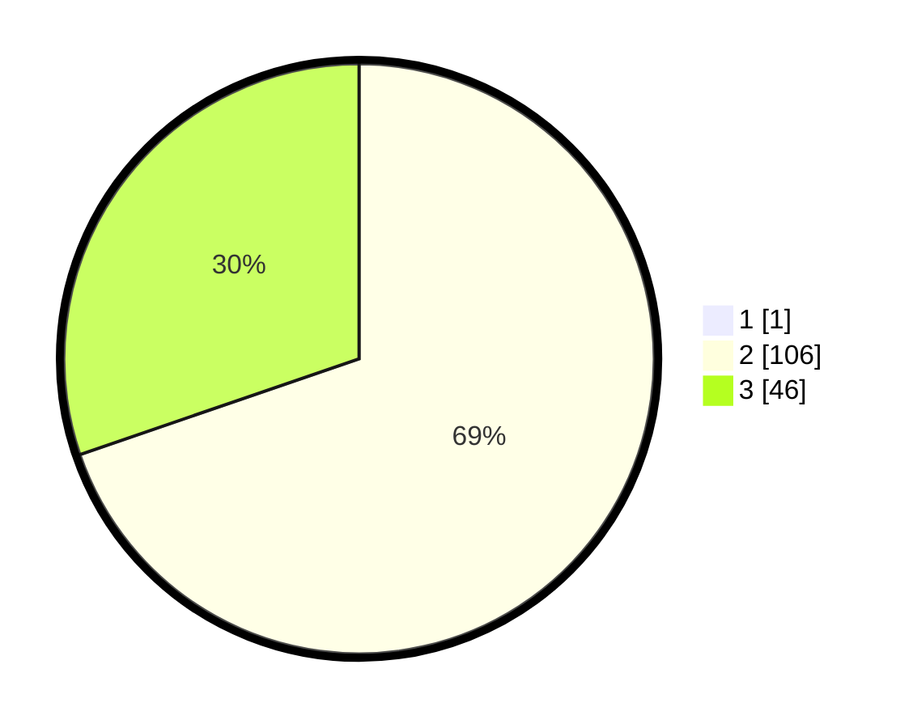

# Hasil

## Grafik

## Tabel

| No. | Nama Paslon    | Suara | Suara (raw) | Persentase |
|:--- |:-------------- | -----:| -----------:| ----------:|
| 1   | ANIES MUHAIMIN | 1     | [1][p-1]    | 0,65       |
| 2   | PRABOWO GIBRAN | 106   | [106][p-2]  | 69,28      |
| 3   | GANJAR MAHFUD  | 46    | [46][p-3]   | 30,07      |

[p-1]: https://github.com/gigit-pemilu/pemilu-2024-51-bali/blob/main/pilpres/hitung-suara/sub/51-bali/sub/02-tabanan/sub/10-pupuan/sub/2002-sanda/sub/002-tps/sub/paslon-1.txt
[p-2]: https://github.com/gigit-pemilu/pemilu-2024-51-bali/blob/main/pilpres/hitung-suara/sub/51-bali/sub/02-tabanan/sub/10-pupuan/sub/2002-sanda/sub/002-tps/sub/paslon-2.txt
[p-3]: https://github.com/gigit-pemilu/pemilu-2024-51-bali/blob/main/pilpres/hitung-suara/sub/51-bali/sub/02-tabanan/sub/10-pupuan/sub/2002-sanda/sub/002-tps/sub/paslon-3.txt

## Foto C Plano

https://sirekap-obj-formc.kpu.go.id/f3c3/pemilu/ppwp/51/02/10/20/02/5102102002002-20240216-150454--bd853543-ca5e-4e33-b09f-dab93fa0b0f0.jpg

https://sirekap-obj-formc.kpu.go.id/f3c3/pemilu/ppwp/51/02/10/20/02/5102102002002-20240216-150455--cd5730f2-fe6e-4d51-9bac-80b021cda978.jpg

https://sirekap-obj-formc.kpu.go.id/f3c3/pemilu/ppwp/51/02/10/20/02/5102102002002-20240216-150455--40753091-3cfb-4bb2-afd9-7631f3e87392.jpg

## Metadata

| Key        | Value               |
| ---------- | ------------------- |
| Time Stamp | 2024-02-16 16:25:10 |

## DATA PEMILIH TETAP

Jumlah pemilih dalam DPT: **191**.
 * L: **94**.
 * P: **97**.

## DATA PENGGUNA HAK PILIH

Jumlah pengguna hak pilih dalam DPT: **154**.
 * L: **78**.
 * P: **76**.

Jumlah pengguna hak pilih dalam DPTb: **1**.
 * L: **0**.
 * P: **1**.

Jumlah pengguna hak pilih dalam DPK: **0**.
 * L: **0**.
 * P: **0**.

Jumlah pengguna hak pilih: **155**.
 * L: **78**.
 * P: **77**.

## JUMLAH SUARA SAH DAN TIDAK SAH

JUMLAH SELURUH SUARA SAH: **153**.

JUMLAH SUARA TIDAK SAH: **2**.

JUMLAH SELURUH SUARA SAH DAN SUARA TIDAK SAH: **155**.

