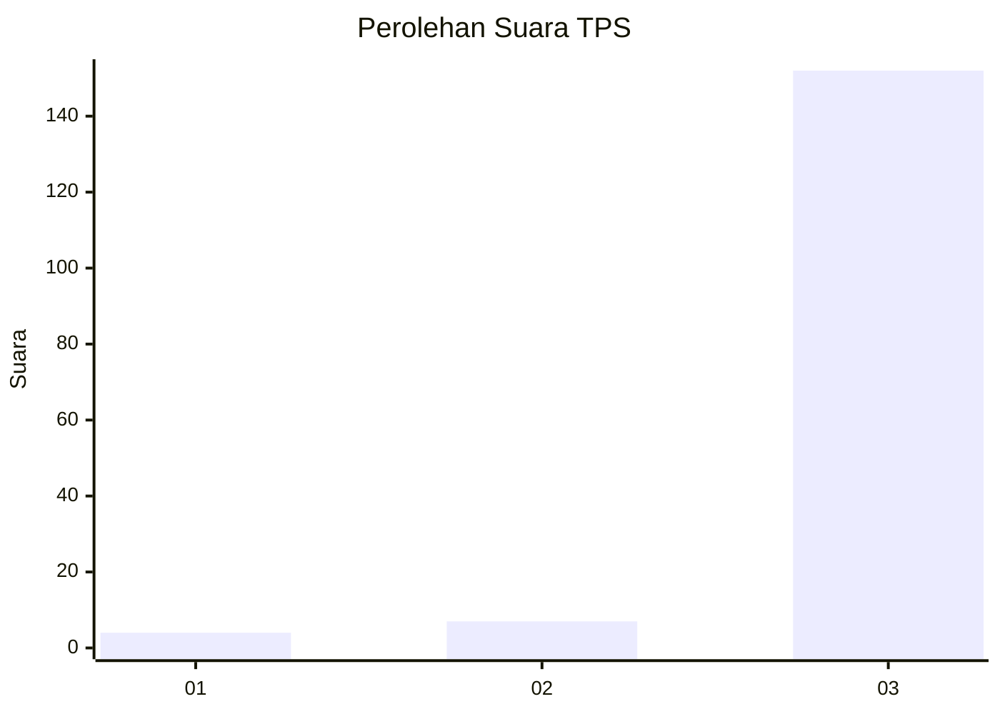
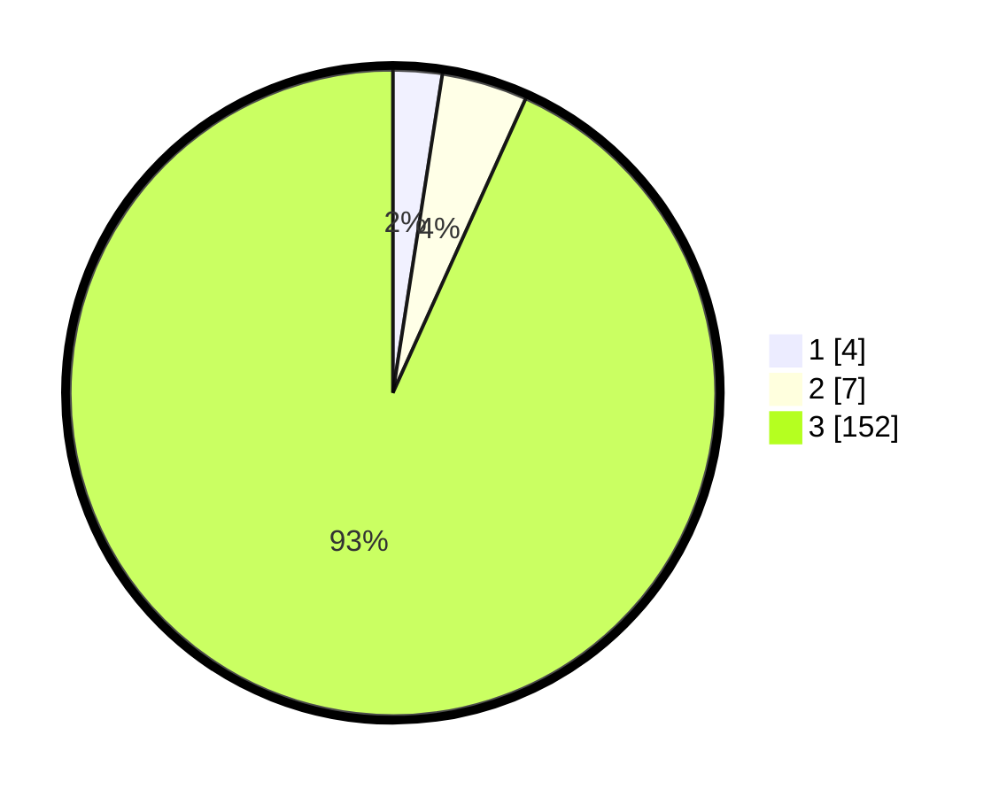

# Hasil

## Grafik

## Tabel

| No. | Nama Paslon    | Suara | Suara (raw) | Persentase |
|:--- |:-------------- | -----:| -----------:| ----------:|
| 1   | ANIES MUHAIMIN | 4     | [4][p-1]    | 2,45       |
| 2   | PRABOWO GIBRAN | 7     | [7][p-2]    | 4,29       |
| 3   | GANJAR MAHFUD  | 152   | [152][p-3]  | 93,25      |

[p-1]: https://github.com/gigit-pemilu/pemilu-2024-51-bali/blob/main/pilpres/hitung-suara/sub/51-bali/sub/02-tabanan/sub/10-pupuan/sub/2003-batungsel/sub/001-tps/sub/paslon-1.txt
[p-2]: https://github.com/gigit-pemilu/pemilu-2024-51-bali/blob/main/pilpres/hitung-suara/sub/51-bali/sub/02-tabanan/sub/10-pupuan/sub/2003-batungsel/sub/001-tps/sub/paslon-2.txt
[p-3]: https://github.com/gigit-pemilu/pemilu-2024-51-bali/blob/main/pilpres/hitung-suara/sub/51-bali/sub/02-tabanan/sub/10-pupuan/sub/2003-batungsel/sub/001-tps/sub/paslon-3.txt

## Foto C Plano

https://sirekap-obj-formc.kpu.go.id/2a1f/pemilu/ppwp/51/02/10/20/03/5102102003001-20240215-005214--b5db757f-02b6-4211-9a4e-89618672e91b.jpg

https://sirekap-obj-formc.kpu.go.id/2a1f/pemilu/ppwp/51/02/10/20/03/5102102003001-20240219-200255--ccebadaf-cac0-486b-8013-d54ac690da14.jpg

https://sirekap-obj-formc.kpu.go.id/2a1f/pemilu/ppwp/51/02/10/20/03/5102102003001-20240215-005257--381d9265-30d3-4b20-b441-c9ac587aaf65.jpg

## Metadata

| Key        | Value               |
| ---------- | ------------------- |
| Time Stamp | 2024-02-24 22:31:28 |

## DATA PEMILIH TETAP

Jumlah pemilih dalam DPT: **266**.
 * L: **136**.
 * P: **130**.

## DATA PENGGUNA HAK PILIH

Jumlah pengguna hak pilih dalam DPT: **233**.
 * L: **118**.
 * P: **115**.

Jumlah pengguna hak pilih dalam DPTb: **1**.
 * L: **1**.
 * P: **0**.

Jumlah pengguna hak pilih dalam DPK: **2**.
 * L: **0**.
 * P: **2**.

Jumlah pengguna hak pilih: **236**.
 * L: **119**.
 * P: **117**.

## JUMLAH SUARA SAH DAN TIDAK SAH

JUMLAH SELURUH SUARA SAH: **227**.

JUMLAH SUARA TIDAK SAH: **9**.

JUMLAH SELURUH SUARA SAH DAN SUARA TIDAK SAH: **236**.

