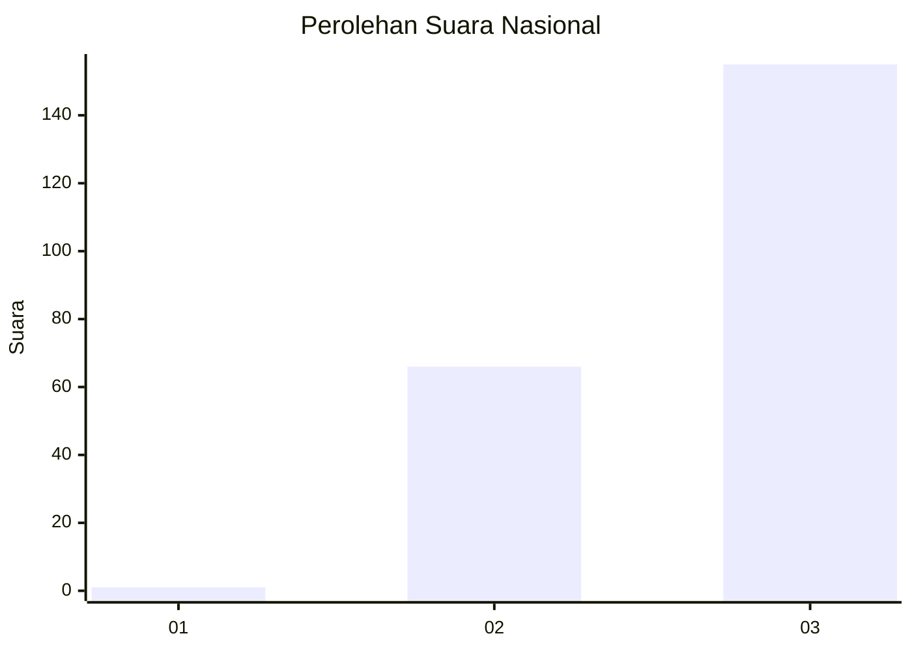
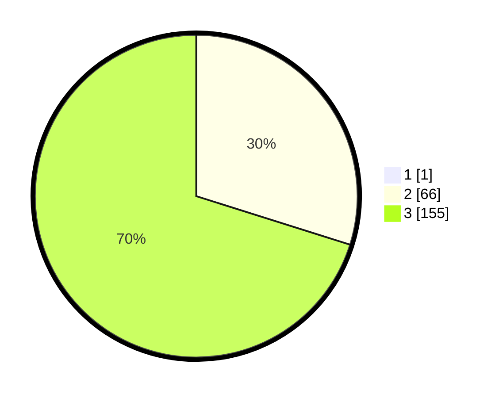

# Hasil

## Grafik

## Tabel

| No. | Nama Paslon    | Suara | Suara (raw) | Persentase |
|:--- |:-------------- | -----:| -----------:| ----------:|
| 1   | ANIES MUHAIMIN | 1     | [1][p-1]    | 0,45       |
| 2   | PRABOWO GIBRAN | 66    | [66][p-2]   | 29,73      |
| 3   | GANJAR MAHFUD  | 155   | [155][p-3]  | 69,82      |

[p-1]: https://github.com/gigit-pemilu/pemilu-2024/blob/main/pilpres/hitung-suara/sub/51-bali/sub/02-tabanan/sub/10-pupuan/sub/2003-batungsel/sub/002-tps/sub/paslon-1.txt
[p-2]: https://github.com/gigit-pemilu/pemilu-2024/blob/main/pilpres/hitung-suara/sub/51-bali/sub/02-tabanan/sub/10-pupuan/sub/2003-batungsel/sub/002-tps/sub/paslon-2.txt
[p-3]: https://github.com/gigit-pemilu/pemilu-2024/blob/main/pilpres/hitung-suara/sub/51-bali/sub/02-tabanan/sub/10-pupuan/sub/2003-batungsel/sub/002-tps/sub/paslon-3.txt

## Foto C Plano

https://sirekap-obj-formc.kpu.go.id/a8d3/pemilu/ppwp/51/02/10/20/03/5102102003002-20240215-191052--a38a5c13-1805-4043-bb51-4c03a519226a.jpg

https://sirekap-obj-formc.kpu.go.id/a8d3/pemilu/ppwp/51/02/10/20/03/5102102003002-20240215-191110--9468e643-b038-4923-99c6-78bc0e1957e9.jpg

https://sirekap-obj-formc.kpu.go.id/a8d3/pemilu/ppwp/51/02/10/20/03/5102102003002-20240215-191116--46d7b8fa-6c6e-4ea0-9e9e-f672c0f947fb.jpg

## Metadata

| Key        | Value               |
| ---------- | ------------------- |
| Time Stamp | 2024-02-16 00:00:26 |

## DATA PEMILIH TETAP

Jumlah pemilih dalam DPT: **272**.
 * L: **146**.
 * P: **126**.

## DATA PENGGUNA HAK PILIH

Jumlah pengguna hak pilih dalam DPT: **231**.
 * L: **123**.
 * P: **108**.

Jumlah pengguna hak pilih dalam DPTb: **1**.
 * L: **1**.
 * P: **0**.

Jumlah pengguna hak pilih dalam DPK: **0**.
 * L: **0**.
 * P: **0**.

Jumlah pengguna hak pilih: **232**.
 * L: **124**.
 * P: **108**.

## JUMLAH SUARA SAH DAN TIDAK SAH

JUMLAH SELURUH SUARA SAH: **222**.

JUMLAH SUARA TIDAK SAH: **10**.

JUMLAH SELURUH SUARA SAH DAN SUARA TIDAK SAH: **232**.

