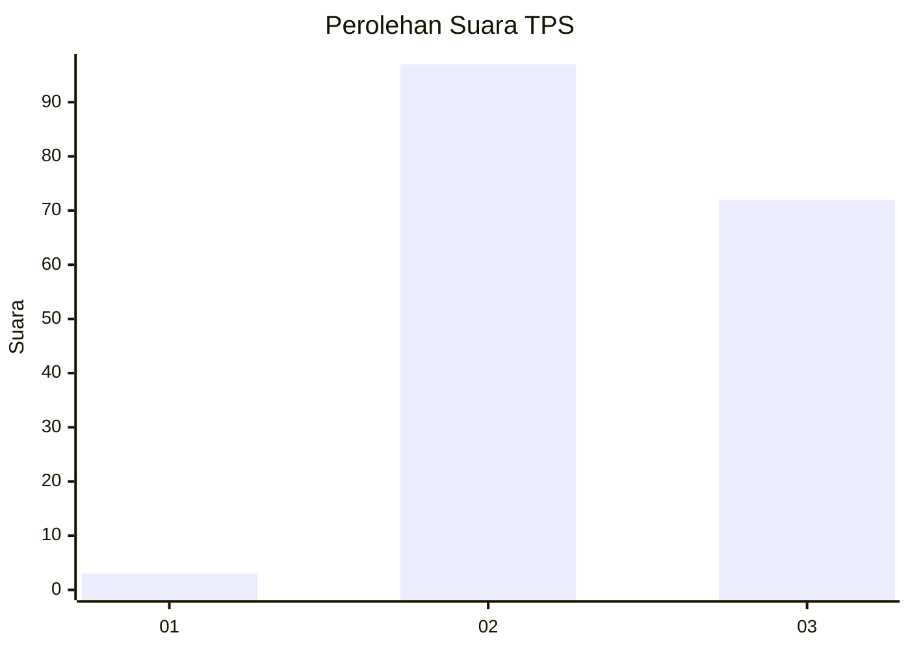
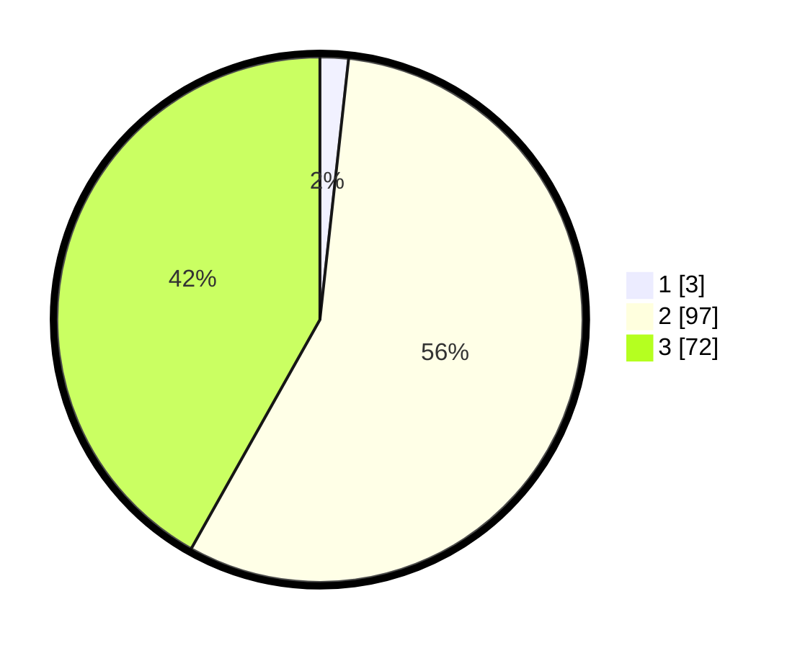

# Hasil

## Grafik

## Tabel

| No. | Nama Paslon    | Suara | Suara (raw) | Persentase |
|:--- |:-------------- | -----:| -----------:| ----------:|
| 1   | ANIES MUHAIMIN | 3     | [3][p-1]    | 1,74       |
| 2   | PRABOWO GIBRAN | 97    | [97][p-2]   | 56,40      |
| 3   | GANJAR MAHFUD  | 72    | [72][p-3]   | 41,86      |

[p-1]: https://github.com/gigit-pemilu/pemilu-2024-51-bali/blob/main/pilpres/hitung-suara/sub/51-bali/sub/02-tabanan/sub/10-pupuan/sub/2003-batungsel/sub/004-tps/sub/paslon-1.txt
[p-2]: https://github.com/gigit-pemilu/pemilu-2024-51-bali/blob/main/pilpres/hitung-suara/sub/51-bali/sub/02-tabanan/sub/10-pupuan/sub/2003-batungsel/sub/004-tps/sub/paslon-2.txt
[p-3]: https://github.com/gigit-pemilu/pemilu-2024-51-bali/blob/main/pilpres/hitung-suara/sub/51-bali/sub/02-tabanan/sub/10-pupuan/sub/2003-batungsel/sub/004-tps/sub/paslon-3.txt

## Foto C Plano

https://sirekap-obj-formc.kpu.go.id/4769/pemilu/ppwp/51/02/10/20/03/5102102003004-20240215-232618--a54915a3-db74-43d7-9967-43c4722eed26.jpg

https://sirekap-obj-formc.kpu.go.id/4769/pemilu/ppwp/51/02/10/20/03/5102102003004-20240215-232620--ea25aeeb-5628-4738-9ef7-83f568a395f0.jpg

https://sirekap-obj-formc.kpu.go.id/4769/pemilu/ppwp/51/02/10/20/03/5102102003004-20240215-232619--0c61bdf9-1b85-4bf9-a921-3041b41098ab.jpg

## Metadata

| Key        | Value               |
| ---------- | ------------------- |
| Time Stamp | 2024-02-16 16:25:10 |

## DATA PEMILIH TETAP

Jumlah pemilih dalam DPT: **223**.
 * L: **111**.
 * P: **112**.

## DATA PENGGUNA HAK PILIH

Jumlah pengguna hak pilih dalam DPT: **186**.
 * L: **97**.
 * P: **89**.

Jumlah pengguna hak pilih dalam DPTb: **1**.
 * L: **0**.
 * P: **1**.

Jumlah pengguna hak pilih dalam DPK: **0**.
 * L: **0**.
 * P: **0**.

Jumlah pengguna hak pilih: **187**.
 * L: **97**.
 * P: **90**.

## JUMLAH SUARA SAH DAN TIDAK SAH

JUMLAH SELURUH SUARA SAH: **172**.

JUMLAH SUARA TIDAK SAH: **15**.

JUMLAH SELURUH SUARA SAH DAN SUARA TIDAK SAH: **187**.

