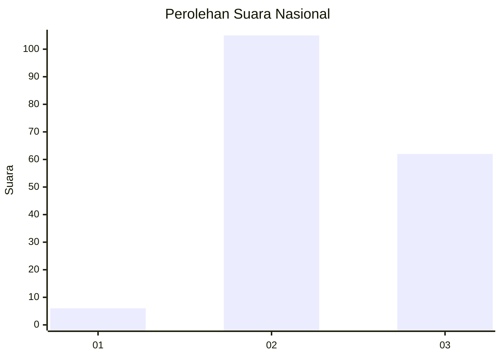
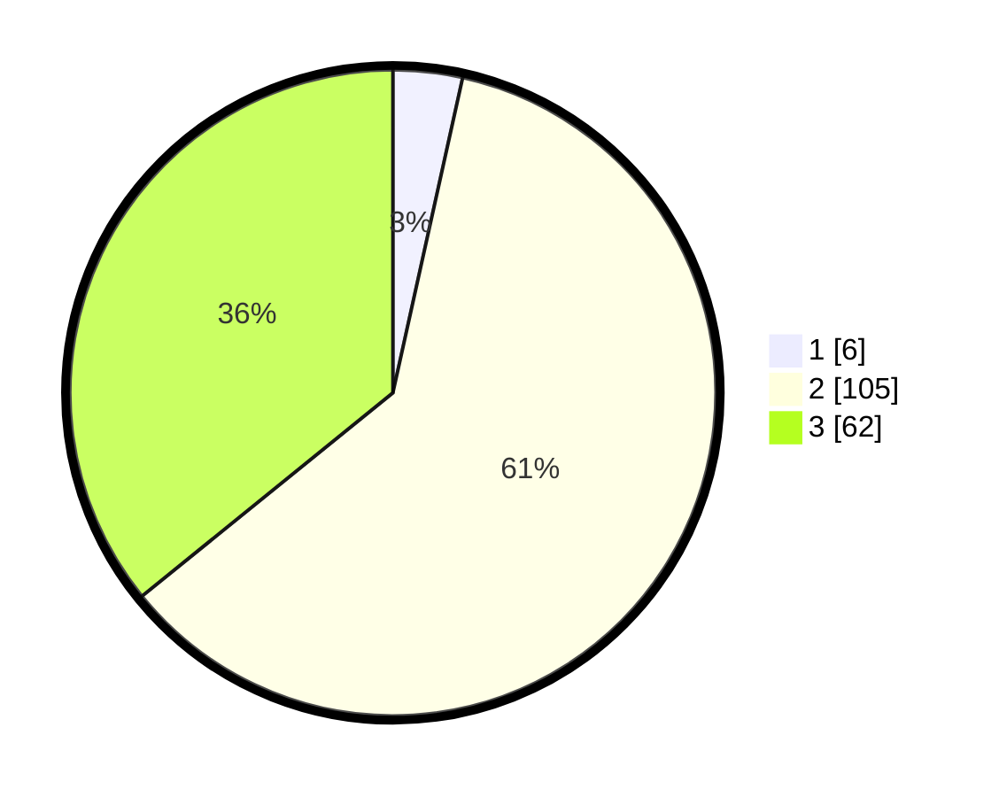

# Hasil

## Grafik

## Tabel

| No. | Nama Paslon    | Suara | Suara (raw) | Persentase |
|:--- |:-------------- | -----:| -----------:| ----------:|
| 1   | ANIES MUHAIMIN | 6     | [6][p-1]    | 3,47       |
| 2   | PRABOWO GIBRAN | 105   | [105][p-2]  | 60,69      |
| 3   | GANJAR MAHFUD  | 62    | [62][p-3]   | 35,84      |

[p-1]: https://github.com/gigit-pemilu/pemilu-2024/blob/main/pilpres/hitung-suara/sub/51-bali/sub/02-tabanan/sub/10-pupuan/sub/2003-batungsel/sub/006-tps/sub/paslon-1.txt
[p-2]: https://github.com/gigit-pemilu/pemilu-2024/blob/main/pilpres/hitung-suara/sub/51-bali/sub/02-tabanan/sub/10-pupuan/sub/2003-batungsel/sub/006-tps/sub/paslon-2.txt
[p-3]: https://github.com/gigit-pemilu/pemilu-2024/blob/main/pilpres/hitung-suara/sub/51-bali/sub/02-tabanan/sub/10-pupuan/sub/2003-batungsel/sub/006-tps/sub/paslon-3.txt

## Foto C Plano

https://sirekap-obj-formc.kpu.go.id/e601/pemilu/ppwp/51/02/10/20/03/5102102003006-20240216-092416--fc4ba3db-5cf0-438d-be7f-206ab7ec947d.jpg

https://sirekap-obj-formc.kpu.go.id/e601/pemilu/ppwp/51/02/10/20/03/5102102003006-20240216-092418--f208c6d8-0df0-45f0-8333-f017a42326a5.jpg

https://sirekap-obj-formc.kpu.go.id/e601/pemilu/ppwp/51/02/10/20/03/5102102003006-20240216-092417--6abc769b-50e5-4bf8-aa3f-90c9824ffacc.jpg

## Metadata

| Key        | Value               |
| ---------- | ------------------- |
| Time Stamp | 2024-02-16 16:25:10 |

## DATA PEMILIH TETAP

Jumlah pemilih dalam DPT: **231**.
 * L: **112**.
 * P: **119**.

## DATA PENGGUNA HAK PILIH

Jumlah pengguna hak pilih dalam DPT: **187**.
 * L: **93**.
 * P: **94**.

Jumlah pengguna hak pilih dalam DPTb: **1**.
 * L: **0**.
 * P: **1**.

Jumlah pengguna hak pilih dalam DPK: **0**.
 * L: **0**.
 * P: **0**.

Jumlah pengguna hak pilih: **188**.
 * L: **93**.
 * P: **95**.

## JUMLAH SUARA SAH DAN TIDAK SAH

JUMLAH SELURUH SUARA SAH: **173**.

JUMLAH SUARA TIDAK SAH: **15**.

JUMLAH SELURUH SUARA SAH DAN SUARA TIDAK SAH: **188**.

