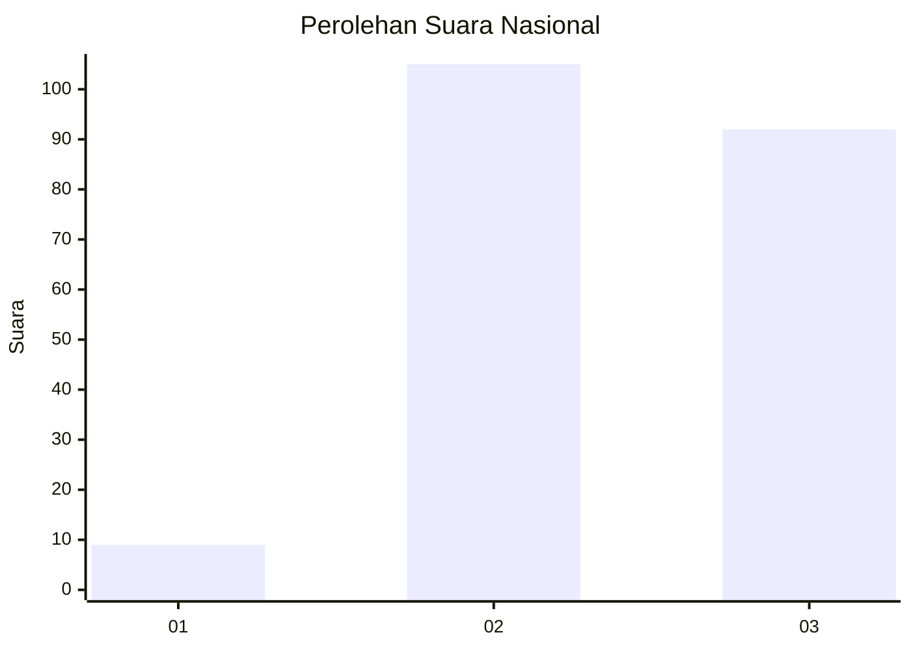
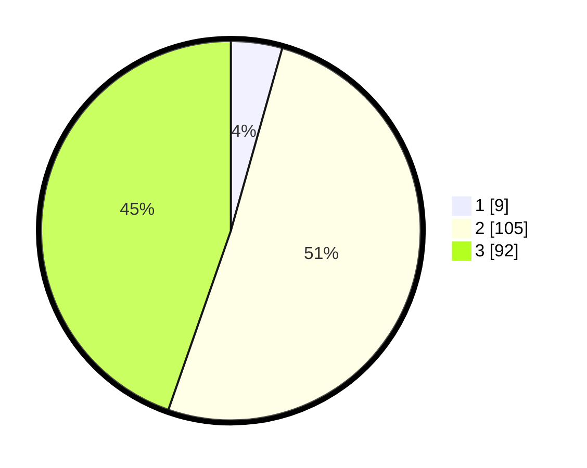

# Hasil

## Grafik

## Tabel

| No. | Nama Paslon    | Suara | Suara (raw) | Persentase |
|:--- |:-------------- | -----:| -----------:| ----------:|
| 1   | ANIES MUHAIMIN | 9     | [9][p-1]    | 4,37       |
| 2   | PRABOWO GIBRAN | 105   | [105][p-2]  | 50,97      |
| 3   | GANJAR MAHFUD  | 92    | [92][p-3]   | 44,66      |

[p-1]: https://github.com/gigit-pemilu/pemilu-2024/blob/main/pilpres/hitung-suara/sub/51-bali/sub/02-tabanan/sub/10-pupuan/sub/2003-batungsel/sub/007-tps/sub/paslon-1.txt
[p-2]: https://github.com/gigit-pemilu/pemilu-2024/blob/main/pilpres/hitung-suara/sub/51-bali/sub/02-tabanan/sub/10-pupuan/sub/2003-batungsel/sub/007-tps/sub/paslon-2.txt
[p-3]: https://github.com/gigit-pemilu/pemilu-2024/blob/main/pilpres/hitung-suara/sub/51-bali/sub/02-tabanan/sub/10-pupuan/sub/2003-batungsel/sub/007-tps/sub/paslon-3.txt

## Foto C Plano

https://sirekap-obj-formc.kpu.go.id/c284/pemilu/ppwp/51/02/10/20/03/5102102003007-20240216-005250--312a1e15-443b-4221-a38d-283ee2bdb637.jpg

https://sirekap-obj-formc.kpu.go.id/c284/pemilu/ppwp/51/02/10/20/03/5102102003007-20240216-005259--a31cf6c3-f9e0-4e68-835b-4d470d289750.jpg

https://sirekap-obj-formc.kpu.go.id/c284/pemilu/ppwp/51/02/10/20/03/5102102003007-20240216-005256--842d4210-c255-46a5-b242-bbd6af1d1ffc.jpg

## Metadata

| Key        | Value               |
| ---------- | ------------------- |
| Time Stamp | 2024-02-16 16:25:10 |

## DATA PEMILIH TETAP

Jumlah pemilih dalam DPT: **262**.
 * L: **132**.
 * P: **130**.

## DATA PENGGUNA HAK PILIH

Jumlah pengguna hak pilih dalam DPT: **221**.
 * L: **120**.
 * P: **101**.

Jumlah pengguna hak pilih dalam DPTb: **1**.
 * L: **1**.
 * P: **0**.

Jumlah pengguna hak pilih dalam DPK: **0**.
 * L: **0**.
 * P: **0**.

Jumlah pengguna hak pilih: **222**.
 * L: **121**.
 * P: **101**.

## JUMLAH SUARA SAH DAN TIDAK SAH

JUMLAH SELURUH SUARA SAH: **206**.

JUMLAH SUARA TIDAK SAH: **16**.

JUMLAH SELURUH SUARA SAH DAN SUARA TIDAK SAH: **222**.

