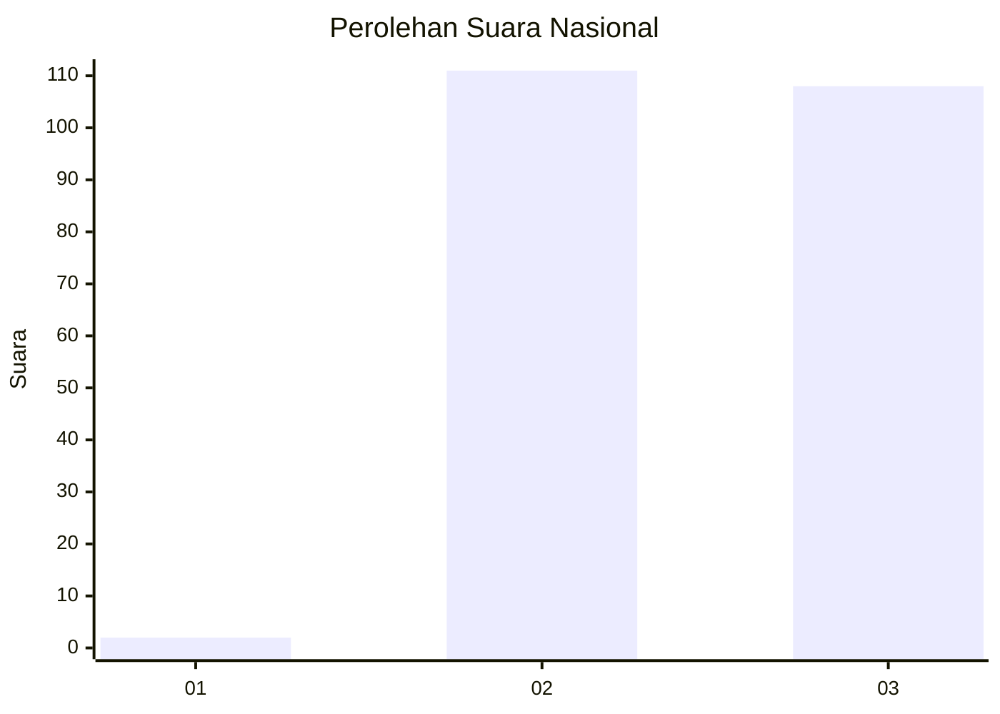
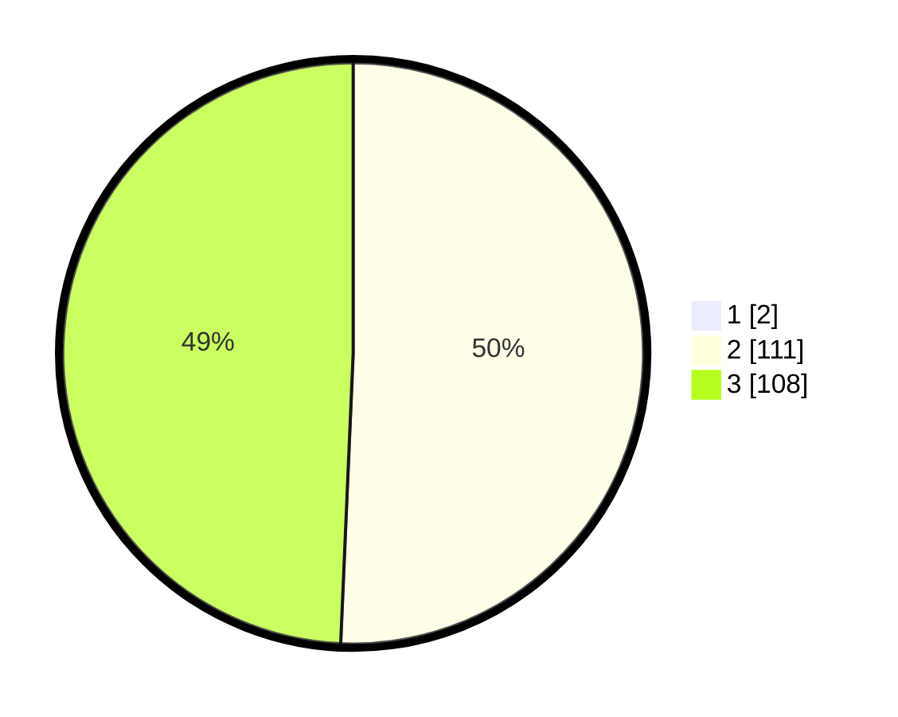

# Hasil

## Grafik

## Tabel

| No. | Nama Paslon    | Suara | Suara (raw) | Persentase |
|:--- |:-------------- | -----:| -----------:| ----------:|
| 1   | ANIES MUHAIMIN | 2     | [2][p-1]    | 0,90       |
| 2   | PRABOWO GIBRAN | 111   | [111][p-2]  | 50,23      |
| 3   | GANJAR MAHFUD  | 108   | [108][p-3]  | 48,87      |

[p-1]: https://github.com/gigit-pemilu/pemilu-2024/blob/main/pilpres/hitung-suara/sub/51-bali/sub/02-tabanan/sub/10-pupuan/sub/2003-batungsel/sub/010-tps/sub/paslon-1.txt
[p-2]: https://github.com/gigit-pemilu/pemilu-2024/blob/main/pilpres/hitung-suara/sub/51-bali/sub/02-tabanan/sub/10-pupuan/sub/2003-batungsel/sub/010-tps/sub/paslon-2.txt
[p-3]: https://github.com/gigit-pemilu/pemilu-2024/blob/main/pilpres/hitung-suara/sub/51-bali/sub/02-tabanan/sub/10-pupuan/sub/2003-batungsel/sub/010-tps/sub/paslon-3.txt

## Foto C Plano

https://sirekap-obj-formc.kpu.go.id/f00c/pemilu/ppwp/51/02/10/20/03/5102102003010-20240216-160353--de52f681-9f94-454d-8cc0-dcd171d1dc00.jpg

https://sirekap-obj-formc.kpu.go.id/f00c/pemilu/ppwp/51/02/10/20/03/5102102003010-20240214-141002--af38ff21-e0de-4ef7-bf90-2513fe19c8f6.jpg

https://sirekap-obj-formc.kpu.go.id/f00c/pemilu/ppwp/51/02/10/20/03/5102102003010-20240216-160354--8cde2c0d-19dd-4107-bc59-bdf704332e11.jpg

## Metadata

| Key        | Value               |
| ---------- | ------------------- |
| Time Stamp | 2024-02-16 16:25:10 |

## DATA PEMILIH TETAP

Jumlah pemilih dalam DPT: **283**.
 * L: **133**.
 * P: **150**.

## DATA PENGGUNA HAK PILIH

Jumlah pengguna hak pilih dalam DPT: **234**.
 * L: **107**.
 * P: **127**.

Jumlah pengguna hak pilih dalam DPTb: **1**.
 * L: **1**.
 * P: **0**.

Jumlah pengguna hak pilih dalam DPK: **0**.
 * L: **0**.
 * P: **0**.

Jumlah pengguna hak pilih: **235**.
 * L: **108**.
 * P: **127**.

## JUMLAH SUARA SAH DAN TIDAK SAH

JUMLAH SELURUH SUARA SAH: **221**.

JUMLAH SUARA TIDAK SAH: **14**.

JUMLAH SELURUH SUARA SAH DAN SUARA TIDAK SAH: **235**.

