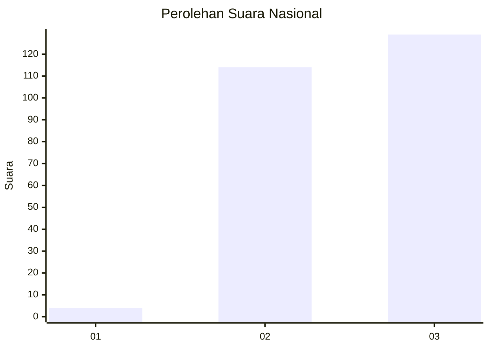
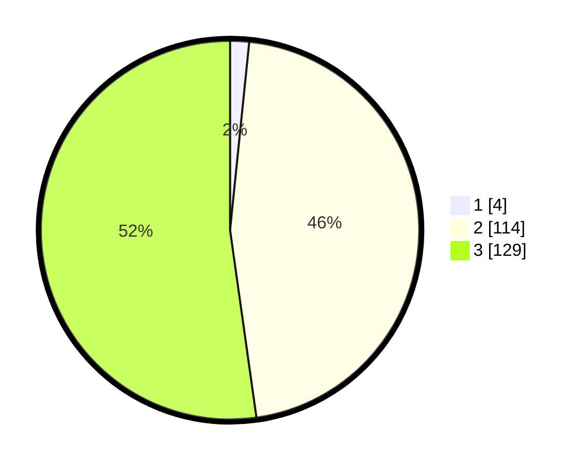

# Hasil

## Grafik

## Tabel

| No. | Nama Paslon    | Suara | Suara (raw) | Persentase |
|:--- |:-------------- | -----:| -----------:| ----------:|
| 1   | ANIES MUHAIMIN | 4     | [4][p-1]    | 1,62       |
| 2   | PRABOWO GIBRAN | 114   | [114][p-2]  | 46,15      |
| 3   | GANJAR MAHFUD  | 129   | [129][p-3]  | 52,23      |

[p-1]: https://github.com/gigit-pemilu/pemilu-2024/blob/main/pilpres/hitung-suara/sub/51-bali/sub/02-tabanan/sub/10-pupuan/sub/2003-batungsel/sub/011-tps/sub/paslon-1.txt
[p-2]: https://github.com/gigit-pemilu/pemilu-2024/blob/main/pilpres/hitung-suara/sub/51-bali/sub/02-tabanan/sub/10-pupuan/sub/2003-batungsel/sub/011-tps/sub/paslon-2.txt
[p-3]: https://github.com/gigit-pemilu/pemilu-2024/blob/main/pilpres/hitung-suara/sub/51-bali/sub/02-tabanan/sub/10-pupuan/sub/2003-batungsel/sub/011-tps/sub/paslon-3.txt

## Foto C Plano

https://sirekap-obj-formc.kpu.go.id/1137/pemilu/ppwp/51/02/10/20/03/5102102003011-20240215-030145--db98b86d-ad42-4528-be40-2a13085c7687.jpg

https://sirekap-obj-formc.kpu.go.id/1137/pemilu/ppwp/51/02/10/20/03/5102102003011-20240215-030217--1382e5ac-33b5-4dba-994a-7baf726512c2.jpg

https://sirekap-obj-formc.kpu.go.id/1137/pemilu/ppwp/51/02/10/20/03/5102102003011-20240215-030250--fefca3e9-ccba-4b00-ae81-58c298fabaeb.jpg

## Metadata

| Key        | Value               |
| ---------- | ------------------- |
| Time Stamp | 2024-02-16 10:00:28 |

