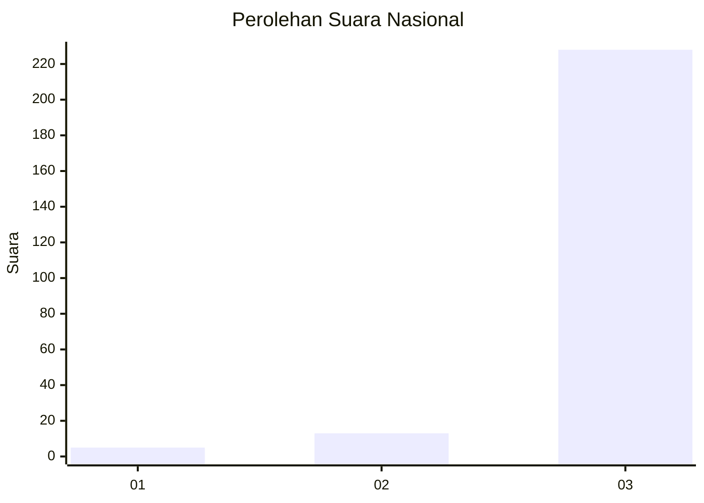
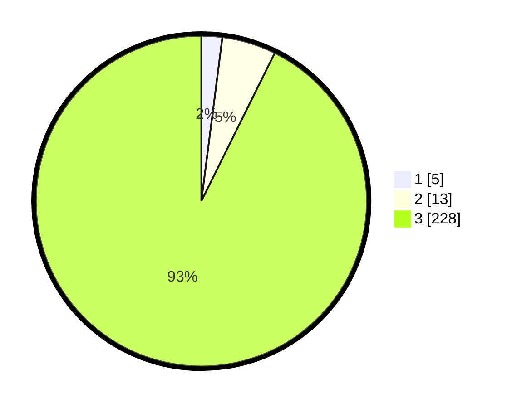

# Hasil

## Grafik

## Tabel

| No. | Nama Paslon    | Suara | Suara (raw) | Persentase |
|:--- |:-------------- | -----:| -----------:| ----------:|
| 1   | ANIES MUHAIMIN | 5     | [5][p-1]    | 2,03       |
| 2   | PRABOWO GIBRAN | 13    | [13][p-2]   | 5,28       |
| 3   | GANJAR MAHFUD  | 228   | [228][p-3]  | 92,68      |

[p-1]: https://github.com/gigit-pemilu/pemilu-2024/blob/main/pilpres/hitung-suara/sub/51-bali/sub/02-tabanan/sub/10-pupuan/sub/2004-kebon-padangan/sub/001-tps/sub/paslon-1.txt
[p-2]: https://github.com/gigit-pemilu/pemilu-2024/blob/main/pilpres/hitung-suara/sub/51-bali/sub/02-tabanan/sub/10-pupuan/sub/2004-kebon-padangan/sub/001-tps/sub/paslon-2.txt
[p-3]: https://github.com/gigit-pemilu/pemilu-2024/blob/main/pilpres/hitung-suara/sub/51-bali/sub/02-tabanan/sub/10-pupuan/sub/2004-kebon-padangan/sub/001-tps/sub/paslon-3.txt

## Foto C Plano

https://sirekap-obj-formc.kpu.go.id/a9a9/pemilu/ppwp/51/02/10/20/04/5102102004001-20240214-140954--482b194a-1e81-4d12-a998-ccac2cb4e304.jpg

https://sirekap-obj-formc.kpu.go.id/a9a9/pemilu/ppwp/51/02/10/20/04/5102102004001-20240214-215931--9a67fe5c-7d95-4a07-906b-c3abd5473601.jpg

https://sirekap-obj-formc.kpu.go.id/a9a9/pemilu/ppwp/51/02/10/20/04/5102102004001-20240214-141027--01d06de8-2657-4493-97b9-8e9955329910.jpg

## Metadata

| Key        | Value               |
| ---------- | ------------------- |
| Time Stamp | 2024-02-16 10:00:28 |

## DATA PEMILIH TETAP

Jumlah pemilih dalam DPT: **265**.
 * L: **138**.
 * P: **127**.

## DATA PENGGUNA HAK PILIH

Jumlah pengguna hak pilih dalam DPT: **254**.
 * L: **130**.
 * P: **124**.

Jumlah pengguna hak pilih dalam DPTb: **1**.
 * L: **1**.
 * P: **0**.

Jumlah pengguna hak pilih dalam DPK: **0**.
 * L: **0**.
 * P: **0**.

Jumlah pengguna hak pilih: **255**.
 * L: **131**.
 * P: **124**.

## JUMLAH SUARA SAH DAN TIDAK SAH

JUMLAH SELURUH SUARA SAH: **246**.

JUMLAH SUARA TIDAK SAH: **9**.

JUMLAH SELURUH SUARA SAH DAN SUARA TIDAK SAH: **255**.

