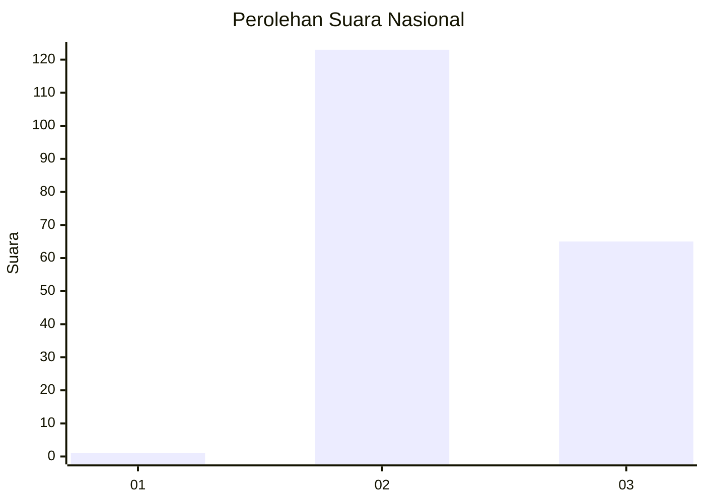
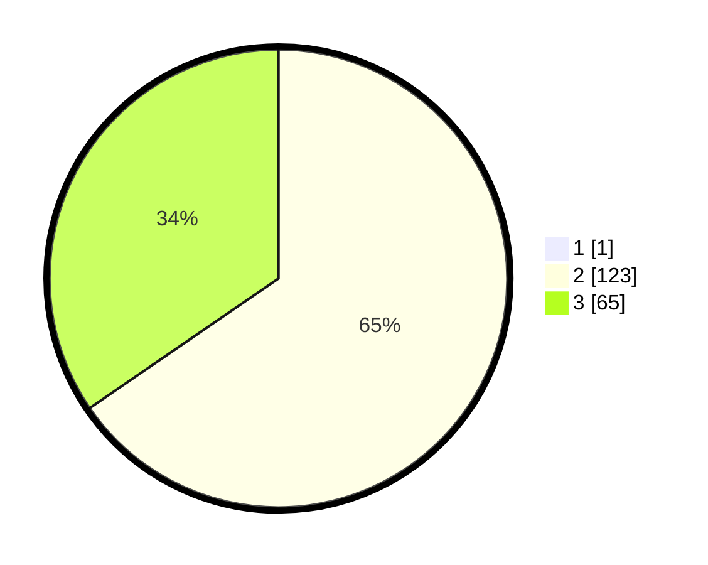

# Hasil

## Grafik

## Tabel

| No. | Nama Paslon    | Suara | Suara (raw) | Persentase |
|:--- |:-------------- | -----:| -----------:| ----------:|
| 1   | ANIES MUHAIMIN | 1     | [1][p-1]    | 0,53       |
| 2   | PRABOWO GIBRAN | 123   | [123][p-2]  | 65,08      |
| 3   | GANJAR MAHFUD  | 65    | [65][p-3]   | 34,39      |

[p-1]: https://github.com/gigit-pemilu/pemilu-2024/blob/main/pilpres/hitung-suara/sub/51-bali/sub/02-tabanan/sub/10-pupuan/sub/2004-kebon-padangan/sub/006-tps/sub/paslon-1.txt
[p-2]: https://github.com/gigit-pemilu/pemilu-2024/blob/main/pilpres/hitung-suara/sub/51-bali/sub/02-tabanan/sub/10-pupuan/sub/2004-kebon-padangan/sub/006-tps/sub/paslon-2.txt
[p-3]: https://github.com/gigit-pemilu/pemilu-2024/blob/main/pilpres/hitung-suara/sub/51-bali/sub/02-tabanan/sub/10-pupuan/sub/2004-kebon-padangan/sub/006-tps/sub/paslon-3.txt

## Foto C Plano

https://sirekap-obj-formc.kpu.go.id/d6b2/pemilu/ppwp/51/02/10/20/04/5102102004006-20240214-133352--1ab89e0e-9b28-4a00-95f9-c22ff2ae2aef.jpg

https://sirekap-obj-formc.kpu.go.id/d6b2/pemilu/ppwp/51/02/10/20/04/5102102004006-20240214-133103--1e69e0b1-7cc9-411c-bf40-d399ea391444.jpg

https://sirekap-obj-formc.kpu.go.id/d6b2/pemilu/ppwp/51/02/10/20/04/5102102004006-20240214-223401--637d93d4-25c0-4c1a-9519-eaca69547dc4.jpg

## Metadata

| Key        | Value               |
| ---------- | ------------------- |
| Time Stamp | 2024-02-16 02:00:27 |

## DATA PEMILIH TETAP

Jumlah pemilih dalam DPT: **265**.
 * L: **132**.
 * P: **133**.

## DATA PENGGUNA HAK PILIH

Jumlah pengguna hak pilih dalam DPT: **193**.
 * L: **98**.
 * P: **95**.

Jumlah pengguna hak pilih dalam DPTb: **1**.
 * L: **0**.
 * P: **1**.

Jumlah pengguna hak pilih dalam DPK: **0**.
 * L: **0**.
 * P: **0**.

Jumlah pengguna hak pilih: **194**.
 * L: **98**.
 * P: **96**.

## JUMLAH SUARA SAH DAN TIDAK SAH

JUMLAH SELURUH SUARA SAH: **189**.

JUMLAH SUARA TIDAK SAH: **5**.

JUMLAH SELURUH SUARA SAH DAN SUARA TIDAK SAH: **194**.

