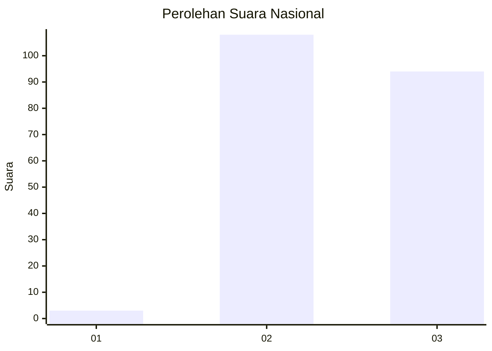
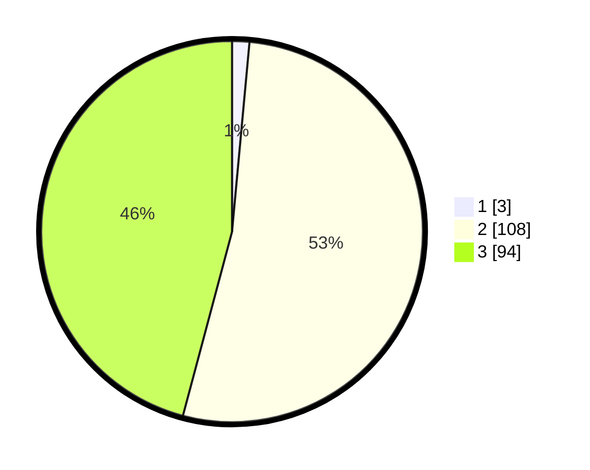

# Hasil

## Grafik

## Tabel

| No. | Nama Paslon    | Suara | Suara (raw) | Persentase |
|:--- |:-------------- | -----:| -----------:| ----------:|
| 1   | ANIES MUHAIMIN | 3     | [3][p-1]    | 1,46       |
| 2   | PRABOWO GIBRAN | 108   | [108][p-2]  | 52,68      |
| 3   | GANJAR MAHFUD  | 94    | [94][p-3]   | 45,85      |

[p-1]: https://github.com/gigit-pemilu/pemilu-2024/blob/main/pilpres/hitung-suara/sub/51-bali/sub/02-tabanan/sub/10-pupuan/sub/2004-kebon-padangan/sub/007-tps/sub/paslon-1.txt
[p-2]: https://github.com/gigit-pemilu/pemilu-2024/blob/main/pilpres/hitung-suara/sub/51-bali/sub/02-tabanan/sub/10-pupuan/sub/2004-kebon-padangan/sub/007-tps/sub/paslon-2.txt
[p-3]: https://github.com/gigit-pemilu/pemilu-2024/blob/main/pilpres/hitung-suara/sub/51-bali/sub/02-tabanan/sub/10-pupuan/sub/2004-kebon-padangan/sub/007-tps/sub/paslon-3.txt

## Foto C Plano

https://sirekap-obj-formc.kpu.go.id/a798/pemilu/ppwp/51/02/10/20/04/5102102004007-20240216-040754--ce1fbc32-343d-47f0-beec-8ea4f349f059.jpg

https://sirekap-obj-formc.kpu.go.id/a798/pemilu/ppwp/51/02/10/20/04/5102102004007-20240216-040812--12783403-5379-4bf2-ba6c-3c5d8d6bab21.jpg

https://sirekap-obj-formc.kpu.go.id/a798/pemilu/ppwp/51/02/10/20/04/5102102004007-20240216-041814--99b446d4-f287-4f9b-b0aa-f745a5be918f.jpg

## Metadata

| Key        | Value               |
| ---------- | ------------------- |
| Time Stamp | 2024-02-16 16:25:10 |

## DATA PEMILIH TETAP

Jumlah pemilih dalam DPT: **268**.
 * L: **138**.
 * P: **130**.

## DATA PENGGUNA HAK PILIH

Jumlah pengguna hak pilih dalam DPT: **205**.
 * L: **106**.
 * P: **99**.

Jumlah pengguna hak pilih dalam DPTb: **1**.
 * L: **1**.
 * P: **0**.

Jumlah pengguna hak pilih dalam DPK: **0**.
 * L: **0**.
 * P: **0**.

Jumlah pengguna hak pilih: **206**.
 * L: **107**.
 * P: **99**.

## JUMLAH SUARA SAH DAN TIDAK SAH

JUMLAH SELURUH SUARA SAH: **205**.

JUMLAH SUARA TIDAK SAH: **1**.

JUMLAH SELURUH SUARA SAH DAN SUARA TIDAK SAH: **206**.

