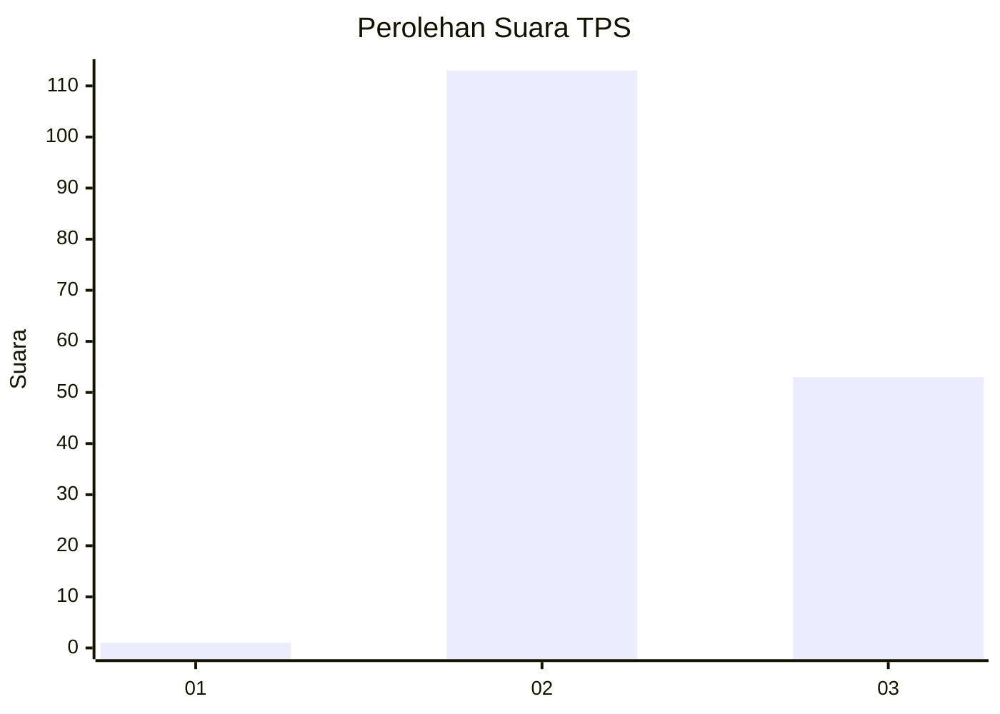
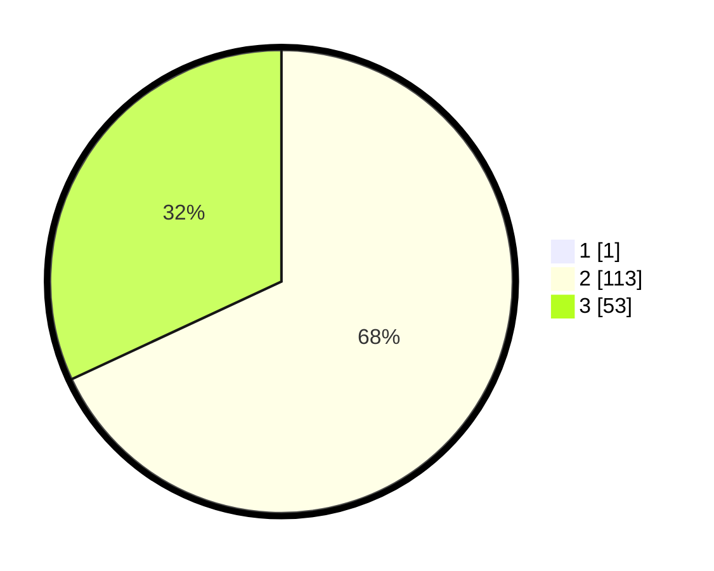

# Hasil

## Grafik

## Tabel

| No. | Nama Paslon    | Suara | Suara (raw) | Persentase |
|:--- |:-------------- | -----:| -----------:| ----------:|
| 1   | ANIES MUHAIMIN | 1     | [1][p-1]    | 0,60       |
| 2   | PRABOWO GIBRAN | 113   | [113][p-2]  | 67,66      |
| 3   | GANJAR MAHFUD  | 53    | [53][p-3]   | 31,74      |

[p-1]: https://github.com/gigit-pemilu/pemilu-2024-51-bali/blob/main/pilpres/hitung-suara/sub/51-bali/sub/02-tabanan/sub/10-pupuan/sub/2004-kebon-padangan/sub/010-tps/sub/paslon-1.txt
[p-2]: https://github.com/gigit-pemilu/pemilu-2024-51-bali/blob/main/pilpres/hitung-suara/sub/51-bali/sub/02-tabanan/sub/10-pupuan/sub/2004-kebon-padangan/sub/010-tps/sub/paslon-2.txt
[p-3]: https://github.com/gigit-pemilu/pemilu-2024-51-bali/blob/main/pilpres/hitung-suara/sub/51-bali/sub/02-tabanan/sub/10-pupuan/sub/2004-kebon-padangan/sub/010-tps/sub/paslon-3.txt

## Foto C Plano

https://sirekap-obj-formc.kpu.go.id/e469/pemilu/ppwp/51/02/10/20/04/5102102004010-20240214-230926--3df5563b-51fa-41f4-a6c0-9c4f53129990.jpg

https://sirekap-obj-formc.kpu.go.id/e469/pemilu/ppwp/51/02/10/20/04/5102102004010-20240214-231017--ab649b04-f971-41b0-9007-31cfbb6b7d66.jpg

https://sirekap-obj-formc.kpu.go.id/e469/pemilu/ppwp/51/02/10/20/04/5102102004010-20240214-231055--525be321-1205-4cf0-aa2b-cfede223d5c1.jpg

## Metadata

| Key        | Value               |
| ---------- | ------------------- |
| Time Stamp | 2024-02-16 10:30:29 |

